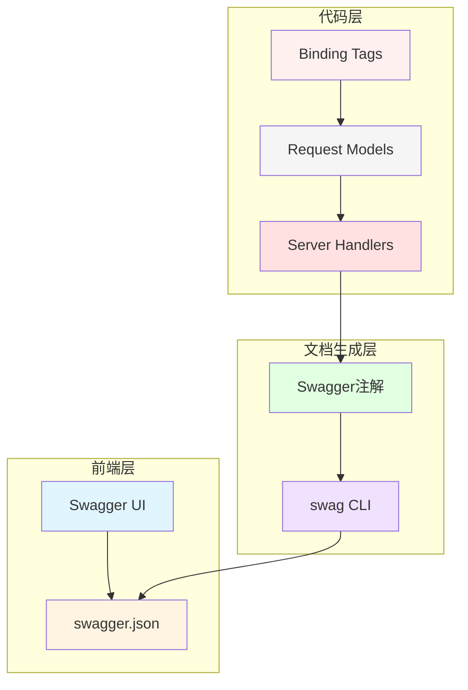
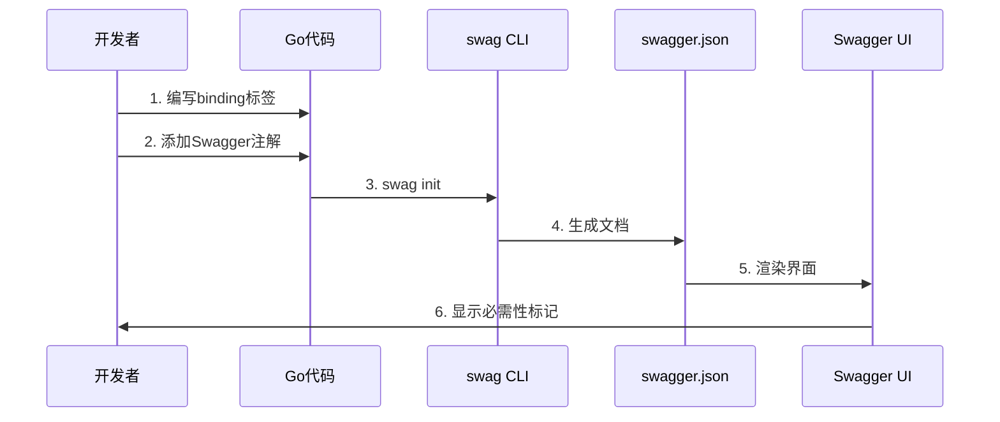
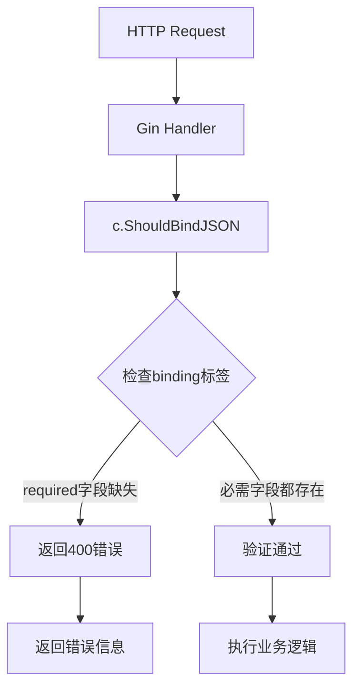

# 设计文档 - Swagger参数必需性标注

## 📋 基本信息

- **任务名称**: Swagger参数必需性标注
- **创建时间**: 2025/10/21
- **文档版本**: v1.0

---

## 🏗️ 整体架构

### 系统分层



### 核心流程



---

## 🔧 核心组件设计

### 1. Swagger注解规范

#### 1.1 Path参数注解
```go
// @Param id path string true "参数说明"
//        ↑   ↑    ↑      ↑    ↑
//        |   |    |      |    └─ 参数描述
//        |   |    |      └────── 是否必需（path参数始终为true）
//        |   |    └───────────── 参数类型
//        |   └────────────────── 参数位置
//        └────────────────────── 参数名称
```

**示例**:
```go
// GetProblem godoc
// @Param id path string true "题目ID"
func (s *Server) GetProblem(c *gin.Context) {
    idStr := c.Param("id")
    // ...
}
```

#### 1.2 Query参数注解
```go
// @Param page query int false "页码" default(1)
//        ↑     ↑     ↑   ↑      ↑          ↑
//        |     |     |   |      |          └─ 默认值（可选）
//        |     |     |   |      └──────────── 参数描述
//        |     |     |   └─────────────────── 是否必需
//        |     |     └─────────────────────── 参数类型
//        |     └───────────────────────────── 参数位置
//        └─────────────────────────────────── 参数名称
```

**必需性规则**:
- **必需查询参数**: `true` - 客户端必须提供
- **可选查询参数**: `false` - 客户端可以不提供

**示例**:
```go
// GetProblems godoc
// @Param page query int false "页码" default(1)
// @Param page_size query int false "每页数量" default(10)
// @Param difficulty query string false "难度" Enums(easy, medium, hard)
func (s *Server) GetProblems(c *gin.Context) {
    page, _ := strconv.Atoi(c.DefaultQuery("page", "1"))
    // ...
}
```

#### 1.3 Body参数注解

**✅ 正确方式 - 引用结构体**:
```go
// @Param request body models.LoginRequest true "登录信息"
//        ↑       ↑    ↑                    ↑    ↑
//        |       |    |                    |    └─ 参数描述
//        |       |    |                    └────── 是否必需（body参数通常为true）
//        |       |    └─────────────────────────── 请求结构体类型
//        |       └──────────────────────────────── 参数位置
//        └──────────────────────────────────────── 参数名称（固定为request）
```

**❌ 错误方式 - inline object**:
```go
// 不要这样做！
// @Param request body object{field1=string,field2=int} true "说明"
```

**为什么不使用inline object**:
1. 无法识别字段的必需性（所有字段都被认为是必需的）
2. 无法利用结构体的binding标签
3. 难以维护，字段变更需要同步修改多处
4. 无法复用已定义的结构体

### 2. Request结构体设计

#### 2.1 字段必需性标注

**必需字段**:
```go
type LoginRequest struct {
    StudentID string `json:"student_id" binding:"required"`
    Password  string `json:"password" binding:"required"`
}
```

**可选字段（方式1 - 不添加binding）**:
```go
type UpdateProfileRequest struct {
    RealName string `json:"real_name"`     // 可选
    Email    string `json:"email"`         // 可选
    Bio      string `json:"bio"`           // 可选
}
```

**可选字段（方式2 - 指针+omitempty）**:
```go
type UpdateCourseRequest struct {
    ID          string  `json:"id" binding:"required"`  // 必需
    Name        *string `json:"name,omitempty"`         // 可选
    Description *string `json:"description,omitempty"`  // 可选
}
```

#### 2.2 使用场景

| 场景 | 推荐方式 | 示例 |
|-----|---------|------|
| 创建资源 | binding:"required" | CreateProblem |
| 登录认证 | binding:"required" | Login |
| 部分更新 | 指针+omitempty | UpdateCourse |
| 可选配置 | 不添加binding | UpdateProfile |

---

## 📐 接口规范定义

### 1. 用户模块接口

#### UpdateUserProfile (需修复)

**当前（错误）**:
```go
// @Param request body object{real_name=string,email=string,bio=string,school=string,major=string,grade=string,class=string,phone=string} true "更新信息"
```

**修复后（正确）**:
```go
// @Param request body models.UpdateProfileRequest true "更新信息"
```

**对应的结构体**:
```go
type UpdateProfileRequest struct {
    RealName string `json:"real_name"`   // 可选
    Email    string `json:"email"`       // 可选
    Bio      string `json:"bio"`         // 可选
    School   string `json:"school"`      // 可选
    Major    string `json:"major"`       // 可选
    Grade    string `json:"grade"`       // 可选
    Class    string `json:"class"`       // 可选
    Phone    string `json:"phone"`       // 可选
}
```

**生成的Swagger定义**:
```json
{
  "UpdateProfileRequest": {
    "type": "object",
    "properties": {
      "real_name": {"type": "string"},
      "email": {"type": "string"},
      "bio": {"type": "string"},
      "school": {"type": "string"},
      "major": {"type": "string"},
      "grade": {"type": "string"},
      "class": {"type": "string"},
      "phone": {"type": "string"}
    }
  }
}
```

注意：由于所有字段都没有binding标签，生成的Swagger中 `required` 数组为空，表示所有字段都是可选的。

---

## 🔄 数据流向图

### Swagger文档生成流程

```mermaid
flowchart LR
    A[Go源代码] --> B{扫描注解}
    B --> C[解析@Param]
    B --> D[解析结构体]
    
    C --> E[提取参数信息]
    D --> F[提取字段信息]
    
    F --> G{检查binding标签}
    G -->|有required| H[标记为必需]
    G -->|无required| I[标记为可选]
    
    E --> J[生成swagger.json]
    H --> J
    I --> J
    
    J --> K[Swagger UI渲染]
    K --> L[显示必需性标记]
```

### 参数验证流程



---

## 🛡️ 异常处理策略

### 1. Swagger生成失败

**可能原因**:
- 注解格式错误
- 引用的结构体不存在
- 循环引用

**处理方案**:
```bash
# 清理缓存重新生成
rm -rf docs/
swag init

# 如果仍然失败，检查具体错误信息
swag init -g cmd/main.go --output docs/
```

### 2. 字段必需性不正确

**问题**: Swagger显示的必需性与预期不符

**检查清单**:
1. ✅ 检查binding标签是否正确
2. ✅ 检查Swagger注解是否引用了正确的结构体
3. ✅ 重新执行swag init
4. ✅ 清除浏览器缓存重新访问Swagger UI

### 3. inline object问题

**问题**: 使用inline object导致无法识别字段必需性

**解决方案**:
1. 创建专门的Request结构体
2. 在结构体中添加binding标签
3. Swagger注解引用该结构体
4. 重新生成文档

---

## 🔍 质量保证

### 1. 代码审查检查点

- [ ] 是否所有body参数都引用了具体的结构体
- [ ] 是否所有必需字段都有binding标签
- [ ] 是否所有可选字段都正确标注（指针/无binding）
- [ ] 注解格式是否符合规范

### 2. 生成验证

```bash
# 1. 生成Swagger文档
swag init

# 2. 检查生成的文件
ls -la docs/
# 应该包含: docs.go, swagger.json, swagger.yaml

# 3. 验证swagger.json格式
cat docs/swagger.json | jq . > /dev/null
# 如果格式正确，不会报错

# 4. 检查特定结构体的定义
cat docs/swagger.json | jq '.definitions.UpdateProfileRequest'
```

### 3. UI测试

1. 启动服务: `make run` 或 `go run cmd/main.go server`
2. 访问: `http://localhost:8080/swagger/index.html`
3. 检查接口: `PUT /api/v1/user/profile`
4. 验证: 所有字段都不应该有红色星号（*）标记

---

## 📊 性能考虑

### Swagger文档大小

- 当前swagger.json大小: ~50KB
- 预计修改后大小: 无明显变化
- 加载时间: <100ms

### 生成时间

- swag init执行时间: 通常<5秒
- 项目规模: 约40个API接口
- 影响: 可忽略

---

## 🔐 安全考虑

### 1. 敏感信息处理

确保Swagger文档中不暴露：
- ❌ 实际的密钥值
- ❌ 数据库连接字符串
- ❌ 内部系统路径

### 2. 访问控制

- Swagger UI访问控制由Nginx配置
- 生产环境建议限制Swagger访问
- 开发环境可以公开访问

---

## 📝 实施步骤

### 步骤1: 修改Swagger注解
```go
// 文件: pkg/app/api-server/server/server_user.go
// 行: 151

// 修改前:
// @Param request body object{real_name=string,...} true "更新信息"

// 修改后:
// @Param request body models.UpdateProfileRequest true "更新信息"
```

### 步骤2: 重新生成文档
```bash
cd G:\code-oj\ZKCodeArenaServer
swag init
```

### 步骤3: 验证
```bash
# 启动服务
go run cmd/main.go server

# 访问Swagger UI
# http://localhost:8080/swagger/index.html

# 检查 PUT /api/v1/user/profile 接口
# 验证所有字段都是可选的
```

---

## ✅ 质量门控

### 设计阶段

- [x] 架构图清晰准确
- [x] 接口定义完整
- [x] 与现有系统无冲突
- [x] 设计可行性验证

### 实施阶段

- [ ] 代码修改符合规范
- [ ] 文档生成无错误
- [ ] Swagger UI显示正确
- [ ] 所有测试通过

---

## 📌 附录

### A. Swaggo注解完整参考

```go
// @Summary      简短摘要
// @Description  详细描述
// @Tags         标签分类
// @Accept       json
// @Produce      json
// @Param        参数名 位置 类型 是否必需 "说明" 其他属性
// @Success      200 {object} 响应类型 "成功说明"
// @Failure      400 {object} map[string]interface{} "失败说明"
// @Router       /路径 [方法]
// @Security     BearerAuth
```

### B. Binding标签参考

| 标签 | 说明 | 示例 |
|-----|------|------|
| required | 必需字段 | `binding:"required"` |
| email | 邮箱格式 | `binding:"email"` |
| min | 最小值/最小长度 | `binding:"min=6"` |
| max | 最大值/最大长度 | `binding:"max=100"` |
| len | 精确长度 | `binding:"len=11"` |
| oneof | 枚举值 | `binding:"oneof=admin teacher student"` |

### C. 常见问题

**Q1: 为什么修改binding标签后Swagger没有更新？**
A: 需要重新执行 `swag init` 生成文档

**Q2: 如何让所有字段都是可选的？**
A: 不添加binding标签，或使用指针类型+omitempty

**Q3: path参数可以是可选的吗？**
A: 不可以，path参数在路由中是必需的，必须标注为true

