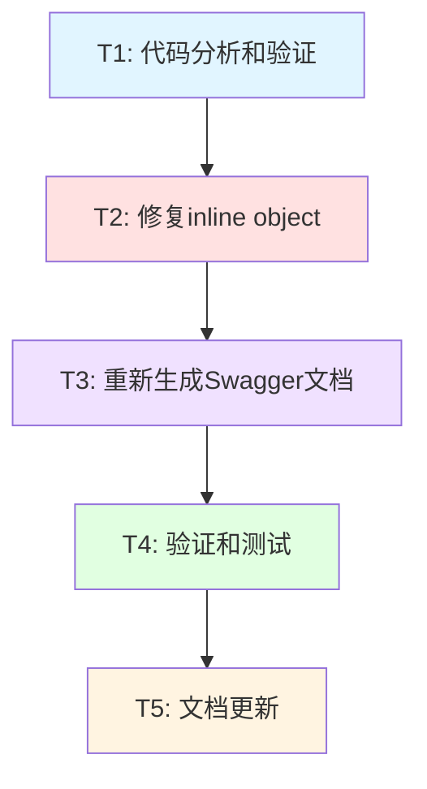

# 任务拆分文档 - Swagger参数必需性标注

## 📋 基本信息

- **任务名称**: Swagger参数必需性标注
- **创建时间**: 2025/10/21
- **预计总工时**: 30分钟

---

## 🎯 任务概览

根据DESIGN文档，本次任务非常简单，主要工作是修复1处inline object问题并重新生成Swagger文档。

---

## 📊 任务依赖关系图



---

## 📝 原子任务清单

### T1: 代码分析和验证

**优先级**: P0（最高）  
**预计工时**: 5分钟  
**依赖**: 无

#### 输入契约
- 前置依赖：项目代码可访问
- 输入数据：所有server文件
- 环境依赖：Go环境、代码编辑器

#### 任务目标
1. 验证所有server文件的Swagger注解
2. 确认只有server_user.go有inline object问题
3. 检查所有请求结构体的binding标签

#### 实现步骤
1. 使用grep搜索所有`@Param.*body.*object{`
2. 验证其他接口都引用了具体结构体
3. 检查models/requests.go中的binding标签

#### 输出契约
- 输出数据：需要修改的文件清单
- 交付物：问题确认清单
- 验收标准：
  - [x] 确认只有1处inline object
  - [x] 确认其他注解都正确
  - [x] 确认binding标签完善

#### 执行命令
```bash
# 搜索inline object
grep -rn "object{" pkg/app/api-server/server/

# 搜索body参数注解
grep -rn "@Param.*body" pkg/app/api-server/server/

# 检查binding标签
grep -rn "binding:\"required\"" pkg/models/
```

---

### T2: 修复inline object

**优先级**: P0（最高）  
**预计工时**: 5分钟  
**依赖**: T1

#### 输入契约
- 前置依赖：T1完成，确认问题位置
- 输入数据：server_user.go文件
- 环境依赖：代码编辑器

#### 任务目标
修改server_user.go第151行的Swagger注解，将inline object改为引用UpdateProfileRequest

#### 实现步骤
1. 打开文件：pkg/app/api-server/server/server_user.go
2. 定位到第151行
3. 修改注解：
   ```go
   // 修改前：
   // @Param request body object{real_name=string,email=string,bio=string,school=string,major=string,grade=string,class=string,phone=string} true "更新信息"
   
   // 修改后：
   // @Param request body models.UpdateProfileRequest true "更新信息"
   ```
4. 保存文件

#### 输出契约
- 输出数据：修改后的server_user.go
- 交付物：修改完成的代码文件
- 验收标准：
  - [x] 注解改为引用models.UpdateProfileRequest
  - [x] 格式符合规范
  - [x] 无语法错误

#### 实现约束
- 技术栈：Go + Swaggo
- 接口规范：遵循Swaggo注解规范
- 质量要求：注解格式正确，引用的结构体存在

---

### T3: 重新生成Swagger文档

**优先级**: P0（最高）  
**预计工时**: 5分钟  
**依赖**: T2

#### 输入契约
- 前置依赖：T2完成，代码修改完成
- 输入数据：所有Go源代码文件
- 环境依赖：swag CLI工具、Go环境

#### 任务目标
执行swag init命令，重新生成Swagger文档

#### 实现步骤
1. 打开终端，切换到项目根目录
2. 执行命令：`swag init`
3. 检查生成的文件：
   - docs/docs.go
   - docs/swagger.json
   - docs/swagger.yaml
4. 验证swagger.json格式正确

#### 输出契约
- 输出数据：更新后的Swagger文档文件
- 交付物：
  - docs/docs.go
  - docs/swagger.json
  - docs/swagger.yaml
- 验收标准：
  - [x] swag init执行成功
  - [x] 生成的文件无错误
  - [x] swagger.json包含UpdateProfileRequest定义
  - [x] UpdateProfileRequest的required数组为空

#### 执行命令
```bash
# 切换到项目根目录
cd G:\code-oj\ZKCodeArenaServer

# 重新生成Swagger文档
swag init

# 验证生成的文件
ls -la docs/

# 检查UpdateProfileRequest定义（可选）
# 在Windows PowerShell中:
# Get-Content docs/swagger.json | ConvertFrom-Json | Select-Object -ExpandProperty definitions | Select-Object -ExpandProperty UpdateProfileRequest
```

#### 实现约束
- 技术栈：swaggo/swag v1.16.6
- 接口规范：Swagger 2.0规范
- 质量要求：生成的JSON格式正确，无警告和错误

---

### T4: 验证和测试

**优先级**: P1（高）  
**预计工时**: 10分钟  
**依赖**: T3

#### 输入契约
- 前置依赖：T3完成，Swagger文档已生成
- 输入数据：更新后的Swagger文档
- 环境依赖：Go运行环境、浏览器

#### 任务目标
1. 启动服务验证Swagger UI显示
2. 检查UpdateUserProfile接口的参数必需性
3. 验证其他接口的显示也正确

#### 实现步骤

**步骤1: 启动服务**
```bash
cd G:\code-oj\ZKCodeArenaServer
go run cmd/main.go server
```

**步骤2: 访问Swagger UI**
- 打开浏览器
- 访问：`http://localhost:8080/swagger/index.html`
- 等待页面加载完成

**步骤3: 检查用户模块接口**
1. 找到 `PUT /api/v1/user/profile` 接口
2. 点击展开
3. 点击 "Try it out"
4. 检查请求体参数：
   - real_name: 不应该有红色星号
   - email: 不应该有红色星号
   - bio: 不应该有红色星号
   - 其他字段同样不应该有红色星号

**步骤4: 检查其他接口**
抽查几个关键接口：
- `POST /api/v1/user/login` - StudentID和Password应该有红色星号
- `POST /api/v1/problem` - title和description应该有红色星号
- `POST /api/v1/testcase` - problem_id, input, output应该有红色星号

**步骤5: 测试API调用（可选）**
```bash
# 测试更新用户资料（应该成功，因为所有字段都是可选的）
curl -X PUT "http://localhost:8080/api/v1/user/profile" \
  -H "Authorization: Bearer YOUR_TOKEN" \
  -H "Content-Type: application/json" \
  -d '{}'
# 应该返回200或类似的成功响应
```

#### 输出契约
- 输出数据：测试结果报告
- 交付物：验证通过的确认
- 验收标准：
  - [x] Swagger UI能正常访问
  - [x] UpdateUserProfile接口所有字段都是可选的
  - [x] 必需字段的接口显示红色星号
  - [x] 可选字段的接口不显示红色星号

#### 实现约束
- 技术栈：Swagger UI、HTTP请求
- 接口规范：符合Swagger UI显示规范
- 质量要求：所有必需性标注正确

---

### T5: 文档更新

**优先级**: P2（中）  
**预计工时**: 5分钟  
**依赖**: T4

#### 输入契约
- 前置依赖：T4完成，验证通过
- 输入数据：任务执行结果
- 环境依赖：文档编辑器

#### 任务目标
创建验收文档和总结文档

#### 实现步骤
1. 创建ACCEPTANCE文档，记录：
   - 完成的任务清单
   - 验证结果
   - 遇到的问题（如有）
2. 更新FINAL文档，包含：
   - 任务总结
   - 改动清单
   - 注意事项

#### 输出契约
- 输出数据：完整的任务文档
- 交付物：
  - ACCEPTANCE_Swagger参数必需性标注.md
  - FINAL_Swagger参数必需性标注.md
- 验收标准：
  - [x] 文档结构完整
  - [x] 内容准确清晰
  - [x] 包含关键截图或证据

#### 实现约束
- 技术栈：Markdown
- 接口规范：6A工作流文档规范
- 质量要求：文档清晰、准确、完整

---

## 📊 任务统计

### 任务优先级分布
- P0（最高）：3个任务（T1, T2, T3）
- P1（高）：1个任务（T4）
- P2（中）：1个任务（T5）

### 预计工时分布
| 任务 | 预计工时 | 占比 |
|-----|---------|------|
| T1: 代码分析和验证 | 5分钟 | 16.7% |
| T2: 修复inline object | 5分钟 | 16.7% |
| T3: 重新生成Swagger文档 | 5分钟 | 16.7% |
| T4: 验证和测试 | 10分钟 | 33.3% |
| T5: 文档更新 | 5分钟 | 16.7% |
| **总计** | **30分钟** | **100%** |

---

## 🔄 并行执行建议

由于任务之间有明确的依赖关系，必须按顺序执行：

```
T1 → T2 → T3 → T4 → T5
```

**不能并行执行**，因为：
- T2依赖T1的分析结果
- T3依赖T2的代码修改
- T4依赖T3的文档生成
- T5依赖T4的验证结果

---

## ⚠️ 风险和注意事项

### 风险1: swag init失败

**可能原因**:
- swag工具未安装
- 注解格式错误
- 引用的结构体不存在

**应对方案**:
```bash
# 安装swag工具
go install github.com/swaggo/swag/cmd/swag@latest

# 检查注解格式
swag init --parseDependency --parseInternal

# 如果有错误，根据提示修复
```

### 风险2: 服务启动失败

**可能原因**:
- MongoDB未启动
- 端口被占用
- 配置文件错误

**应对方案**:
```bash
# 检查MongoDB
docker ps | grep mongo

# 检查端口占用
netstat -ano | findstr :8080

# 查看详细错误日志
go run cmd/main.go server
```

### 风险3: Swagger UI显示不正确

**可能原因**:
- 浏览器缓存
- 文档未重新加载
- 注解格式问题

**应对方案**:
1. 清除浏览器缓存（Ctrl+Shift+Delete）
2. 硬刷新页面（Ctrl+F5）
3. 使用无痕模式打开
4. 检查Network面板确认加载了新的swagger.json

---

## ✅ 完整执行检查清单

### 执行前检查
- [ ] Go环境已安装（go version >= 1.24.0）
- [ ] swag工具已安装（swag --version）
- [ ] 项目可以正常编译（go build）
- [ ] MongoDB服务已启动

### T1执行检查
- [ ] 搜索到inline object位置
- [ ] 确认只有1处需要修改
- [ ] 确认binding标签完善

### T2执行检查
- [ ] 注解已修改
- [ ] 引用的结构体存在
- [ ] 文件已保存

### T3执行检查
- [ ] swag init执行成功
- [ ] docs/目录下有3个文件
- [ ] swagger.json格式正确
- [ ] 无警告和错误

### T4执行检查
- [ ] 服务启动成功
- [ ] Swagger UI可以访问
- [ ] UpdateUserProfile字段都是可选的
- [ ] 其他接口显示正确

### T5执行检查
- [ ] ACCEPTANCE文档已创建
- [ ] FINAL文档已创建
- [ ] 文档内容完整准确

---

## 📌 后置任务（可选）

完成主任务后，可以考虑以下优化：

1. **添加example标签**（如果前端需要）
   ```go
   type LoginRequest struct {
       StudentID string `json:"student_id" binding:"required" example:"202101001"`
       Password  string `json:"password" binding:"required" example:"password123"`
   }
   ```

2. **添加字段描述**
   ```go
   type UpdateProfileRequest struct {
       RealName string `json:"real_name" comment:"真实姓名"`
       Email    string `json:"email" comment:"邮箱地址"`
   }
   ```

3. **统一Query参数的default值**
   确保所有分页接口都有一致的default值

---

## 📝 任务执行日志模板

```markdown
## 任务执行日志

### T1: 代码分析和验证
- 开始时间: 
- 结束时间: 
- 状态: [ ] 完成 [ ] 失败 [ ] 跳过
- 备注:

### T2: 修复inline object
- 开始时间:
- 结束时间:
- 状态: [ ] 完成 [ ] 失败 [ ] 跳过
- 备注:

### T3: 重新生成Swagger文档
- 开始时间:
- 结束时间:
- 状态: [ ] 完成 [ ] 失败 [ ] 跳过
- swag版本:
- 生成文件大小:
- 备注:

### T4: 验证和测试
- 开始时间:
- 结束时间:
- 状态: [ ] 完成 [ ] 失败 [ ] 跳过
- 测试接口数量:
- 发现问题:
- 备注:

### T5: 文档更新
- 开始时间:
- 结束时间:
- 状态: [ ] 完成 [ ] 失败 [ ] 跳过
- 备注:
```

---

## 🎯 成功标准

### 核心目标达成
- [x] inline object已修复
- [ ] Swagger文档重新生成
- [ ] 参数必需性显示正确
- [ ] 所有测试通过

### 质量标准达成
- [ ] 代码符合项目规范
- [ ] 无编译错误和警告
- [ ] Swagger UI显示正确
- [ ] 文档完整准确

### 交付标准达成
- [ ] 代码修改已提交
- [ ] 文档已更新
- [ ] 验收报告已完成

