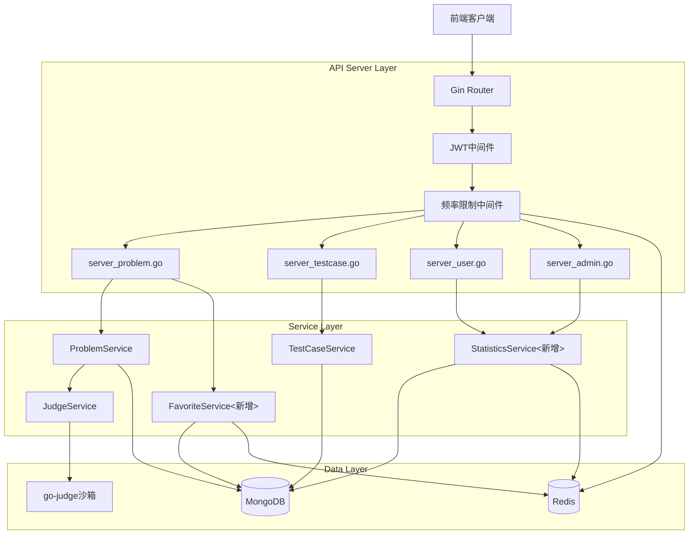
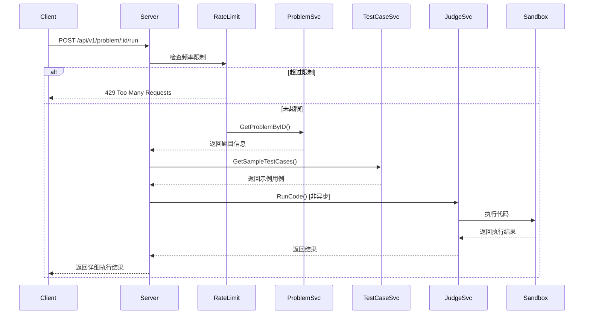
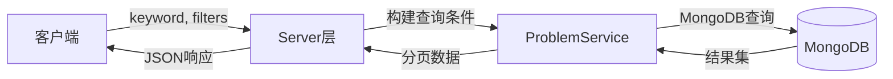
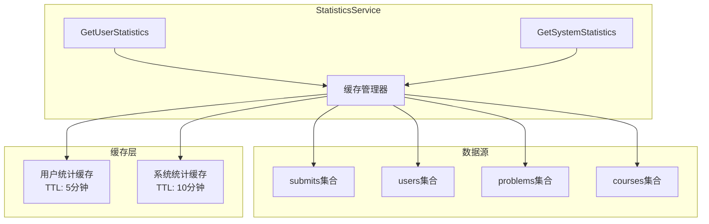
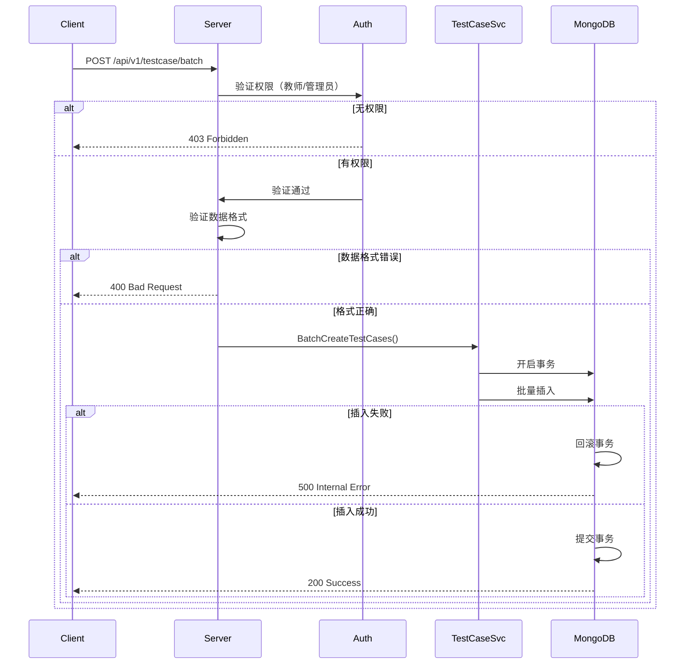
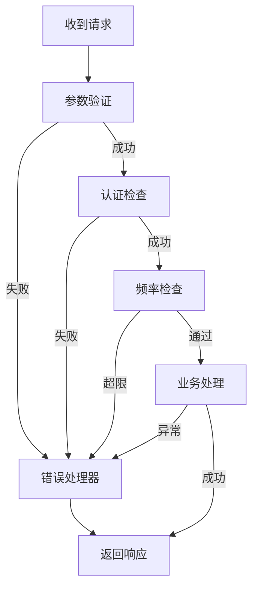
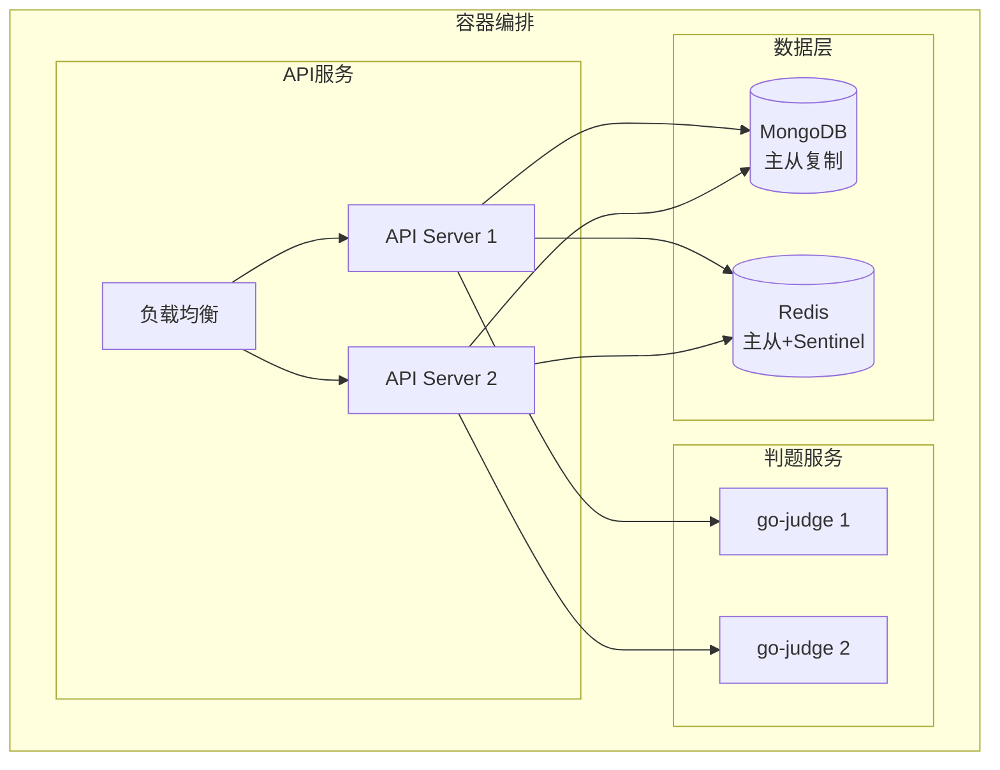

# 补充功能开发 - 架构设计文档

## 📋 文档信息
- **任务名称**: v1.0补充功能开发
- **创建时间**: 2025-10-06
- **版本**: v1.0
- **基于文档**: CONSENSUS_补充功能开发.md

---

## 1. 整体架构设计

### 1.1 系统分层架构



### 1.2 新增组件说明

| 组件 | 文件位置 | 职责 |
|-----|---------|------|
| **FavoriteService** | `pkg/app/api-server/service/service_favorite.go` | 管理题目收藏 |
| **StatisticsService** | `pkg/app/api-server/service/service_statistics.go` | 计算统计数据 |
| **RateLimitMiddleware** | `pkg/utils/middleware/rate_limit.go` | 频率限制 |
| **ProblemFavorite模型** | `pkg/models/favorite.go` | 收藏数据模型 |

---

## 2. 模块设计

### 2.1 代码运行测试模块

#### 架构图


#### 关键方法

**Server层**: `server_problem.go`
```go
// RunCode 运行代码（非提交）
func (s *Server) RunCode(c *gin.Context) {
    // 1. 获取参数
    // 2. 检查频率限制（中间件已处理）
    // 3. 获取题目信息
    // 4. 获取示例测试用例
    // 5. 调用判题服务（同步执行）
    // 6. 返回详细结果
}
```

**Service层**: `service_problem.go` (扩展)
```go
// RunCode 运行代码（仅示例用例）
func (s *ProblemService) RunCode(
    ctx context.Context,
    problemID primitive.ObjectID,
    code string,
    language string,
) (*RunResult, error)
```

**频率限制**: `middleware/rate_limit.go` (新增)
```go
// RateLimitMiddleware 频率限制中间件
func RateLimitMiddleware(redisClient *redis.Client) gin.HandlerFunc {
    // 使用滑动窗口算法
    // Key: rate_limit:run:{user_id}:{problem_id}
    // 限制: 每分钟3次
}
```

---

### 2.2 题目搜索模块

#### 数据流图


#### MongoDB查询设计

**索引**:
```javascript
db.problems.createIndex({ "title": "text", "description": "text" })
db.problems.createIndex({ "difficulty": 1 })
db.problems.createIndex({ "tags": 1 })
db.problems.createIndex({ "created_at": -1 })
```

**查询示例**:
```go
filter := bson.M{
    "is_public": true,
    "status": models.StatusPublished,
}

// 关键词搜索
if keyword != "" {
    filter["$or"] = []bson.M{
        {"title": bson.M{"$regex": keyword, "$options": "i"}},
        {"description": bson.M{"$regex": keyword, "$options": "i"}},
    }
}

// 难度筛选
if difficulty != "" {
    filter["difficulty"] = difficulty
}

// 标签筛选
if len(tags) > 0 {
    filter["tags"] = bson.M{"$in": tags}
}
```

---

### 2.3 收藏功能模块

#### 数据模型
```go
// models/favorite.go (新增文件)

package models

import (
    "time"
    "go.mongodb.org/mongo-driver/bson/primitive"
)

// ProblemFavorite 题目收藏
type ProblemFavorite struct {
    ID        primitive.ObjectID `bson:"_id,omitempty" json:"id"`
    UserID    primitive.ObjectID `bson:"user_id" json:"user_id" binding:"required"`
    ProblemID primitive.ObjectID `bson:"problem_id" json:"problem_id" binding:"required"`
    CreatedAt time.Time          `bson:"created_at" json:"created_at"`
}

// FavoriteResponse 收藏响应
type FavoriteResponse struct {
    IsFavorited bool   `json:"is_favorited"`
    Message     string `json:"message"`
}

// FavoriteListResponse 收藏列表响应
type FavoriteListResponse struct {
    Problems  []Problem `json:"problems"`
    Total     int64     `json:"total"`
    Page      int       `json:"page"`
    PageSize  int       `json:"page_size"`
    TotalPage int64     `json:"total_page"`
}
```

#### Service设计
```go
// service/service_favorite.go (新增文件)

type FavoriteService struct {
    redisClient *redis.Client
}

// ToggleFavorite 收藏/取消收藏
func (s *FavoriteService) ToggleFavorite(
    ctx context.Context,
    userID, problemID primitive.ObjectID,
) (bool, error)

// IsFavorited 检查是否已收藏
func (s *FavoriteService) IsFavorited(
    ctx context.Context,
    userID, problemID primitive.ObjectID,
) (bool, error)

// GetUserFavorites 获取用户收藏列表
func (s *FavoriteService) GetUserFavorites(
    ctx context.Context,
    userID primitive.ObjectID,
    page, pageSize int,
) (*models.FavoriteListResponse, error)
```

#### 缓存策略
```
Key: favorite:{user_id}:{problem_id}
Value: 1 (已收藏) / 0 (未收藏)
TTL: 1小时
```

---

### 2.4 统计功能模块

#### 组件架构


#### 用户统计聚合管道
```go
// MongoDB Aggregation Pipeline
pipeline := []bson.M{
    // 1. 匹配用户提交
    {"$match": bson.M{"user_id": userID}},
    
    // 2. 关联题目信息
    {"$lookup": bson.M{
        "from":         "problems",
        "localField":   "problem_id",
        "foreignField": "_id",
        "as":           "problem",
    }},
    {"$unwind": "$problem"},
    
    // 3. 分组统计
    {"$group": bson.M{
        "_id": bson.M{
            "difficulty": "$problem.difficulty",
            "status":     "$status",
        },
        "count": bson.M{"$sum": 1},
    }},
    
    // 4. 格式化输出
    {"$group": bson.M{
        "_id": "$_id.difficulty",
        "total": bson.M{"$sum": "$count"},
        "ac_count": bson.M{
            "$sum": bson.M{
                "$cond": []interface{}{
                    bson.M{"$eq": []interface{}{"$_id.status", "accepted"}},
                    "$count",
                    0,
                },
            },
        },
    }},
}
```

---

### 2.5 批量导入测试用例模块

#### 处理流程


#### 事务处理
```go
func (s *TestCaseService) BatchCreateTestCases(
    ctx context.Context,
    problemID primitive.ObjectID,
    testCases []TestCaseInput,
) (*BatchResult, error) {
    // 1. 开启事务
    session, err := s.client.StartSession()
    defer session.EndSession(ctx)
    
    // 2. 事务回调
    _, err = session.WithTransaction(ctx, func(sc mongo.SessionContext) (interface{}, error) {
        // 批量插入
        for _, tc := range testCases {
            // 插入单个测试用例
        }
        return nil, nil
    })
    
    return result, err
}
```

---

## 3. 数据模型设计

### 3.1 新增Collection

#### problem_favorites
```javascript
{
  "_id": ObjectId,
  "user_id": ObjectId,       // 用户ID
  "problem_id": ObjectId,    // 题目ID
  "created_at": ISODate      // 收藏时间
}

// 索引
db.problem_favorites.createIndex({ "user_id": 1, "problem_id": 1 }, { unique: true })
db.problem_favorites.createIndex({ "user_id": 1, "created_at": -1 })
```

### 3.2 扩展现有Model

#### Problem (扩展)
```go
// 添加字段到响应结构
type ProblemDetailResponse struct {
    models.Problem
    IsFavorited bool `json:"is_favorited"` // 当前用户是否收藏
}
```

---

## 4. 接口契约定义

### 4.1 代码运行测试

```
POST /api/v1/problem/:id/run
认证: 必需
频率限制: 每用户每题每分钟3次

请求头:
Authorization: Bearer {token}

请求体:
{
  "code": "string",           // 用户代码
  "language": "java|cpp|..."  // 编程语言
}

响应 200:
{
  "code": 200,
  "data": {
    "results": [
      {
        "test_case_id": "string",
        "status": "string",        // accepted, wrong_answer, etc.
        "time_used": 100,          // ms
        "memory_used": 1024,       // KB
        "input": "string",         // 仅示例用例返回
        "output": "string",        // 实际输出
        "expected": "string",      // 期望输出
        "error": "string"          // 错误信息
      }
    ],
    "summary": {
      "total": 3,
      "passed": 2,
      "failed": 1
    }
  }
}

响应 429:
{
  "code": 429,
  "message": "运行次数过多，请稍后再试"
}
```

### 4.2 题目搜索

```
GET /api/v1/problem/search
认证: 可选
查询参数:
  - keyword: string (可选) - 关键词
  - difficulty: string (可选) - easy|medium|hard
  - tags: string (可选) - 逗号分隔，如 "算法,数据结构"
  - page: int (默认1)
  - page_size: int (默认10, 最大100)

响应 200:
{
  "code": 200,
  "data": {
    "problems": [...],
    "total": 100,
    "page": 1,
    "page_size": 10,
    "total_page": 10
  }
}
```

### 4.3 收藏题目

```
POST /api/v1/problem/:id/favorite
认证: 必需
功能: Toggle收藏状态

响应 200:
{
  "code": 200,
  "data": {
    "is_favorited": true,
    "message": "收藏成功"
  }
}
```

```
GET /api/v1/user/favorites
认证: 必需
查询参数:
  - page: int (默认1)
  - page_size: int (默认10)

响应 200:
{
  "code": 200,
  "data": {
    "problems": [...],
    "total": 25,
    "page": 1,
    "page_size": 10,
    "total_page": 3
  }
}
```

### 4.4 用户统计

```
GET /api/v1/user/statistics
或
GET /api/v1/user/:id/statistics
认证: 必需

响应 200:
{
  "code": 200,
  "data": {
    "user_id": "string",
    "total_submit": 150,
    "total_ac": 80,
    "ac_rate": 53.3,
    "solved_problems": 47,
    "difficulty_stats": {
      "easy": {...},
      "medium": {...},
      "hard": {...}
    },
    "recent_submits": [...]
  }
}
```

### 4.5 批量导入

```
POST /api/v1/testcase/batch
认证: 必需（教师/管理员）
请求体:
{
  "problem_id": "string",
  "test_cases": [
    {
      "input": "string",
      "output": "string",
      "is_sample": false,
      "score": 10
    }
  ]
}

限制: 单次最多100个

响应 200:
{
  "code": 200,
  "data": {
    "success_count": 10,
    "failed_count": 0
  }
}
```

### 4.6 系统统计

```
GET /api/v1/admin/system/stats
认证: 必需（仅管理员）

响应 200:
{
  "code": 200,
  "data": {
    "users": {...},
    "problems": {...},
    "submits": {...},
    "courses": {...},
    "system": {...}
  }
}
```

---

## 5. 异常处理策略

### 5.1 错误码定义

| 错误码 | 说明 | 场景 |
|-------|------|------|
| 400 | 请求参数错误 | 参数格式不正确 |
| 401 | 未认证 | Token无效或过期 |
| 403 | 权限不足 | 非教师/管理员访问受限接口 |
| 404 | 资源不存在 | 题目ID不存在 |
| 429 | 请求过于频繁 | 超过频率限制 |
| 500 | 服务器错误 | 判题系统异常 |

### 5.2 异常处理流程



---

## 6. 性能优化设计

### 6.1 缓存策略

| 数据类型 | 缓存Key | TTL | 更新策略 |
|---------|--------|-----|---------|
| 用户统计 | `stats:user:{user_id}` | 5分钟 | 提交成功后失效 |
| 系统统计 | `stats:system` | 10分钟 | 定时刷新 |
| 收藏状态 | `favorite:{user_id}:{problem_id}` | 1小时 | 收藏操作后更新 |
| 频率限制 | `rate_limit:run:{user_id}:{problem_id}` | 1分钟 | 滑动窗口 |

### 6.2 数据库优化

**建议索引**:
```javascript
// problems
db.problems.createIndex({ "title": 1 })
db.problems.createIndex({ "difficulty": 1, "created_at": -1 })
db.problems.createIndex({ "tags": 1 })

// problem_favorites
db.problem_favorites.createIndex({ "user_id": 1, "created_at": -1 })
db.problem_favorites.createIndex({ "user_id": 1, "problem_id": 1 }, { unique: true })

// submits
db.submits.createIndex({ "user_id": 1, "created_at": -1 })
db.submits.createIndex({ "user_id": 1, "status": 1 })
```

### 6.3 查询优化

- 统计查询使用聚合管道
- 分页使用 `skip` + `limit`
- 避免全表扫描，使用索引
- 大数据量查询分批处理

---

## 7. 安全设计

### 7.1 频率限制算法（滑动窗口）

```go
func checkRateLimit(
    redis *redis.Client,
    key string,
    limit int,
    window time.Duration,
) (bool, error) {
    now := time.Now().Unix()
    windowStart := now - int64(window.Seconds())
    
    pipe := redis.Pipeline()
    
    // 1. 删除窗口外的记录
    pipe.ZRemRangeByScore(ctx, key, "0", strconv.FormatInt(windowStart, 10))
    
    // 2. 获取当前窗口内的请求数
    pipe.ZCard(ctx, key)
    
    // 3. 添加当前请求
    pipe.ZAdd(ctx, key, &redis.Z{Score: float64(now), Member: now})
    
    // 4. 设置过期时间
    pipe.Expire(ctx, key, window)
    
    results, err := pipe.Exec(ctx)
    if err != nil {
        return false, err
    }
    
    count := results[1].(*redis.IntCmd).Val()
    return count < int64(limit), nil
}
```

### 7.2 权限控制

```go
// 中间件：教师权限
func RequireTeacher() gin.HandlerFunc {
    return func(c *gin.Context) {
        role := c.GetString("role")
        if role != "teacher" && role != "admin" {
            utils.ForbiddenResponse(c, "需要教师权限")
            c.Abort()
            return
        }
        c.Next()
    }
}

// 中间件：管理员权限
func RequireAdmin() gin.HandlerFunc {
    return func(c *gin.Context) {
        role := c.GetString("role")
        if role != "admin" {
            utils.ForbiddenResponse(c, "需要管理员权限")
            c.Abort()
            return
        }
        c.Next()
    }
}
```

---

## 8. 部署架构



---

## 9. 监控与日志

### 9.1 关键指标

| 指标 | 类型 | 阈值 | 说明 |
|-----|------|------|------|
| 代码运行响应时间 | 平均值 | < 5秒 | 超过需优化 |
| 搜索接口响应时间 | P95 | < 500ms | - |
| 统计接口响应时间 | P95 | < 1秒 | - |
| 频率限制触发率 | 比例 | < 5% | 过高需调整限制 |
| 缓存命中率 | 比例 | > 80% | - |

### 9.2 日志记录

```go
// 代码运行日志
log.Info().
    Str("user_id", userID).
    Str("problem_id", problemID).
    Str("language", language).
    Int("test_cases", len(results)).
    Int("passed", passed).
    Int("time_used", totalTime).
    Msg("Code run completed")

// 频率限制日志
log.Warn().
    Str("user_id", userID).
    Str("endpoint", "/problem/:id/run").
    Msg("Rate limit exceeded")
```

---

## 10. 质量门控

### 10.1 架构验证

- [x] 架构图清晰准确
- [x] 接口定义完整
- [x] 与现有系统无冲突
- [x] 设计可行性已验证

### 10.2 技术验证

- [ ] 频率限制算法可行性验证
- [ ] 统计查询性能测试
- [ ] 缓存失效策略验证
- [ ] 并发场景测试

---

**文档状态**: ✅ 架构设计完成

**下一步**: 生成 `TASK_补充功能开发.md` (任务拆分)

