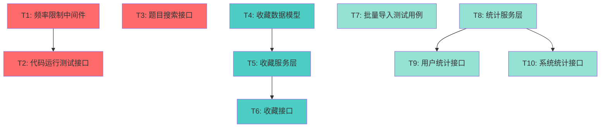

# 补充功能开发 - 任务拆分文档

## 📋 文档信息
- **任务名称**: v1.0补充功能开发
- **创建时间**: 2025-10-06
- **版本**: v1.0
- **基于文档**: DESIGN_补充功能开发.md

---

## 1. 任务依赖关系图



**图例**:
- 🔴 红色: 中优先级（代码运行、搜索）
- 🔵 青色: 低优先级（收藏）
- 🟢 绿色: 低优先级（统计、批量导入）

---

## 2. 任务清单

| ID | 任务名称 | 优先级 | 工作量 | 依赖 | 状态 |
|----|---------|--------|--------|------|------|
| T1 | 频率限制中间件 | 🔴高 | 0.5人日 | 无 | ⏸️ 待开始 |
| T2 | 代码运行测试接口 | 🔴高 | 1人日 | T1 | ⏸️ 待开始 |
| T3 | 题目搜索接口 | 🔴高 | 0.5人日 | 无 | ⏸️ 待开始 |
| T4 | 收藏数据模型 | 🟡中 | 0.3人日 | 无 | ⏸️ 待开始 |
| T5 | 收藏服务层 | 🟡中 | 0.5人日 | T4 | ⏸️ 待开始 |
| T6 | 收藏接口 | 🟡中 | 0.3人日 | T5 | ⏸️ 待开始 |
| T7 | 批量导入测试用例 | 🟢低 | 0.5人日 | 无 | ⏸️ 待开始 |
| T8 | 统计服务层 | 🟢低 | 1人日 | 无 | ⏸️ 待开始 |
| T9 | 用户统计接口 | 🟢低 | 0.3人日 | T8 | ⏸️ 待开始 |
| T10 | 系统统计接口 | 🟢低 | 0.3人日 | T8 | ⏸️ 待开始 |
| **总计** | | | **5.2人日** | | |

---

## 3. 详细任务定义

### T1: 频率限制中间件

#### 输入契约
- **前置依赖**: 
  - Redis 连接可用
  - JWT 中间件已配置（需要获取 user_id）
  
- **输入数据**:
  - 用户ID（从JWT token获取）
  - 请求路径和参数
  
- **环境依赖**:
  - Redis 客户端
  - Gin 框架

#### 输出契约
- **交付物**:
  - 文件: `pkg/utils/middleware/rate_limit.go`
  - 中间件函数: `RateLimitMiddleware(key string, limit int, window time.Duration)`
  
- **验收标准**:
  - [x] 实现滑动窗口算法
  - [x] 限制规则可配置（key, limit, window）
  - [x] 超限返回 429 状态码
  - [x] Redis 故障降级（允许通过）
  - [x] 单元测试覆盖率 > 80%

#### 实现约束
- **技术栈**: Golang, Redis, Gin
- **代码规范**: 遵循项目现有风格
- **性能要求**: 中间件响应 < 10ms
- **错误处理**: Redis 连接失败不影响主流程

#### 接口规范
```go
// RateLimitMiddleware 创建频率限制中间件
// key: Redis key前缀，如 "rate_limit:run"
// limit: 时间窗口内最大请求数
// window: 时间窗口大小
func RateLimitMiddleware(
    redis *redis.Client,
    key string,
    limit int,
    window time.Duration,
) gin.HandlerFunc

// 使用示例
router.POST("/problem/:id/run",
    middleware.JWTMiddleware(),
    middleware.RateLimitMiddleware(
        redisClient,
        "rate_limit:run",
        3,
        time.Minute,
    ),
    handler.RunCode,
)
```

---

### T2: 代码运行测试接口

#### 输入契约
- **前置依赖**:
  - T1 完成（频率限制中间件）
  - JudgeService 可用
  - TestCaseService 可用
  
- **输入数据**:
  - 题目ID（路径参数）
  - 用户代码和语言（请求体）
  - 用户ID（从JWT获取）

#### 输出契约
- **交付物**:
  - `pkg/app/api-server/server/server_problem.go` - 添加 `RunCode` 方法
  - `pkg/app/api-server/service/service_problem.go` - 添加 `RunCode` 方法
  
- **验收标准**:
  - [x] 只运行示例测试用例（is_sample=true）
  - [x] 不创建Submit记录
  - [x] 不更新题目统计
  - [x] 返回详细执行结果（输入、输出、期望）
  - [x] 频率限制生效（每题每分钟3次）
  - [x] 超时控制（单次总时长 ≤ 30秒）
  - [x] 错误处理完善

#### 实现约束
- **技术栈**: 复用现有 JudgeService
- **判题方式**: 同步执行（不入队列）
- **超时设置**: 30秒总超时
- **频率限制**: 每用户每题每分钟3次

#### 接口规范
```go
// Server层
func (s *Server) RunCode(c *gin.Context)

// Service层
func (s *ProblemService) RunCode(
    ctx context.Context,
    problemID primitive.ObjectID,
    code string,
    language string,
) (*RunCodeResult, error)

// 返回结构
type RunCodeResult struct {
    Results []TestResult `json:"results"`
    Summary struct {
        Total  int `json:"total"`
        Passed int `json:"passed"`
        Failed int `json:"failed"`
    } `json:"summary"`
}
```

#### 测试用例
1. 正常运行成功
2. 代码编译错误
3. 运行时错误
4. 超过频率限制
5. 题目不存在
6. 无示例测试用例

---

### T3: 题目搜索接口

#### 输入契约
- **前置依赖**:
  - MongoDB 索引已创建
  
- **输入数据**:
  - 关键词（可选）
  - 难度（可选）
  - 标签列表（可选）
  - 分页参数

#### 输出契约
- **交付物**:
  - `pkg/app/api-server/server/server_problem.go` - 添加 `SearchProblems` 方法
  - `pkg/app/api-server/service/service_problem.go` - 添加 `SearchProblems` 方法
  - MongoDB 索引定义脚本
  
- **验收标准**:
  - [x] 支持标题和描述模糊搜索
  - [x] 支持难度精确筛选
  - [x] 支持标签筛选（多选）
  - [x] 只返回公开且已发布的题目
  - [x] 分页功能正常
  - [x] 排序：按创建时间倒序
  - [x] 响应时间 < 500ms（正常数据量）

#### 实现约束
- **搜索方式**: MongoDB $regex（不区分大小写）
- **索引**: title, difficulty, tags, created_at
- **性能**: 响应时间 < 500ms

#### 接口规范
```go
// Server层
func (s *Server) SearchProblems(c *gin.Context)

// Service层
func (s *ProblemService) SearchProblems(
    ctx context.Context,
    keyword string,
    difficulty ProblemDifficulty,
    tags []string,
    page, pageSize int,
) ([]*ProblemList, int64, error)
```

#### MongoDB查询示例
```go
filter := bson.M{
    "is_public": true,
    "status": "published",
}

if keyword != "" {
    filter["$or"] = []bson.M{
        {"title": bson.M{"$regex": keyword, "$options": "i"}},
        {"description": bson.M{"$regex": keyword, "$options": "i"}},
    }
}

if difficulty != "" {
    filter["difficulty"] = difficulty
}

if len(tags) > 0 {
    filter["tags"] = bson.M{"$in": tags}
}
```

---

### T4: 收藏数据模型

#### 输入契约
- **前置依赖**: 无
  
- **输入数据**: 无

#### 输出契约
- **交付物**:
  - `pkg/models/favorite.go` - 新文件
  - MongoDB 索引定义
  
- **验收标准**:
  - [x] ProblemFavorite 模型定义
  - [x] 响应结构定义
  - [x] JSON 和 BSON 标签正确
  - [x] 复合唯一索引定义

#### 实现约束
- **命名规范**: 遵循项目约定
- **字段验证**: 使用 binding tags

#### 数据模型
```go
// ProblemFavorite 题目收藏
type ProblemFavorite struct {
    ID        primitive.ObjectID `bson:"_id,omitempty" json:"id"`
    UserID    primitive.ObjectID `bson:"user_id" json:"user_id" binding:"required"`
    ProblemID primitive.ObjectID `bson:"problem_id" json:"problem_id" binding:"required"`
    CreatedAt time.Time          `bson:"created_at" json:"created_at"`
}

// 索引
// {"user_id": 1, "problem_id": 1} - unique
// {"user_id": 1, "created_at": -1}
```

---

### T5: 收藏服务层

#### 输入契约
- **前置依赖**:
  - T4 完成（数据模型）
  - MongoDB 连接可用
  - Redis 连接可用
  
- **输入数据**:
  - 用户ID
  - 题目ID

#### 输出契约
- **交付物**:
  - `pkg/app/api-server/service/service_favorite.go` - 新文件
  - 服务注册到 `service.go`
  
- **验收标准**:
  - [x] ToggleFavorite 方法（收藏/取消）
  - [x] IsFavorited 方法（检查状态）
  - [x] GetUserFavorites 方法（收藏列表）
  - [x] Redis 缓存支持
  - [x] 错误处理完善

#### 实现约束
- **缓存策略**:
  - Key: `favorite:{user_id}:{problem_id}`
  - TTL: 1小时
  - 操作后更新缓存
- **数据库操作**: 使用 upsert 避免重复

#### 接口规范
```go
type FavoriteService struct {
    redisClient *redis.Client
}

func NewFavoriteService(redis *redis.Client) *FavoriteService

// ToggleFavorite 切换收藏状态
func (s *FavoriteService) ToggleFavorite(
    ctx context.Context,
    userID, problemID primitive.ObjectID,
) (bool, error) // 返回新状态

// IsFavorited 检查是否已收藏
func (s *FavoriteService) IsFavorited(
    ctx context.Context,
    userID, problemID primitive.ObjectID,
) (bool, error)

// GetUserFavorites 获取用户收藏列表
func (s *FavoriteService) GetUserFavorites(
    ctx context.Context,
    userID primitive.ObjectID,
    page, pageSize int,
) ([]*models.Problem, int64, error)
```

---

### T6: 收藏接口

#### 输入契约
- **前置依赖**:
  - T5 完成（服务层）
  - JWT 中间件
  
- **输入数据**:
  - 题目ID（路径参数）
  - 用户ID（从JWT获取）

#### 输出契约
- **交付物**:
  - `pkg/app/api-server/server/server_problem.go` - 添加方法
  - 路由注册
  
- **验收标准**:
  - [x] POST `/api/v1/problem/:id/favorite` - Toggle收藏
  - [x] GET `/api/v1/user/favorites` - 收藏列表
  - [x] DELETE `/api/v1/problem/:id/favorite` - 取消收藏
  - [x] 需要登录认证
  - [x] 题目不存在返回404
  - [x] 响应格式规范

#### 实现约束
- **认证**: 必需
- **权限**: 只能操作自己的收藏

#### 接口规范
```go
// Server层
func (s *Server) ToggleFavorite(c *gin.Context)
func (s *Server) GetUserFavorites(c *gin.Context)
func (s *Server) DeleteFavorite(c *gin.Context)

// 路由注册
problemGroup.POST("/:id/favorite", s.ToggleFavorite)
problemGroup.DELETE("/:id/favorite", s.DeleteFavorite)
userGroup.GET("/favorites", s.GetUserFavorites)
```

---

### T7: 批量导入测试用例

#### 输入契约
- **前置依赖**:
  - TestCaseService 存在
  - MongoDB 事务支持
  
- **输入数据**:
  - 题目ID
  - 测试用例列表（最多100个）

#### 输出契约
- **交付物**:
  - `pkg/app/api-server/server/server_testcase.go` - 添加 `BatchCreateTestCases`
  - `pkg/app/api-server/service/service_testcase.go` - 添加方法
  
- **验收标准**:
  - [x] 单次最多100个用例
  - [x] 事务处理（全部成功或全部失败）
  - [x] 权限检查（教师/管理员）
  - [x] 验证题目存在
  - [x] 验证必填字段
  - [x] 返回成功和失败统计

#### 实现约束
- **权限**: 教师或管理员
- **事务**: MongoDB 事务
- **限制**: 单次100个

#### 接口规范
```go
// Server层
func (s *Server) BatchCreateTestCases(c *gin.Context)

// Service层
func (s *TestCaseService) BatchCreateTestCases(
    ctx context.Context,
    problemID primitive.ObjectID,
    testCases []TestCaseInput,
) (*BatchResult, error)

type BatchResult struct {
    SuccessCount int `json:"success_count"`
    FailedCount  int `json:"failed_count"`
    FailedItems  []string `json:"failed_items"`
}
```

---

### T8: 统计服务层

#### 输入契约
- **前置依赖**:
  - MongoDB 聚合管道
  - Redis 缓存
  
- **输入数据**:
  - 用户ID（用户统计）
  - 无（系统统计）

#### 输出契约
- **交付物**:
  - `pkg/app/api-server/service/service_statistics.go` - 新文件
  - 服务注册到 `service.go`
  
- **验收标准**:
  - [x] GetUserStatistics 方法
  - [x] GetSystemStatistics 方法
  - [x] MongoDB 聚合查询
  - [x] Redis 缓存支持
  - [x] 缓存失效策略

#### 实现约束
- **缓存策略**:
  - 用户统计: TTL 5分钟
  - 系统统计: TTL 10分钟
- **查询优化**: 使用聚合管道

#### 接口规范
```go
type StatisticsService struct {
    redisClient *redis.Client
}

func NewStatisticsService(redis *redis.Client) *StatisticsService

// GetUserStatistics 获取用户统计
func (s *StatisticsService) GetUserStatistics(
    ctx context.Context,
    userID primitive.ObjectID,
) (*models.UserStatistics, error)

// GetSystemStatistics 获取系统统计
func (s *StatisticsService) GetSystemStatistics(
    ctx context.Context,
) (*models.SystemStatistics, error)
```

---

### T9: 用户统计接口

#### 输入契约
- **前置依赖**:
  - T8 完成（服务层）
  
- **输入数据**:
  - 用户ID（路径参数，可选）
  - 当前用户ID（从JWT获取）

#### 输出契约
- **交付物**:
  - `pkg/app/api-server/server/server_user.go` - 添加方法
  - 路由注册
  
- **验收标准**:
  - [x] GET `/api/v1/user/statistics` - 当前用户统计
  - [x] GET `/api/v1/user/:id/statistics` - 指定用户统计
  - [x] 权限控制（只能查看自己的或管理员）
  - [x] 缓存生效
  - [x] 响应时间 < 1秒

#### 实现约束
- **认证**: 必需
- **权限**: 查看自己 或 管理员查看任意

---

### T10: 系统统计接口

#### 输入契约
- **前置依赖**:
  - T8 完成（服务层）
  
- **输入数据**:
  - 用户角色（从JWT获取）

#### 输出契约
- **交付物**:
  - `pkg/app/api-server/server/server_admin.go` - 新文件或添加方法
  - 路由注册
  
- **验收标准**:
  - [x] GET `/api/v1/admin/system/stats` - 系统统计
  - [x] 仅管理员可访问
  - [x] 缓存生效
  - [x] 响应时间 < 1秒

#### 实现约束
- **认证**: 必需
- **权限**: 仅管理员

---

## 4. 实施顺序建议

### 阶段1: 高优先级功能（2人日）
**目标**: 完成代码运行和搜索功能

1. T1: 频率限制中间件（0.5人日）
2. T2: 代码运行测试接口（1人日）
3. T3: 题目搜索接口（0.5人日）

### 阶段2: 收藏功能（1人日）
**目标**: 完成题目收藏功能

4. T4: 收藏数据模型（0.3人日）
5. T5: 收藏服务层（0.5人日）
6. T6: 收藏接口（0.3人日）

### 阶段3: 扩展功能（2人日）
**目标**: 完成批量导入和统计功能

7. T7: 批量导入测试用例（0.5人日）
8. T8: 统计服务层（1人日）
9. T9: 用户统计接口（0.3人日）
10. T10: 系统统计接口（0.3人日）

**总工作量**: **5.2人日**

---

## 5. 质量门控

### 5.1 任务级别验收

每个任务完成后必须通过：
- [ ] 代码编译通过
- [ ] 单元测试通过（覆盖率 > 70%）
- [ ] 接口测试通过
- [ ] 代码审查通过
- [ ] 文档更新完成

### 5.2 阶段级别验收

每个阶段完成后必须通过：
- [ ] 所有任务验收标准满足
- [ ] 集成测试通过
- [ ] 性能测试达标
- [ ] 无阻塞性Bug

### 5.3 整体验收

全部任务完成后：
- [ ] 功能完整性测试通过
- [ ] 性能压测达标
- [ ] 安全测试通过
- [ ] 部署文档完整

---

## 6. 风险管理

### 6.1 技术风险

| 风险 | 任务 | 影响 | 应对措施 |
|-----|-----|------|---------|
| 频率限制Redis故障 | T1, T2 | 高 | 降级策略（允许通过） |
| 统计查询性能差 | T8 | 中 | 索引优化 + 缓存 |
| 批量导入超时 | T7 | 低 | 限制数量 + 异步处理 |

### 6.2 进度风险

| 风险 | 可能性 | 应对措施 |
|-----|--------|---------|
| 代码运行逻辑复杂 | 中 | 预留缓冲时间0.5人日 |
| 统计查询优化困难 | 中 | 分阶段实现，先功能后优化 |

---

## 7. 测试策略

### 7.1 单元测试

- 每个Service方法必须有单元测试
- 覆盖率要求 > 70%
- 测试框架: testing + testify

### 7.2 集成测试

- API接口测试（Postman/自动化脚本）
- Redis连接测试
- MongoDB事务测试

### 7.3 性能测试

- 代码运行接口: 并发100, 响应时间 < 5秒
- 搜索接口: 并发200, 响应时间 < 500ms
- 统计接口: 并发50, 响应时间 < 1秒

---

## 8. 文档清单

### 8.1 开发文档

- [x] CONSENSUS_补充功能开发.md
- [x] DESIGN_补充功能开发.md
- [x] TASK_补充功能开发.md
- [ ] ACCEPTANCE_补充功能开发.md (执行时创建)

### 8.2 技术文档

- [ ] API文档更新（Postman Collection）
- [ ] 数据库索引文档
- [ ] Redis key设计文档
- [ ] 部署文档更新

---

**文档状态**: ✅ 任务拆分完成

**下一步**: 进入阶段4: Approve (审批阶段)，等待人工审批后开始实施

