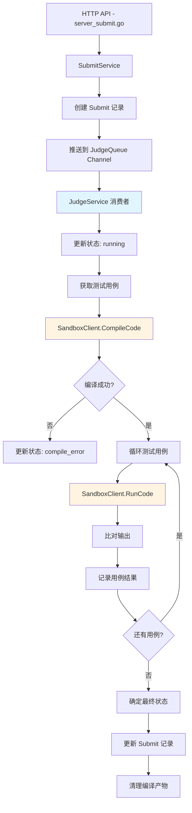

# 判题系统重构 - 对齐文档

## 📋 原始需求

对题目、测试用例、判题流程进行优化重构，实现以下目标：

1. **服务分层架构**：
   - 提交服务（Submit Service）
   - 判题服务（Judge Service）
   - 沙箱服务（Sandbox Service）

2. **沙箱服务封装**：
   - 封装 go-judge 为 SandboxClient/GoJudgeClient
   - 提供编译接口和运行接口
   - 定义生产和消费接口规范

3. **异步判题机制**：
   - 使用 Channel 实现异步判题
   - 对 Channel 中的数据和完成状态进行跟踪
   - 避免服务重启时未完成任务丢失

4. **判题服务职责**：
   - 管理消费者生命周期（调用消息队列接口）
   - 业务逻辑编排：消费者生命周期 + 判题主流程 + 沙箱调用

5. **多语言支持**：
   - 配置驱动的语言管理
   - 统一的编译-运行-判题流程

## 🔍 项目上下文分析

### 现有技术栈
- **语言**: Go 1.23+
- **框架**: Gin (HTTP 路由)
- **数据库**: MongoDB 4.4+
- **沙箱**: go-judge (http://localhost:5050)
- **部署**: Docker Compose

### 现有项目结构
```
pkg/
├── app/api-server/
│   ├── server/          # HTTP 路由处理层
│   │   ├── server_submit.go
│   │   ├── server_judge.go
│   │   └── server_problem.go
│   └── service/         # 业务逻辑层
│       ├── service_submit.go
│       ├── service_judge.go
│       └── service_problem.go
├── models/              # 数据模型
│   ├── submit.go
│   ├── problem.go
│   └── user.go
└── utils/               # 工具包
    ├── mongo.go
    └── middleware/
```

### 现有代码模式分析

#### 1. 当前提交流程（server_submit.go:96-118）
```go
// 异步评测 - 使用简单的 goroutine
go func() {
    result, err := s.svc.JudgeService.JudgeSubmit(ctx, submit, problem)
    // ... 更新提交记录
}()
```

**问题**：
- ❌ 无任务队列管理
- ❌ 无任务状态跟踪
- ❌ 服务重启任务丢失
- ❌ 无并发控制

#### 2. 当前判题服务（service_judge.go:100-158）
```go
func (s *JudgeService) JudgeSubmit(ctx context.Context, submit *models.Submit, problem *models.Problem) (*models.JudgeResult, error) {
    // 1. 获取测试用例（TODO: 未实现）
    testCases, err := s.getTestCases(ctx, problem.ID)
    
    // 2. 评测每个测试用例
    for _, testCase := range testCases {
        judgeResp, err := s.JudgeCode(ctx, submit.Code, string(submit.Language), testCase.Input, ...)
        // ...
    }
}
```

**问题**：
- ❌ 直接 HTTP 调用沙箱，未封装客户端
- ❌ 测试用例获取未实现
- ❌ 不支持配置驱动的多语言
- ❌ 与沙箱接口不匹配（go-judge 需要编译-运行两阶段）

#### 3. 当前沙箱调用（service_judge.go:47-98）
```go
func (s *JudgeService) JudgeCode(ctx context.Context, code, language, input string, timeLimit, memoryLimit int) (*JudgeResponse, error) {
    // 构建请求
    req := JudgeRequest{
        Code:        code,
        Language:    language,
        Input:       input,
        TimeLimit:   timeLimit,
        MemoryLimit: memoryLimit,
    }
    // 发送HTTP请求
    httpReq, err := http.NewRequestWithContext(ctx, conf.Config.Sandbox.Method, conf.Config.Sandbox.Url, bytes.NewBuffer(reqBody))
    // ...
}
```

**问题**：
- ❌ 请求格式与 go-judge API 不匹配
- ❌ 未按照编译-运行两阶段处理
- ❌ 未处理文件缓存（编译产物）

### 数据模型分析

#### Submit 模型（models/submit.go）
```go
type Submit struct {
    ID        primitive.ObjectID
    ProblemID primitive.ObjectID
    UserID    primitive.ObjectID
    Code      string
    Language  Language
    Status    SubmitStatus  // pending, running, accepted, wrong_answer, etc.
    Result    *JudgeResult
    CreatedAt time.Time
    UpdatedAt time.Time
}
```

#### Problem 模型（models/problem.go）
```go
type Problem struct {
    ID          primitive.ObjectID
    Title       string
    TimeLimit   int  // ms
    MemoryLimit int  // MB
    // ... 其他字段
}

type TestCase struct {
    ID        primitive.ObjectID
    ProblemID primitive.ObjectID
    Input     string
    Output    string
    IsSample  bool
    CreatedAt time.Time
}
```

**问题**：
- ⚠️ TestCase 独立存储，需要实现查询逻辑
- ⚠️ 时间限制单位为 ms，需转换为 go-judge 的纳秒

## 🎯 需求理解与边界确认

### 核心需求拆解

#### 1. 沙箱服务封装
**目标**：封装 go-judge REST API 为 Go 客户端

**接口规范**（基于沙箱使用指南.md）：
- `CompileCode(ctx, language, sourceCode) -> (executableFileId, error)`
- `RunCode(ctx, language, executableFileId, input) -> (output, time, memory, status, error)`
- `DeleteFile(ctx, fileId) -> error`

**技术约束**：
- 请求格式必须符合 go-judge `/run` 接口
- 支持文件缓存机制（编译产物）
- 支持配置驱动的语言参数

#### 2. 判题服务重构
**目标**：业务逻辑编排 + 消费者管理

**职责**：
- 管理判题任务队列（Channel）
- 启动/停止消费者 goroutine
- 编排判题流程：编译 -> 运行测试用例 -> 结果判断
- 调用沙箱客户端

**不包含**：
- ❌ 不负责 HTTP 路由处理（由 server 层负责）
- ❌ 不直接操作数据库（通过 service 层接口）

#### 3. 提交服务职责
**目标**：提交记录管理 + 任务入队

**职责**：
- 创建提交记录（状态：pending）
- 将任务推送到判题队列
- 提供提交记录查询接口

**不包含**：
- ❌ 不负责判题逻辑
- ❌ 不直接调用沙箱

#### 4. 异步判题与持久化
**目标**：使用 Channel + MongoDB 实现任务跟踪

**方案**：
- 使用 buffered channel 作为任务队列
- 任务入队时更新 Submit.Status = "pending"
- 消费者开始处理时更新 Submit.Status = "running"
- 完成后更新 Submit.Status 和 Submit.Result
- 服务启动时从 MongoDB 恢复 pending/running 状态的任务

**持久化策略**：
```
1. 提交时：Submit.Status = "pending" -> MongoDB
2. 入队：JudgeTask -> Channel
3. 消费开始：Submit.Status = "running" -> MongoDB
4. 完成：Submit.Status = "accepted/..." + Result -> MongoDB
5. 服务重启：查询 pending/running 状态的 Submit -> 重新入队
```

#### 5. 测试用例管理
**目标**：实现测试用例的存储和查询

**方案**：
- 使用 MongoDB `test_cases` 集合
- 按 `problem_id` 索引查询
- 支持示例用例标记（`is_sample`）

#### 6. 多语言配置
**目标**：配置驱动的语言支持

**方案**：
- 在 `conf/config.yaml` 中定义语言配置
- 包含编译和运行阶段的参数
- 支持 Java, C++, Python, Go, C

## ❓ 疑问澄清

### 已明确的设计决策

#### 1. 消息队列选型
**决策**：第一版使用 Go Channel
**理由**：
- ✅ 简单易实现
- ✅ 无外部依赖
- ✅ 满足基本异步需求
- ⚠️ 未来可扩展为 Redis/RabbitMQ

#### 2. 任务持久化策略
**决策**：通过 Submit 表的 Status 字段跟踪
**理由**：
- ✅ 复用现有数据模型
- ✅ 服务重启可恢复
- ✅ 前端可查询实时状态

#### 3. 沙箱客户端位置
**决策**：创建 `pkg/sandbox/` 包
**理由**：
- ✅ 独立封装，职责清晰
- ✅ 可复用于其他服务
- ✅ 便于单元测试

#### 4. 判题服务架构
**决策**：判题服务持有沙箱客户端引用
```go
type JudgeService struct {
    sandboxClient *sandbox.Client
    taskQueue     chan *JudgeTask
    workers       int
    // ...
}
```

#### 5. 语言配置结构
**决策**：基于 1.md 中的 YAML 配置格式
```yaml
languages:
  java:
    name: "Java 17"
    compile:
      args: ["/usr/bin/javac", "Main.java"]
      env: ["PATH=/usr/bin:/bin"]
      time_limit: 10000000000  # 纳秒
      memory_limit: 268435456  # 字节
      source_file: "Main.java"
      executable_file: "Main.class"
    run:
      args: ["/usr/bin/java", "Main"]
      time_limit: 1000000000
      memory_limit: 268435456
```

### 设计决策（已确认）

#### Q1: 并发消费者数量 ✅
**决策**：配置文件指定 `Judge.Workers: 4`
**说明**：
- 项目用户最多 1000，并发最多几百
- 开发环境使用固定配置便于调试
- 生产环境可根据实际负载调整

#### Q2: 任务队列容量 ✅
**决策**：`Judge.QueueSize: 100`
**说明**：
- 快速反压机制，避免内存占用过大
- 对于几百并发的场景足够使用
- 队列满时可提示用户稍后重试

#### Q3: 任务超时处理 ✅
**决策**：灵活的超时配置策略
**规则**：
1. 优先级：测试用例配置 > 题目默认配置
2. 单个测试用例超时 → 该用例标记为 Time Limit Exceeded
3. 任何一个测试用例超时 → 整个判题任务继续（不中断）
4. 测试用例数量不做限制

**实现**：
```go
// TestCase 增加可选的超时配置
type TestCase struct {
    TimeLimit   *int  `bson:"time_limit,omitempty"`   // 可选，ms
    MemoryLimit *int  `bson:"memory_limit,omitempty"` // 可选，MB
}

// 获取超时时间的逻辑
func getTimeLimit(testCase *TestCase, problem *Problem) int {
    if testCase.TimeLimit != nil {
        return *testCase.TimeLimit
    }
    return problem.TimeLimit
}
```

#### Q4: 测试用例数量限制 ✅
**决策**：不做限制
**说明**：
- 由题目创建者自行控制
- 判题服务需要处理任意数量的测试用例

#### Q5: 编译产物缓存策略 ✅
**决策**：不做文件清理
**说明**：
- 沙箱服务（go-judge）有文件自动清理机制
- 会自动管理文件生命周期
- 本项目无需关心文件清理逻辑

#### Q6: 服务重启恢复策略 ✅
**决策**：只恢复 "pending" 状态，"running" 标记为 "system_error"
**说明**：
- 避免重复判题
- `running` 状态的任务可能已部分完成，标记为系统错误更安全
- 用户可以重新提交

**实现逻辑**：
```go
// 服务启动时
func (js *JudgeService) RecoverTasks(ctx context.Context) {
    // 1. 查询所有 pending 状态的提交
    pendingSubmits := findSubmitsByStatus(ctx, StatusPending)
    for _, submit := range pendingSubmits {
        js.taskQueue <- &JudgeTask{SubmitID: submit.ID}
    }
    
    // 2. 将所有 running 状态标记为 system_error
    updateSubmitStatus(ctx, StatusRunning, StatusSystemError, "服务重启，任务中断")
}
```

#### Q7: 判题结果详细程度 ✅
**决策**：示例用例返回详细信息，隐藏用例返回 AC/WA
**说明**：
- 示例用例（`is_sample=true`）：返回完整输出、错误信息
- 隐藏用例（`is_sample=false`）：仅返回状态（AC/WA/TLE/MLE/RE）
- 便于用户调试，同时保护测试数据

**数据结构**：
```go
type TestResult struct {
    TestCaseID primitive.ObjectID `json:"test_case_id"`
    Status     SubmitStatus       `json:"status"`
    TimeUsed   int                `json:"time_used"`
    MemoryUsed int                `json:"memory_used"`
    
    // 仅示例用例返回
    Output     string             `json:"output,omitempty"`      // 实际输出
    Expected   string             `json:"expected,omitempty"`    // 期望输出
    Error      string             `json:"error,omitempty"`       // 错误信息
    IsSample   bool               `json:"is_sample"`             // 是否为示例用例
}
```

## 📊 技术实现方案

### 架构图



### 模块划分

#### 1. `pkg/sandbox/` - 沙箱客户端
```
pkg/sandbox/
├── client.go           # 沙箱客户端主逻辑
├── types.go            # 请求/响应数据结构
├── language_config.go  # 语言配置管理
└── client_test.go      # 单元测试
```

#### 2. `pkg/app/api-server/service/` - 服务层重构
```
service/
├── service_submit.go      # 提交服务（已存在，需增强）
├── service_judge.go       # 判题服务（需重构）
├── service_problem.go     # 题目服务（需增加测试用例查询）
└── service_testcase.go    # 测试用例服务（新增）
```

#### 3. `pkg/models/` - 数据模型增强
```
models/
├── submit.go    # 已存在，可能需要增强
├── problem.go   # 已存在，TestCase 已定义
└── judge.go     # 新增：判题任务相关模型
```

#### 4. `conf/` - 配置文件增强
```
conf/
├── config.yaml          # 增加判题和语言配置
├── config.go            # 增加配置结构体
└── languages.yaml       # 语言配置（可选独立文件）
```

## ✅ 验收标准

### 功能验收
- [ ] 提交代码后返回 submit_id，状态为 pending
- [ ] 判题服务自动消费任务，状态变为 running
- [ ] 编译失败返回编译错误信息
- [ ] 所有测试用例通过返回 accepted
- [ ] 部分测试用例失败返回对应状态（wrong_answer, time_limit, etc.）
- [ ] 支持 Java, C++, Python 至少 3 种语言
- [ ] 服务重启后未完成任务自动恢复

### 性能验收
- [ ] 单个判题任务不超过 30 秒（10 个测试用例）
- [ ] 支持至少 10 个并发判题任务
- [ ] Channel 队列不阻塞（配置合理容量）

### 代码质量验收
- [ ] 沙箱客户端有单元测试
- [ ] 代码符合项目现有风格
- [ ] 关键逻辑有注释
- [ ] 配置文件有示例和说明

## 📝 最终共识总结

### 核心架构
- **三层服务**：提交服务 → 判题服务 → 沙箱服务
- **异步机制**：Channel 队列 + 消费者模式
- **持久化**：通过 Submit.Status 跟踪任务状态
- **多语言**：配置驱动的语言支持

### 关键配置
```yaml
Judge:
  Workers: 4          # 消费者数量
  QueueSize: 100      # 队列容量
```

### 超时策略
- 测试用例级别超时配置（可选）
- 优先级：测试用例 > 题目默认
- 单个超时不中断整体流程

### 恢复策略
- 服务重启：pending → 重新入队
- running → system_error

### 结果返回
- 示例用例：详细输出 + 错误信息
- 隐藏用例：仅状态（AC/WA/TLE/MLE/RE）

---

**文档版本**: v1.1  
**创建时间**: 2025-10-05  
**更新时间**: 2025-10-05  
**状态**: ✅ 已确认，进入架构设计阶段
