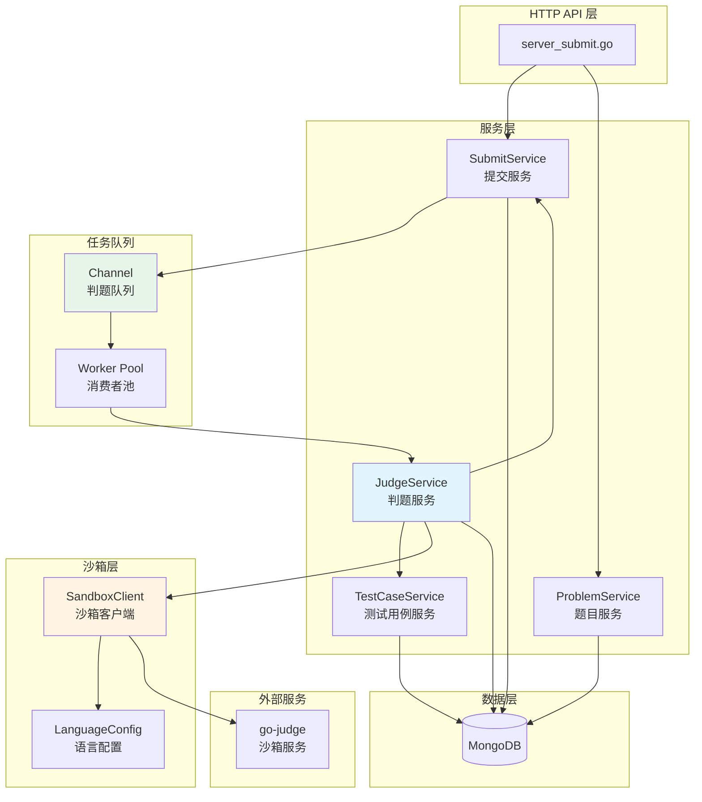
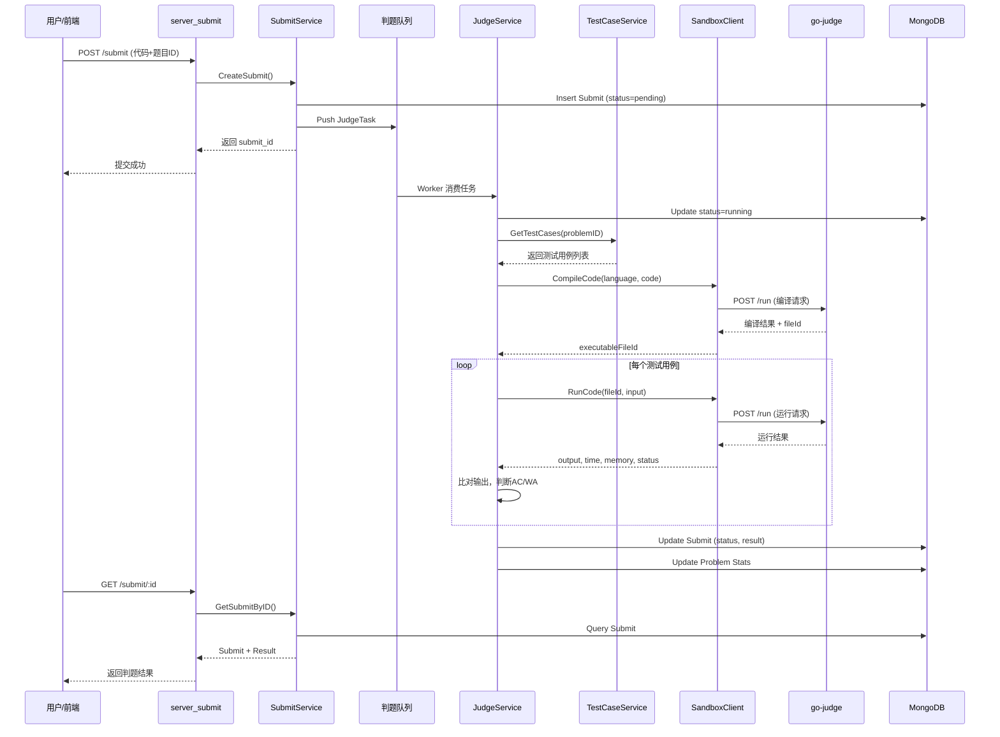

# 判题系统重构 - 架构设计文档

## 📋 设计概述

基于对齐文档的共识，本文档详细定义判题系统的架构设计、模块划分、接口规范和数据流向。

## 🏗️ 系统架构

### 整体架构图



### 核心流程图



## 📦 模块设计

### 1. 沙箱客户端模块 (`pkg/sandbox/`)

#### 1.1 文件结构
```
pkg/sandbox/
├── client.go           # 沙箱客户端主逻辑
├── types.go            # 请求/响应数据结构
├── language_config.go  # 语言配置管理
└── errors.go           # 错误定义
```

#### 1.2 核心接口

```go
// Client 沙箱客户端
type Client struct {
    baseURL    string
    httpClient *http.Client
    languages  map[string]*LanguageConfig
}

// NewClient 创建沙箱客户端
func NewClient(baseURL string, languageConfigs map[string]*LanguageConfig) *Client

// CompileCode 编译代码
// 返回：编译产物文件ID、编译错误信息、错误
func (c *Client) CompileCode(ctx context.Context, req *CompileRequest) (*CompileResponse, error)

// RunCode 运行代码
// 返回：程序输出、运行时间、内存使用、状态、错误
func (c *Client) RunCode(ctx context.Context, req *RunRequest) (*RunResponse, error)
```

#### 1.3 数据结构

```go
// CompileRequest 编译请求
type CompileRequest struct {
    Language   string // 语言标识：java, cpp, python, go, c
    SourceCode string // 源代码
}

// CompileResponse 编译响应
type CompileResponse struct {
    Success        bool   // 是否成功
    ExecutableID   string // 编译产物文件ID（用于后续运行）
    CompileOutput  string // 编译输出（stdout）
    CompileError   string // 编译错误（stderr）
    Time           int64  // 编译时间（纳秒）
    Memory         int64  // 内存使用（字节）
}

// RunRequest 运行请求
type RunRequest struct {
    Language     string // 语言标识
    ExecutableID string // 编译产物文件ID（编译型语言）或源代码（解释型语言）
    Input        string // 标准输入
    TimeLimit    int64  // 时间限制（纳秒）
    MemoryLimit  int64  // 内存限制（字节）
}

// RunResponse 运行响应
type RunResponse struct {
    Status       RunStatus // 运行状态
    Output       string    // 标准输出
    Error        string    // 标准错误
    Time         int64     // 运行时间（纳秒）
    Memory       int64     // 内存使用（字节）
    ExitCode     int       // 退出码
}

// RunStatus 运行状态
type RunStatus string

const (
    RunStatusAccepted            RunStatus = "Accepted"
    RunStatusTimeLimitExceeded   RunStatus = "Time Limit Exceeded"
    RunStatusMemoryLimitExceeded RunStatus = "Memory Limit Exceeded"
    RunStatusRuntimeError        RunStatus = "Runtime Error"
    RunStatusSystemError         RunStatus = "System Error"
)

// LanguageConfig 语言配置
type LanguageConfig struct {
    Name    string       `yaml:"name"`
    Compile *StageConfig `yaml:"compile,omitempty"` // nil 表示无需编译（如 Python）
    Run     *StageConfig `yaml:"run"`
}

// StageConfig 阶段配置（编译或运行）
type StageConfig struct {
    Args           []string `yaml:"args"`            // 执行命令参数
    Env            []string `yaml:"env"`             // 环境变量
    TimeLimit      int64    `yaml:"time_limit"`      // 时间限制（纳秒）
    MemoryLimit    int64    `yaml:"memory_limit"`    // 内存限制（字节）
    ProcLimit      int      `yaml:"proc_limit"`      // 进程数限制
    SourceFile     string   `yaml:"source_file"`     // 源文件名
    ExecutableFile string   `yaml:"executable_file"` // 可执行文件名
}
```

#### 1.4 go-judge 请求映射

```go
// buildGoJudgeRequest 构建 go-judge 请求
func buildGoJudgeRequest(stage *StageConfig, files map[string]interface{}) *GoJudgeRequest {
    return &GoJudgeRequest{
        Cmd: []Command{
            {
                Args:        stage.Args,
                Env:         stage.Env,
                Files:       buildFileDescriptors(files),
                CPULimit:    stage.TimeLimit,
                MemoryLimit: stage.MemoryLimit,
                ProcLimit:   stage.ProcLimit,
                CopyIn:      files,
                CopyOut:     []string{"stdout", "stderr"},
                CopyOutCached: getCopyOutCached(stage),
            },
        },
    }
}

// GoJudgeRequest go-judge 请求结构
type GoJudgeRequest struct {
    Cmd []Command `json:"cmd"`
}

type Command struct {
    Args        []string               `json:"args"`
    Env         []string               `json:"env"`
    Files       []FileDescriptor       `json:"files"`
    CPULimit    int64                  `json:"cpuLimit"`
    MemoryLimit int64                  `json:"memoryLimit"`
    ProcLimit   int                    `json:"procLimit"`
    CopyIn      map[string]interface{} `json:"copyIn"`
    CopyOut     []string               `json:"copyOut"`
    CopyOutCached []string             `json:"copyOutCached,omitempty"`
}

type FileDescriptor struct {
    Content string `json:"content,omitempty"`
    Name    string `json:"name,omitempty"`
    Max     int    `json:"max,omitempty"`
}

// GoJudgeResponse go-judge 响应结构
type GoJudgeResponse struct {
    Status     string            `json:"status"`
    ExitStatus int               `json:"exitStatus"`
    Time       int64             `json:"time"`
    Memory     int64             `json:"memory"`
    RunTime    int64             `json:"runTime"`
    Files      map[string]string `json:"files"`
    FileIds    map[string]string `json:"fileIds"`
    FileError  []FileError       `json:"fileError"`
}

type FileError struct {
    Name    string `json:"name"`
    Type    string `json:"type"`
    Message string `json:"message"`
}
```

### 2. 判题服务模块 (`pkg/app/api-server/service/`)

#### 2.1 JudgeService 重构

```go
// JudgeService 判题服务
type JudgeService struct {
    sandboxClient  *sandbox.Client
    submitService  *SubmitService
    testCaseService *TestCaseService
    problemService *ProblemService
    
    taskQueue      chan *JudgeTask
    workers        int
    stopCh         chan struct{}
    wg             sync.WaitGroup
}

// NewJudgeService 创建判题服务
func NewJudgeService(
    sandboxClient *sandbox.Client,
    submitService *SubmitService,
    testCaseService *TestCaseService,
    problemService *ProblemService,
    workers int,
    queueSize int,
) *JudgeService

// Start 启动判题服务（启动消费者）
func (js *JudgeService) Start(ctx context.Context) error

// Stop 停止判题服务（优雅关闭）
func (js *JudgeService) Stop(ctx context.Context) error

// SubmitTask 提交判题任务（生产者接口）
func (js *JudgeService) SubmitTask(task *JudgeTask) error

// RecoverTasks 恢复未完成的任务（服务重启时调用）
func (js *JudgeService) RecoverTasks(ctx context.Context) error

// worker 消费者工作协程
func (js *JudgeService) worker(ctx context.Context, workerID int)

// judgeTask 判题主流程
func (js *JudgeService) judgeTask(ctx context.Context, task *JudgeTask) error
```

#### 2.2 判题任务数据结构

```go
// JudgeTask 判题任务
type JudgeTask struct {
    SubmitID  primitive.ObjectID // 提交ID
    ProblemID primitive.ObjectID // 题目ID
    UserID    primitive.ObjectID // 用户ID
    Language  models.Language    // 编程语言
    Code      string             // 源代码
}

// JudgeContext 判题上下文（内部使用）
type JudgeContext struct {
    Task         *JudgeTask
    Problem      *models.Problem
    TestCases    []*models.TestCase
    ExecutableID string // 编译产物ID
    Results      []*models.TestResult
}
```

#### 2.3 判题主流程

```go
func (js *JudgeService) judgeTask(ctx context.Context, task *JudgeTask) error {
    // 1. 更新状态为 running
    if err := js.updateSubmitStatus(ctx, task.SubmitID, models.StatusRunning); err != nil {
        return err
    }
    
    // 2. 获取题目信息
    problem, err := js.problemService.GetProblemByID(ctx, task.ProblemID)
    if err != nil {
        return js.handleError(ctx, task.SubmitID, "获取题目失败", err)
    }
    
    // 3. 获取测试用例
    testCases, err := js.testCaseService.GetTestCasesByProblemID(ctx, task.ProblemID)
    if err != nil {
        return js.handleError(ctx, task.SubmitID, "获取测试用例失败", err)
    }
    
    judgeCtx := &JudgeContext{
        Task:      task,
        Problem:   problem,
        TestCases: testCases,
        Results:   make([]*models.TestResult, 0, len(testCases)),
    }
    
    // 4. 编译阶段（如果需要）
    if err := js.compileStage(ctx, judgeCtx); err != nil {
        return js.handleCompileError(ctx, judgeCtx, err)
    }
    
    // 5. 运行测试用例
    if err := js.runTestCases(ctx, judgeCtx); err != nil {
        return js.handleError(ctx, task.SubmitID, "运行测试用例失败", err)
    }
    
    // 6. 确定最终状态
    finalStatus := js.determineFinalStatus(judgeCtx.Results)
    
    // 7. 保存结果
    result := &models.JudgeResult{
        Status:      finalStatus,
        TimeUsed:    js.calculateMaxTime(judgeCtx.Results),
        MemoryUsed:  js.calculateMaxMemory(judgeCtx.Results),
        TestResults: judgeCtx.Results,
    }
    
    if err := js.saveJudgeResult(ctx, task.SubmitID, result); err != nil {
        return err
    }
    
    // 8. 更新题目统计
    isAC := finalStatus == models.StatusAccepted
    if err := js.problemService.UpdateProblemStats(ctx, task.ProblemID, isAC); err != nil {
        // 统计更新失败不影响判题结果
        log.Errorf("更新题目统计失败: %v", err)
    }
    
    return nil
}

// compileStage 编译阶段
func (js *JudgeService) compileStage(ctx context.Context, judgeCtx *JudgeContext) error {
    // 检查语言是否需要编译
    langConfig := js.sandboxClient.GetLanguageConfig(string(judgeCtx.Task.Language))
    if langConfig.Compile == nil {
        // 解释型语言，无需编译
        return nil
    }
    
    compileReq := &sandbox.CompileRequest{
        Language:   string(judgeCtx.Task.Language),
        SourceCode: judgeCtx.Task.Code,
    }
    
    compileResp, err := js.sandboxClient.CompileCode(ctx, compileReq)
    if err != nil {
        return fmt.Errorf("沙箱编译失败: %w", err)
    }
    
    if !compileResp.Success {
        return &CompileError{
            Message: compileResp.CompileError,
            Output:  compileResp.CompileOutput,
        }
    }
    
    judgeCtx.ExecutableID = compileResp.ExecutableID
    return nil
}

// runTestCases 运行测试用例
func (js *JudgeService) runTestCases(ctx context.Context, judgeCtx *JudgeContext) error {
    for _, testCase := range judgeCtx.TestCases {
        result, err := js.runSingleTestCase(ctx, judgeCtx, testCase)
        if err != nil {
            return err
        }
        judgeCtx.Results = append(judgeCtx.Results, result)
    }
    return nil
}

// runSingleTestCase 运行单个测试用例
func (js *JudgeService) runSingleTestCase(
    ctx context.Context,
    judgeCtx *JudgeContext,
    testCase *models.TestCase,
) (*models.TestResult, error) {
    // 获取时间和内存限制
    timeLimit := js.getTimeLimit(testCase, judgeCtx.Problem)
    memoryLimit := js.getMemoryLimit(testCase, judgeCtx.Problem)
    
    // 构建运行请求
    runReq := &sandbox.RunRequest{
        Language:     string(judgeCtx.Task.Language),
        ExecutableID: judgeCtx.ExecutableID,
        Input:        testCase.Input,
        TimeLimit:    int64(timeLimit) * 1_000_000, // ms -> ns
        MemoryLimit:  int64(memoryLimit) * 1_048_576, // MB -> bytes
    }
    
    // 调用沙箱运行
    runResp, err := js.sandboxClient.RunCode(ctx, runReq)
    if err != nil {
        return nil, fmt.Errorf("沙箱运行失败: %w", err)
    }
    
    // 构建测试结果
    result := &models.TestResult{
        TestCaseID: testCase.ID,
        TimeUsed:   int(runResp.Time / 1_000_000), // ns -> ms
        MemoryUsed: int(runResp.Memory / 1024),    // bytes -> KB
        IsSample:   testCase.IsSample,
    }
    
    // 判断运行状态
    switch runResp.Status {
    case sandbox.RunStatusAccepted:
        // 比对输出
        if js.compareOutput(runResp.Output, testCase.Output) {
            result.Status = models.StatusAccepted
        } else {
            result.Status = models.StatusWrongAnswer
        }
    case sandbox.RunStatusTimeLimitExceeded:
        result.Status = models.StatusTimeLimit
    case sandbox.RunStatusMemoryLimitExceeded:
        result.Status = models.StatusMemoryLimit
    case sandbox.RunStatusRuntimeError:
        result.Status = models.StatusRuntimeError
    default:
        result.Status = models.StatusSystemError
    }
    
    // 根据是否为示例用例，决定返回详细信息
    if testCase.IsSample {
        result.Output = runResp.Output
        result.Expected = testCase.Output
        result.Error = runResp.Error
    }
    
    return result, nil
}

// compareOutput 比对输出（去除首尾空白，按行比较）
func (js *JudgeService) compareOutput(actual, expected string) bool {
    actualLines := strings.Split(strings.TrimSpace(actual), "\n")
    expectedLines := strings.Split(strings.TrimSpace(expected), "\n")
    
    if len(actualLines) != len(expectedLines) {
        return false
    }
    
    for i := range actualLines {
        if strings.TrimSpace(actualLines[i]) != strings.TrimSpace(expectedLines[i]) {
            return false
        }
    }
    
    return true
}
```

### 3. 测试用例服务 (`pkg/app/api-server/service/service_testcase.go`)

```go
// TestCaseService 测试用例服务
type TestCaseService struct{}

func NewTestCaseService() *TestCaseService

// GetTestCasesByProblemID 根据题目ID获取测试用例
func (s *TestCaseService) GetTestCasesByProblemID(
    ctx context.Context,
    problemID primitive.ObjectID,
) ([]*models.TestCase, error) {
    collection := utils.GetCollection("test_cases")
    
    cursor, err := collection.Find(ctx, bson.M{"problem_id": problemID})
    if err != nil {
        return nil, err
    }
    defer cursor.Close(ctx)
    
    var testCases []*models.TestCase
    if err := cursor.All(ctx, &testCases); err != nil {
        return nil, err
    }
    
    return testCases, nil
}

// CreateTestCase 创建测试用例
func (s *TestCaseService) CreateTestCase(ctx context.Context, testCase *models.TestCase) error

// UpdateTestCase 更新测试用例
func (s *TestCaseService) UpdateTestCase(ctx context.Context, testCase *models.TestCase) error

// DeleteTestCase 删除测试用例
func (s *TestCaseService) DeleteTestCase(ctx context.Context, id primitive.ObjectID) error
```

### 4. 提交服务增强 (`pkg/app/api-server/service/service_submit.go`)

```go
// 新增方法

// GetSubmitsByStatus 根据状态查询提交
func (s *SubmitService) GetSubmitsByStatus(
    ctx context.Context,
    status models.SubmitStatus,
) ([]*models.Submit, error) {
    collection := utils.GetCollection("submits")
    
    cursor, err := collection.Find(ctx, bson.M{"status": status})
    if err != nil {
        return nil, err
    }
    defer cursor.Close(ctx)
    
    var submits []*models.Submit
    if err := cursor.All(ctx, &submits); err != nil {
        return nil, err
    }
    
    return submits, nil
}

// UpdateSubmitStatus 更新提交状态
func (s *SubmitService) UpdateSubmitStatus(
    ctx context.Context,
    submitID primitive.ObjectID,
    status models.SubmitStatus,
) error {
    collection := utils.GetCollection("submits")
    
    update := bson.M{
        "$set": bson.M{
            "status":     status,
            "updated_at": time.Now(),
        },
    }
    
    _, err := collection.UpdateOne(ctx, bson.M{"_id": submitID}, update)
    return err
}

// UpdateSubmitResult 更新提交结果
func (s *SubmitService) UpdateSubmitResult(
    ctx context.Context,
    submitID primitive.ObjectID,
    result *models.JudgeResult,
) error {
    collection := utils.GetCollection("submits")
    
    update := bson.M{
        "$set": bson.M{
            "status":     result.Status,
            "result":     result,
            "updated_at": time.Now(),
        },
    }
    
    _, err := collection.UpdateOne(ctx, bson.M{"_id": submitID}, update)
    return err
}

// BatchUpdateStatus 批量更新状态（用于服务重启恢复）
func (s *SubmitService) BatchUpdateStatus(
    ctx context.Context,
    fromStatus models.SubmitStatus,
    toStatus models.SubmitStatus,
    errorMsg string,
) error {
    collection := utils.GetCollection("submits")
    
    filter := bson.M{"status": fromStatus}
    update := bson.M{
        "$set": bson.M{
            "status": toStatus,
            "result": &models.JudgeResult{
                Status:       toStatus,
                RuntimeError: errorMsg,
            },
            "updated_at": time.Now(),
        },
    }
    
    _, err := collection.UpdateMany(ctx, filter, update)
    return err
}
```

## 📊 数据模型增强

### 1. TestCase 模型增强

```go
// TestCase 测试用例（增强）
type TestCase struct {
    ID          primitive.ObjectID `bson:"_id,omitempty" json:"id"`
    ProblemID   primitive.ObjectID `bson:"problem_id" json:"problem_id"`
    Input       string             `bson:"input" json:"input"`
    Output      string             `bson:"output" json:"output"`
    IsSample    bool               `bson:"is_sample" json:"is_sample"`
    
    // 新增：可选的超时配置
    TimeLimit   *int               `bson:"time_limit,omitempty" json:"time_limit,omitempty"`     // ms
    MemoryLimit *int               `bson:"memory_limit,omitempty" json:"memory_limit,omitempty"` // MB
    
    Score       int                `bson:"score" json:"score"`           // 用例分数（可选，用于部分分）
    CreatedAt   time.Time          `bson:"created_at" json:"created_at"`
}
```

### 2. TestResult 模型增强

```go
// TestResult 测试用例结果（增强）
type TestResult struct {
    TestCaseID primitive.ObjectID `json:"test_case_id"`
    Status     SubmitStatus       `json:"status"`
    TimeUsed   int                `json:"time_used"`   // ms
    MemoryUsed int                `json:"memory_used"` // KB
    
    // 新增：是否为示例用例
    IsSample   bool               `json:"is_sample"`
    
    // 仅示例用例返回以下字段
    Output     string             `json:"output,omitempty"`   // 实际输出
    Expected   string             `json:"expected,omitempty"` // 期望输出
    Error      string             `json:"error,omitempty"`    // 错误信息
}
```

## ⚙️ 配置文件设计

### conf/config.yaml 增强

```yaml
App:
  Host: "0.0.0.0"
  Port: "8080"
  Mode: "debug"
  Env: "development"
  GracefulTime: 5s

Mongo:
  Uri: mongodb://42.194.245.236:27017
  DbName: zk_code_arena

# 判题配置（新增）
Judge:
  Workers: 4          # 消费者数量
  QueueSize: 100      # 队列容量
  
  # 语言配置
  Languages:
    java:
      name: "Java 17"
      compile:
        args: ["/usr/bin/javac", "-encoding", "UTF-8", "Main.java"]
        env:
          - "PATH=/usr/bin:/bin"
          - "JAVA_HOME=/usr/lib/jvm/java-17-openjdk-amd64"
        time_limit: 10000000000    # 10秒（纳秒）
        memory_limit: 268435456    # 256MB（字节）
        proc_limit: 50
        source_file: "Main.java"
        executable_file: "Main.class"
      run:
        args: ["/usr/bin/java", "-Xmx256m", "-Xss256m", "Main"]
        env:
          - "PATH=/usr/bin:/bin"
          - "JAVA_HOME=/usr/lib/jvm/java-17-openjdk-amd64"
        time_limit: 1000000000     # 1秒（纳秒）
        memory_limit: 268435456    # 256MB（字节）
        proc_limit: 100
    
    cpp:
      name: "C++ 17"
      compile:
        args: ["/usr/bin/g++", "-std=c++17", "-O2", "-Wall", "main.cpp", "-o", "main"]
        env: ["PATH=/usr/bin:/bin"]
        time_limit: 10000000000
        memory_limit: 268435456
        proc_limit: 50
        source_file: "main.cpp"
        executable_file: "main"
      run:
        args: ["./main"]
        env: ["PATH=/usr/bin:/bin"]
        time_limit: 1000000000
        memory_limit: 134217728    # 128MB
        proc_limit: 1
    
    python:
      name: "Python 3.9"
      # Python 无需编译
      run:
        args: ["/usr/bin/python3", "-u", "main.py"]
        env: ["PATH=/usr/bin:/bin", "PYTHONPATH=/w"]
        time_limit: 2000000000     # 2秒（Python 需要更多时间）
        memory_limit: 268435456
        proc_limit: 1
        source_file: "main.py"
    
    go:
      name: "Go 1.21"
      compile:
        args: ["/usr/bin/go", "build", "-o", "main", "main.go"]
        env: ["PATH=/usr/bin:/bin", "GOCACHE=/tmp"]
        time_limit: 10000000000
        memory_limit: 268435456
        proc_limit: 50
        source_file: "main.go"
        executable_file: "main"
      run:
        args: ["./main"]
        env: ["PATH=/usr/bin:/bin"]
        time_limit: 1000000000
        memory_limit: 134217728
        proc_limit: 1
    
    c:
      name: "C11"
      compile:
        args: ["/usr/bin/gcc", "-std=c11", "-O2", "-Wall", "main.c", "-o", "main", "-lm"]
        env: ["PATH=/usr/bin:/bin"]
        time_limit: 10000000000
        memory_limit: 268435456
        proc_limit: 50
        source_file: "main.c"
        executable_file: "main"
      run:
        args: ["./main"]
        env: ["PATH=/usr/bin:/bin"]
        time_limit: 1000000000
        memory_limit: 134217728
        proc_limit: 1

# 沙箱配置
Sandbox:
  Url: "http://localhost:5050/run"
  Method: "POST"
  Timeout: 30s

Log:
  Level: "info"
  Format: "json"
  Output: "stdout"
  File:
    Path: "./logs/server.log"
    MaxSize: 100
    MaxBackups: 3
    MaxAge: 28
    Compress: true

JWT:
  Secret: "zk-code-arena-secret-key-2025"
  ExpireTime: 24h

Redis:
  Host: "42.194.245.236"
  Port: 16379
  Password: ""
  DB: 0
  PoolSize: 10
```

### conf/config.go 增强

```go
// Config 配置结构体（增强）
type Config struct {
    App     AppConfig     `yaml:"App"`
    Mongo   MongoConfig   `yaml:"Mongo"`
    Judge   JudgeConfig   `yaml:"Judge"`    // 新增
    Sandbox SandboxConfig `yaml:"Sandbox"`
    Log     LogConfig     `yaml:"Log"`
    JWT     JWTConfig     `yaml:"JWT"`
    Redis   RedisConfig   `yaml:"Redis"`
}

// JudgeConfig 判题配置（新增）
type JudgeConfig struct {
    Workers   int                            `yaml:"Workers"`
    QueueSize int                            `yaml:"QueueSize"`
    Languages map[string]*LanguageConfig     `yaml:"Languages"`
}

// LanguageConfig 语言配置
type LanguageConfig struct {
    Name    string       `yaml:"name"`
    Compile *StageConfig `yaml:"compile,omitempty"`
    Run     *StageConfig `yaml:"run"`
}

// StageConfig 阶段配置
type StageConfig struct {
    Args           []string `yaml:"args"`
    Env            []string `yaml:"env"`
    TimeLimit      int64    `yaml:"time_limit"`
    MemoryLimit    int64    `yaml:"memory_limit"`
    ProcLimit      int      `yaml:"proc_limit"`
    SourceFile     string   `yaml:"source_file,omitempty"`
    ExecutableFile string   `yaml:"executable_file,omitempty"`
}
```

## 🔄 服务生命周期管理

### 服务启动流程

```go
// cmd/runServer.go 增强

func RunServer() error {
    // ... 现有初始化逻辑 ...
    
    // 1. 初始化沙箱客户端
    sandboxClient := sandbox.NewClient(
        conf.Config.Sandbox.Url,
        conf.Config.Judge.Languages,
    )
    
    // 2. 初始化服务
    submitService := service.NewSubmitService()
    problemService := service.NewProblemService()
    testCaseService := service.NewTestCaseService()
    
    judgeService := service.NewJudgeService(
        sandboxClient,
        submitService,
        testCaseService,
        problemService,
        conf.Config.Judge.Workers,
        conf.Config.Judge.QueueSize,
    )
    
    // 3. 启动判题服务
    ctx := context.Background()
    if err := judgeService.Start(ctx); err != nil {
        return fmt.Errorf("启动判题服务失败: %w", err)
    }
    
    // 4. 恢复未完成的任务
    if err := judgeService.RecoverTasks(ctx); err != nil {
        log.Errorf("恢复判题任务失败: %v", err)
    }
    
    // 5. 启动 HTTP 服务器
    server := server.NewServer(/* ... */)
    
    // 6. 优雅关闭
    quit := make(chan os.Signal, 1)
    signal.Notify(quit, syscall.SIGINT, syscall.SIGTERM)
    <-quit
    
    log.Info("正在关闭服务...")
    
    shutdownCtx, cancel := context.WithTimeout(context.Background(), 30*time.Second)
    defer cancel()
    
    // 停止判题服务
    if err := judgeService.Stop(shutdownCtx); err != nil {
        log.Errorf("停止判题服务失败: %v", err)
    }
    
    // 停止 HTTP 服务器
    if err := httpServer.Shutdown(shutdownCtx); err != nil {
        log.Errorf("停止 HTTP 服务器失败: %v", err)
    }
    
    return nil
}
```

## 🔐 错误处理策略

### 错误分类

```go
// pkg/sandbox/errors.go

// CompileError 编译错误
type CompileError struct {
    Message string
    Output  string
}

func (e *CompileError) Error() string {
    return fmt.Sprintf("编译错误: %s", e.Message)
}

// SandboxError 沙箱错误
type SandboxError struct {
    StatusCode int
    Message    string
}

func (e *SandboxError) Error() string {
    return fmt.Sprintf("沙箱错误 [%d]: %s", e.StatusCode, e.Message)
}

// TimeoutError 超时错误
type TimeoutError struct {
    Stage   string // "compile" or "run"
    Timeout time.Duration
}

func (e *TimeoutError) Error() string {
    return fmt.Sprintf("%s 阶段超时: %v", e.Stage, e.Timeout)
}
```

### 错误处理流程

```go
// JudgeService 错误处理方法

func (js *JudgeService) handleError(
    ctx context.Context,
    submitID primitive.ObjectID,
    message string,
    err error,
) error {
    log.Errorf("判题失败 [%s]: %s - %v", submitID.Hex(), message, err)
    
    result := &models.JudgeResult{
        Status:       models.StatusSystemError,
        RuntimeError: fmt.Sprintf("%s: %v", message, err),
    }
    
    return js.submitService.UpdateSubmitResult(ctx, submitID, result)
}

func (js *JudgeService) handleCompileError(
    ctx context.Context,
    judgeCtx *JudgeContext,
    err error,
) error {
    var compileErr *CompileError
    if errors.As(err, &compileErr) {
        result := &models.JudgeResult{
            Status:       models.StatusCompileError,
            CompileError: compileErr.Message,
        }
        return js.submitService.UpdateSubmitResult(ctx, judgeCtx.Task.SubmitID, result)
    }
    
    return js.handleError(ctx, judgeCtx.Task.SubmitID, "编译失败", err)
}
```

## 📈 监控与日志

### 关键日志点

```go
// 判题服务启动
log.Infof("判题服务启动: workers=%d, queueSize=%d", workers, queueSize)

// 任务入队
log.Debugf("任务入队: submitID=%s, problemID=%s", task.SubmitID, task.ProblemID)

// 消费者开始处理
log.Infof("[Worker-%d] 开始处理任务: submitID=%s", workerID, task.SubmitID)

// 编译阶段
log.Debugf("[%s] 编译开始: language=%s", task.SubmitID, task.Language)
log.Infof("[%s] 编译完成: time=%dms, executableID=%s", task.SubmitID, compileTime, executableID)

// 运行测试用例
log.Debugf("[%s] 运行测试用例 %d/%d", task.SubmitID, i+1, len(testCases))
log.Debugf("[%s] 测试用例 %d 结果: status=%s, time=%dms, memory=%dKB", 
    task.SubmitID, i+1, result.Status, result.TimeUsed, result.MemoryUsed)

// 判题完成
log.Infof("[%s] 判题完成: status=%s, time=%dms, memory=%dKB", 
    task.SubmitID, finalStatus, totalTime, totalMemory)

// 错误日志
log.Errorf("[%s] 判题失败: %v", task.SubmitID, err)
```

## ✅ 接口契约

### 1. 沙箱客户端接口契约

#### CompileCode
- **输入**：语言标识、源代码
- **输出**：编译产物ID、编译错误信息
- **异常**：网络错误、沙箱服务不可用
- **幂等性**：是（相同代码返回相同结果）

#### RunCode
- **输入**：语言标识、可执行文件ID、标准输入、资源限制
- **输出**：程序输出、运行时间、内存使用、状态
- **异常**：网络错误、沙箱服务不可用
- **幂等性**：否（可能有副作用）

### 2. 判题服务接口契约

#### SubmitTask
- **输入**：判题任务
- **输出**：无（异步）
- **异常**：队列已满
- **幂等性**：否（重复提交会重复判题）

#### RecoverTasks
- **输入**：无
- **输出**：恢复的任务数量
- **异常**：数据库错误
- **幂等性**：是

### 3. 提交服务接口契约

#### CreateSubmit
- **输入**：提交记录
- **输出**：提交ID
- **异常**：数据库错误
- **幂等性**：否（每次创建新记录）

#### UpdateSubmitResult
- **输入**：提交ID、判题结果
- **输出**：无
- **异常**：数据库错误、提交不存在
- **幂等性**：是（多次更新结果相同）

---

**文档版本**: v1.0  
**创建时间**: 2025-10-05  
**状态**: ✅ 架构设计完成，待进入原子化阶段
