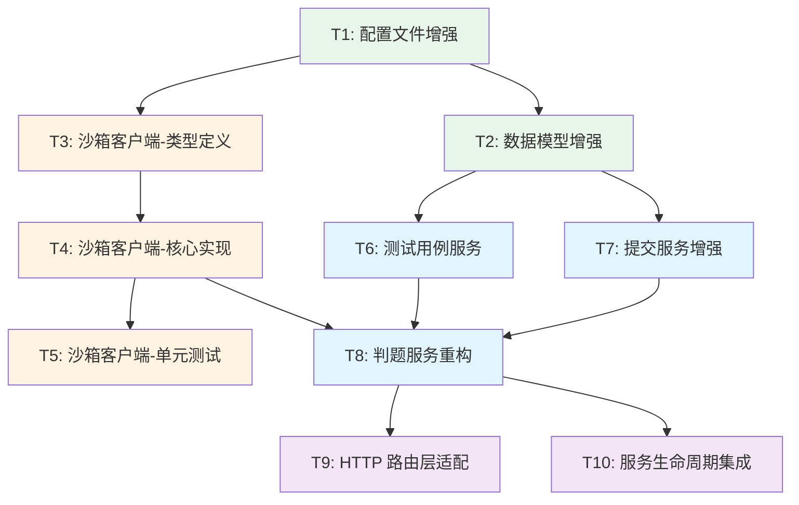

# 判题系统重构 - 任务拆分文档

## 📋 任务概述

基于架构设计文档，将判题系统重构拆分为 **10 个原子任务**，按依赖关系顺序执行。

## 📊 任务依赖关系图



## 🎯 任务列表

### T1: 配置文件增强 ✅

**任务描述**：增强配置文件，添加判题和语言配置

**输入契约**：
- 现有配置文件：`conf/config.yaml`
- 现有配置结构：`conf/config.go`

**输出契约**：
- 更新后的 `conf/config.yaml`（包含 Judge 配置）
- 更新后的 `conf/config.go`（包含 JudgeConfig、LanguageConfig 结构体）

**实现约束**：
- 保持现有配置不变
- 添加 `Judge` 配置节
- 支持至少 5 种语言：Java, C++, Python, Go, C
- 配置参数符合 go-judge 规范

**验收标准**：
- [ ] 配置文件可正常解析
- [ ] 包含 Workers、QueueSize 配置
- [ ] 包含 5 种语言的完整配置（编译+运行）
- [ ] 时间单位为纳秒，内存单位为字节

**依赖关系**：
- 前置任务：无
- 后置任务：T2, T3

---

### T2: 数据模型增强 ✅

**任务描述**：增强 TestCase 和 TestResult 数据模型

**输入契约**：
- 现有模型：`pkg/models/problem.go`（TestCase）
- 现有模型：`pkg/models/submit.go`（TestResult）

**输出契约**：
- 更新后的 `TestCase` 结构体（增加 TimeLimit、MemoryLimit、Score 字段）
- 更新后的 `TestResult` 结构体（增加 IsSample、Expected 字段）

**实现约束**：
- 保持现有字段不变
- 新增字段使用指针类型（可选字段）
- 添加 JSON 和 BSON 标签

**验收标准**：
- [ ] TestCase 包含可选的 TimeLimit、MemoryLimit 字段
- [ ] TestResult 包含 IsSample 字段
- [ ] TestResult 的 Output、Expected、Error 字段使用 omitempty 标签
- [ ] 数据模型可正常序列化和反序列化

**依赖关系**：
- 前置任务：T1
- 后置任务：T6, T7, T8

---

### T3: 沙箱客户端-类型定义 ✅

**任务描述**：定义沙箱客户端的数据类型和接口

**输入契约**：
- 沙箱使用指南：`docs/沙箱使用指南/沙箱使用指南.md`
- 语言配置：`conf/config.go`（LanguageConfig）

**输出契约**：
- 创建 `pkg/sandbox/types.go`（请求/响应数据结构）
- 创建 `pkg/sandbox/errors.go`（错误定义）

**实现约束**：
- 定义 CompileRequest、CompileResponse
- 定义 RunRequest、RunResponse
- 定义 GoJudgeRequest、GoJudgeResponse（对应 go-judge API）
- 定义 RunStatus 枚举
- 定义 CompileError、SandboxError、TimeoutError

**验收标准**：
- [ ] 所有数据结构包含完整的 JSON 标签
- [ ] RunStatus 包含所有可能的状态
- [ ] 错误类型实现 error 接口
- [ ] 数据结构与 go-judge API 兼容

**依赖关系**：
- 前置任务：T1
- 后置任务：T4

---

### T4: 沙箱客户端-核心实现 ⚙️

**任务描述**：实现沙箱客户端的核心逻辑

**输入契约**：
- 类型定义：`pkg/sandbox/types.go`
- 语言配置：`conf/config.go`
- 沙箱 URL：`conf.Config.Sandbox.Url`

**输出契约**：
- 创建 `pkg/sandbox/client.go`（客户端实现）
- 创建 `pkg/sandbox/language_config.go`（语言配置管理）

**实现约束**：
- 实现 `NewClient` 构造函数
- 实现 `CompileCode` 方法（编译代码）
- 实现 `RunCode` 方法（运行代码）
- 实现 `buildGoJudgeRequest` 方法（构建 go-judge 请求）
- 实现 `parseGoJudgeResponse` 方法（解析 go-judge 响应）
- 使用 `context.Context` 支持超时和取消
- 使用 `http.Client` 发送 HTTP 请求

**核心方法签名**：
```go
func NewClient(baseURL string, languages map[string]*LanguageConfig) *Client
func (c *Client) CompileCode(ctx context.Context, req *CompileRequest) (*CompileResponse, error)
func (c *Client) RunCode(ctx context.Context, req *RunRequest) (*RunResponse, error)
func (c *Client) GetLanguageConfig(language string) *LanguageConfig
```

**验收标准**：
- [ ] 编译请求正确映射到 go-judge API
- [ ] 运行请求正确映射到 go-judge API
- [ ] 正确处理编译成功和失败的情况
- [ ] 正确解析运行状态（Accepted, TLE, MLE, RE）
- [ ] 支持编译型语言（Java, C++, Go, C）
- [ ] 支持解释型语言（Python）
- [ ] 错误处理完善（网络错误、HTTP 错误、JSON 解析错误）

**依赖关系**：
- 前置任务：T3
- 后置任务：T5, T8

---

### T5: 沙箱客户端-单元测试 🧪

**任务描述**：为沙箱客户端编写单元测试

**输入契约**：
- 沙箱客户端实现：`pkg/sandbox/client.go`

**输出契约**：
- 创建 `pkg/sandbox/client_test.go`

**实现约束**：
- 使用 `httptest` 模拟 go-judge 服务
- 测试编译成功场景
- 测试编译失败场景
- 测试运行成功场景（AC）
- 测试运行失败场景（WA, TLE, MLE, RE）
- 测试网络错误处理
- 测试超时处理

**验收标准**：
- [ ] 测试覆盖率 > 80%
- [ ] 所有测试用例通过
- [ ] 包含正常流程和异常流程测试
- [ ] 使用 table-driven tests 模式

**依赖关系**：
- 前置任务：T4
- 后置任务：无

---

### T6: 测试用例服务 ⚙️

**任务描述**：实现测试用例服务

**输入契约**：
- 数据模型：`pkg/models/problem.go`（TestCase）
- MongoDB 工具：`pkg/utils/mongo.go`

**输出契约**：
- 创建 `pkg/app/api-server/service/service_testcase.go`

**实现约束**：
- 实现 `NewTestCaseService` 构造函数
- 实现 `GetTestCasesByProblemID` 方法
- 实现 `CreateTestCase` 方法
- 实现 `UpdateTestCase` 方法
- 实现 `DeleteTestCase` 方法
- 使用 MongoDB 查询

**核心方法签名**：
```go
func NewTestCaseService() *TestCaseService
func (s *TestCaseService) GetTestCasesByProblemID(ctx context.Context, problemID primitive.ObjectID) ([]*models.TestCase, error)
func (s *TestCaseService) CreateTestCase(ctx context.Context, testCase *models.TestCase) error
func (s *TestCaseService) UpdateTestCase(ctx context.Context, testCase *models.TestCase) error
func (s *TestCaseService) DeleteTestCase(ctx context.Context, id primitive.ObjectID) error
```

**验收标准**：
- [ ] 可正确查询测试用例
- [ ] 支持按 problem_id 索引查询
- [ ] 错误处理完善
- [ ] 返回的测试用例按创建时间排序

**依赖关系**：
- 前置任务：T2
- 后置任务：T8

---

### T7: 提交服务增强 ⚙️

**任务描述**：增强提交服务，添加状态查询和批量更新方法

**输入契约**：
- 现有服务：`pkg/app/api-server/service/service_submit.go`
- 数据模型：`pkg/models/submit.go`

**输出契约**：
- 更新后的 `service_submit.go`（新增方法）

**实现约束**：
- 保持现有方法不变
- 实现 `GetSubmitsByStatus` 方法
- 实现 `UpdateSubmitStatus` 方法
- 实现 `UpdateSubmitResult` 方法
- 实现 `BatchUpdateStatus` 方法（用于服务重启恢复）

**核心方法签名**：
```go
func (s *SubmitService) GetSubmitsByStatus(ctx context.Context, status models.SubmitStatus) ([]*models.Submit, error)
func (s *SubmitService) UpdateSubmitStatus(ctx context.Context, submitID primitive.ObjectID, status models.SubmitStatus) error
func (s *SubmitService) UpdateSubmitResult(ctx context.Context, submitID primitive.ObjectID, result *models.JudgeResult) error
func (s *SubmitService) BatchUpdateStatus(ctx context.Context, fromStatus, toStatus models.SubmitStatus, errorMsg string) error
```

**验收标准**：
- [ ] 可按状态查询提交
- [ ] 可更新单个提交的状态
- [ ] 可更新单个提交的结果
- [ ] 可批量更新状态（用于恢复）
- [ ] 更新操作同时更新 updated_at 字段

**依赖关系**：
- 前置任务：T2
- 后置任务：T8

---

### T8: 判题服务重构 ⚙️⚙️⚙️

**任务描述**：重构判题服务，实现消费者模式和判题主流程

**输入契约**：
- 沙箱客户端：`pkg/sandbox/client.go`
- 提交服务：`service_submit.go`
- 测试用例服务：`service_testcase.go`
- 题目服务：`service_problem.go`
- 配置：`conf.Config.Judge`

**输出契约**：
- 重构后的 `pkg/app/api-server/service/service_judge.go`

**实现约束**：
- 实现 `NewJudgeService` 构造函数
- 实现 `Start` 方法（启动消费者）
- 实现 `Stop` 方法（优雅关闭）
- 实现 `SubmitTask` 方法（生产者接口）
- 实现 `RecoverTasks` 方法（恢复未完成任务）
- 实现 `worker` 方法（消费者工作协程）
- 实现 `judgeTask` 方法（判题主流程）
- 实现 `compileStage` 方法（编译阶段）
- 实现 `runTestCases` 方法（运行测试用例）
- 实现 `runSingleTestCase` 方法（运行单个测试用例）
- 实现 `compareOutput` 方法（输出比对）
- 实现 `determineFinalStatus` 方法（确定最终状态）
- 实现 `getTimeLimit`、`getMemoryLimit` 方法（获取资源限制）

**核心数据结构**：
```go
type JudgeService struct {
    sandboxClient   *sandbox.Client
    submitService   *SubmitService
    testCaseService *TestCaseService
    problemService  *ProblemService
    
    taskQueue chan *JudgeTask
    workers   int
    stopCh    chan struct{}
    wg        sync.WaitGroup
}

type JudgeTask struct {
    SubmitID  primitive.ObjectID
    ProblemID primitive.ObjectID
    UserID    primitive.ObjectID
    Language  models.Language
    Code      string
}

type JudgeContext struct {
    Task         *JudgeTask
    Problem      *models.Problem
    TestCases    []*models.TestCase
    ExecutableID string
    Results      []*models.TestResult
}
```

**判题流程**：
1. 更新状态为 running
2. 获取题目信息
3. 获取测试用例
4. 编译阶段（如果需要）
5. 循环运行测试用例
6. 确定最终状态
7. 保存结果
8. 更新题目统计

**验收标准**：
- [ ] 服务可正常启动和停止
- [ ] 消费者可正常消费任务
- [ ] 编译失败返回编译错误
- [ ] 所有测试用例通过返回 accepted
- [ ] 部分测试用例失败返回对应状态
- [ ] 示例用例返回详细输出
- [ ] 隐藏用例仅返回状态
- [ ] 服务重启可恢复 pending 任务
- [ ] running 任务标记为 system_error
- [ ] 优雅关闭等待任务完成
- [ ] 输出比对正确（去除首尾空白）
- [ ] 时间和内存限制正确转换（ms->ns, MB->bytes）

**依赖关系**：
- 前置任务：T4, T6, T7
- 后置任务：T9, T10

---

### T9: HTTP 路由层适配 ⚙️

**任务描述**：适配 HTTP 路由层，使用新的判题服务

**输入契约**：
- 现有路由：`pkg/app/api-server/server/server_submit.go`
- 判题服务：`service_judge.go`

**输出契约**：
- 更新后的 `server_submit.go`

**实现约束**：
- 修改 `SubmitCode` 方法
- 移除直接调用 `JudgeSubmit` 的 goroutine
- 改为调用 `judgeService.SubmitTask`
- 保持 API 响应格式不变

**修改前**：
```go
go func() {
    result, err := s.svc.JudgeService.JudgeSubmit(ctx, submit, problem)
    // ...
}()
```

**修改后**：
```go
task := &service.JudgeTask{
    SubmitID:  submit.ID,
    ProblemID: submit.ProblemID,
    UserID:    submit.UserID,
    Language:  submit.Language,
    Code:      submit.Code,
}

if err := s.svc.JudgeService.SubmitTask(task); err != nil {
    // 队列已满，返回错误
    utils.InternalServerErrorResponse(c, "判题队列已满，请稍后重试")
    return
}
```

**验收标准**：
- [ ] 提交代码后返回 submit_id
- [ ] 任务成功入队
- [ ] 队列满时返回友好错误
- [ ] API 响应格式不变

**依赖关系**：
- 前置任务：T8
- 后置任务：T10

---

### T10: 服务生命周期集成 ⚙️

**任务描述**：集成判题服务到应用生命周期

**输入契约**：
- 服务启动：`cmd/runServer.go`
- 判题服务：`service_judge.go`
- 沙箱客户端：`sandbox.Client`
- 配置：`conf.Config.Judge`

**输出契约**：
- 更新后的 `cmd/runServer.go`

**实现约束**：
- 在服务启动时初始化沙箱客户端
- 初始化判题服务
- 调用 `judgeService.Start()` 启动消费者
- 调用 `judgeService.RecoverTasks()` 恢复任务
- 在优雅关闭时调用 `judgeService.Stop()`
- 等待判题任务完成（最多 30 秒）

**初始化顺序**：
```go
1. 初始化配置
2. 初始化 MongoDB
3. 初始化沙箱客户端
4. 初始化各个 Service
5. 初始化判题服务（传入依赖）
6. 启动判题服务
7. 恢复未完成任务
8. 启动 HTTP 服务器
9. 等待关闭信号
10. 优雅关闭判题服务
11. 优雅关闭 HTTP 服务器
```

**验收标准**：
- [ ] 服务启动时判题服务正常启动
- [ ] 消费者数量符合配置
- [ ] 未完成任务自动恢复
- [ ] 服务关闭时等待任务完成
- [ ] 关闭超时时强制退出
- [ ] 日志输出完整

**依赖关系**：
- 前置任务：T8, T9
- 后置任务：无

---

## 📋 任务执行顺序

### 第一批（并行执行）
- **T1**: 配置文件增强
- **T2**: 数据模型增强

### 第二批（并行执行）
- **T3**: 沙箱客户端-类型定义
- **T6**: 测试用例服务
- **T7**: 提交服务增强

### 第三批（串行执行）
- **T4**: 沙箱客户端-核心实现
- **T5**: 沙箱客户端-单元测试

### 第四批（串行执行）
- **T8**: 判题服务重构

### 第五批（并行执行）
- **T9**: HTTP 路由层适配
- **T10**: 服务生命周期集成

## 📊 任务复杂度评估

| 任务 | 复杂度 | 预计时间 | 风险等级 |
|------|--------|----------|----------|
| T1   | 简单   | 30分钟   | 低       |
| T2   | 简单   | 20分钟   | 低       |
| T3   | 中等   | 40分钟   | 低       |
| T4   | 高     | 2小时    | 中       |
| T5   | 中等   | 1小时    | 低       |
| T6   | 简单   | 30分钟   | 低       |
| T7   | 简单   | 30分钟   | 低       |
| T8   | 极高   | 3小时    | 高       |
| T9   | 简单   | 20分钟   | 低       |
| T10  | 中等   | 40分钟   | 中       |

**总计**：约 8.5 小时

## 🔍 风险点识别

### 高风险任务
- **T4**: 沙箱客户端核心实现
  - 风险：go-judge API 对接可能有细节问题
  - 缓解：参考沙箱使用指南，先实现 Java 单语言，再扩展

- **T8**: 判题服务重构
  - 风险：并发控制、错误处理、状态管理复杂
  - 缓解：分步实现，先实现基础流程，再添加恢复机制

### 中风险任务
- **T10**: 服务生命周期集成
  - 风险：优雅关闭可能有竞态条件
  - 缓解：使用 context 和 WaitGroup 正确管理生命周期

## ✅ 整体验收标准

### 功能验收
- [ ] 提交代码后返回 submit_id，状态为 pending
- [ ] 判题服务自动消费任务，状态变为 running
- [ ] 编译失败返回编译错误信息
- [ ] 所有测试用例通过返回 accepted
- [ ] 部分测试用例失败返回对应状态
- [ ] 支持 Java, C++, Python, Go, C 五种语言
- [ ] 示例用例返回详细输出
- [ ] 隐藏用例仅返回状态
- [ ] 服务重启后未完成任务自动恢复

### 性能验收
- [ ] 单个判题任务不超过 30 秒（10 个测试用例）
- [ ] 支持至少 10 个并发判题任务
- [ ] Channel 队列不阻塞

### 代码质量验收
- [ ] 沙箱客户端有单元测试（覆盖率 > 80%）
- [ ] 代码符合项目现有风格
- [ ] 关键逻辑有注释
- [ ] 配置文件有示例和说明
- [ ] 错误处理完善
- [ ] 日志输出完整

---

**文档版本**: v1.0  
**创建时间**: 2025-10-05  
**状态**: ✅ 任务拆分完成，待用户审批
