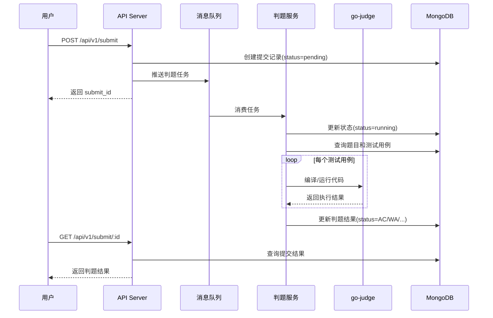
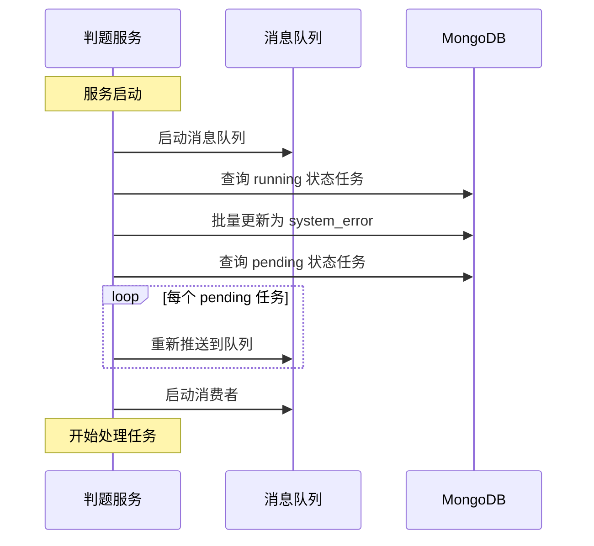

# 判题系统验证 - 架构设计

## 1. 整体架构

```mermaid
graph TB
    subgraph "验证流程"
        A[数据库初始化] --> B[测试数据准备]
        B --> C[服务启动验证]
        C --> D[集成测试]
        D --> E[手动验证]
    end
    
    subgraph "数据库初始化"
        A1[更新 init.js] --> A2[添加测试用例字段]
        A2 --> A3[创建索引]
        A3 --> A4[执行初始化]
    end
    
    subgraph "测试数据准备"
        B1[创建测试用户] --> B2[创建测试题目]
        B2 --> B3[创建测试用例]
        B3 --> B4[验证数据完整性]
    end
    
    subgraph "集成测试"
        D1[提交代码测试] --> D2[异步判题测试]
        D2 --> D3[结果查询测试]
        D3 --> D4[重启恢复测试]
    end
```



## 2. 核心组件设计

### 2.1 数据库初始化脚本

**文件**: `deploy/mongo/init/init.js`

**新增内容**：
```javascript
// 测试用例集合字段定义
db.test_cases.createIndex({ "problem_id": 1 });
db.test_cases.createIndex({ "is_sample": 1 });
db.test_cases.createIndex({ "created_at": -1 });

// 测试用例字段说明
/*
{
  "_id": ObjectId,
  "problem_id": ObjectId,        // 关联题目ID
  "input": String,               // 输入数据
  "output": String,              // 期望输出
  "is_sample": Boolean,          // 是否为示例用例
  "time_limit": Number,          // 可选：时间限制(ms)
  "memory_limit": Number,        // 可选：内存限制(MB)
  "score": Number,               // 可选：用例分数
  "created_at": Date,
  "updated_at": Date
}
*/
```

### 2.2 测试数据准备脚本

**文件**: `scripts/init_test_data.js`

**功能模块**：
1. 创建测试用户（管理员、普通用户）
2. 创建测试题目（多种难度、多种语言）
3. 创建测试用例（示例用例、隐藏用例）
4. 数据验证

**测试数据集**：
```
用户数据:
- admin (管理员)
- test_user_1 (普通用户)
- test_user_2 (普通用户)

题目数据:
- P1: A+B Problem (简单, 支持所有语言)
- P2: 排序问题 (中等, 支持 C/C++/Java)
- P3: 字符串处理 (简单, 支持 Python/Java)

测试用例:
- 每个题目 2 个示例用例 + 3 个隐藏用例
- 包含边界条件测试
```

### 2.3 集成测试脚本

**文件**: `scripts/test_judge_flow.sh`

**测试场景**：

#### 场景1: 基础判题流程
```bash
1. 用户登录获取 Token
2. 提交正确代码
3. 查询提交状态（轮询）
4. 验证判题结果（AC）
5. 验证示例用例详细输出
6. 验证隐藏用例仅返回状态
```

#### 场景2: 错误处理
```bash
1. 提交编译错误代码 -> CE
2. 提交运行超时代码 -> TLE
3. 提交内存超限代码 -> MLE
4. 提交运行错误代码 -> RE
5. 提交错误答案代码 -> WA
```

#### 场景3: 异步流程验证
```bash
1. 快速提交多个任务
2. 验证任务排队
3. 验证并发执行（4个worker）
4. 验证任务完成顺序
```

#### 场景4: 服务重启恢复
```bash
1. 提交多个任务
2. 在判题过程中重启服务
3. 验证 pending 任务恢复
4. 验证 running 任务标记为 system_error
```

### 2.4 手动验证指南

**文件**: `docs/判题系统验证/MANUAL_TEST_GUIDE.md`

**验证项目**：
1. API 接口测试（Postman/cURL）
2. 判题结果验证
3. 性能观察
4. 日志检查

## 3. 数据流设计

### 3.1 判题流程数据流



### 3.2 服务重启恢复流程



## 4. 接口契约

### 4.1 测试数据准备接口

**MongoDB 连接**：
```javascript
const uri = "mongodb://42.194.245.236:27017";
const dbName = "zk_code_arena";
```

**数据模型**：
```javascript
// User
{
  username: String,
  password: String (bcrypt),
  email: String,
  real_name: String,
  role: "admin" | "teacher" | "student",
  is_active: Boolean
}

// Problem
{
  title: String,
  description: String,
  difficulty: "easy" | "medium" | "hard",
  time_limit: Number (ms),
  memory_limit: Number (MB),
  tags: [String],
  is_public: Boolean,
  created_by: ObjectId
}

// TestCase
{
  problem_id: ObjectId,
  input: String,
  output: String,
  is_sample: Boolean,
  time_limit: Number (可选),
  memory_limit: Number (可选),
  score: Number (可选)
}
```

### 4.2 测试 API 接口

**基础接口**：
```
POST /api/v1/user/login
POST /api/v1/submit/
GET  /api/v1/submit/:id
GET  /api/v1/submit/?user_id=xxx&problem_id=xxx
```

**测试用例管理接口**：
```
GET    /api/v1/testcase/problem/:problem_id
GET    /api/v1/testcase/:id
POST   /api/v1/testcase/
PUT    /api/v1/testcase/:id
DELETE /api/v1/testcase/:id
```

## 5. 异常处理策略

### 5.1 数据库初始化异常

**场景**：
- 数据库连接失败
- 集合已存在
- 索引创建失败

**处理**：
- 检查连接字符串
- 幂等性设计（可重复执行）
- 详细错误日志

### 5.2 测试数据准备异常

**场景**：
- 数据已存在
- 外键约束失败
- 数据格式错误

**处理**：
- 清理旧数据选项
- 数据验证
- 回滚机制

### 5.3 判题测试异常

**场景**：
- 沙箱服务不可用
- 超时
- 内存不足

**处理**：
- 重试机制
- 超时配置
- 降级策略

## 6. 验收标准

### 6.1 数据库初始化

- [ ] 所有集合创建成功
- [ ] 所有索引创建成功
- [ ] 测试用例字段定义正确
- [ ] 可重复执行不报错

### 6.2 测试数据准备

- [ ] 用户数据创建成功（3个用户）
- [ ] 题目数据创建成功（3个题目）
- [ ] 测试用例创建成功（每题5个用例）
- [ ] 数据关联关系正确

### 6.3 集成测试

- [ ] 基础判题流程测试通过
- [ ] 错误处理测试通过（5种错误）
- [ ] 异步流程验证通过
- [ ] 服务重启恢复测试通过

### 6.4 手动验证

- [ ] API 接口响应正常
- [ ] 判题结果准确
- [ ] 性能符合预期（4个worker并发）
- [ ] 日志记录完整

## 7. 性能指标

### 7.1 判题性能

- 单个任务处理时间: < 5秒（简单题目）
- 并发处理能力: 4个任务同时执行
- 队列容量: 100个任务

### 7.2 API 响应时间

- 提交接口: < 200ms
- 查询接口: < 100ms
- 列表接口: < 500ms

### 7.3 资源占用

- 内存占用: < 512MB
- CPU 占用: < 50%（空闲时）
- 数据库连接: < 10个

## 8. 安全考虑

### 8.1 数据安全

- 密码加密存储（bcrypt）
- JWT Token 认证
- 敏感信息不记录日志

### 8.2 代码安全

- 沙箱隔离执行
- 资源限制（时间、内存、进程）
- 恶意代码防护

### 8.3 API 安全

- 认证中间件
- 权限验证
- 请求频率限制（未来实现）
