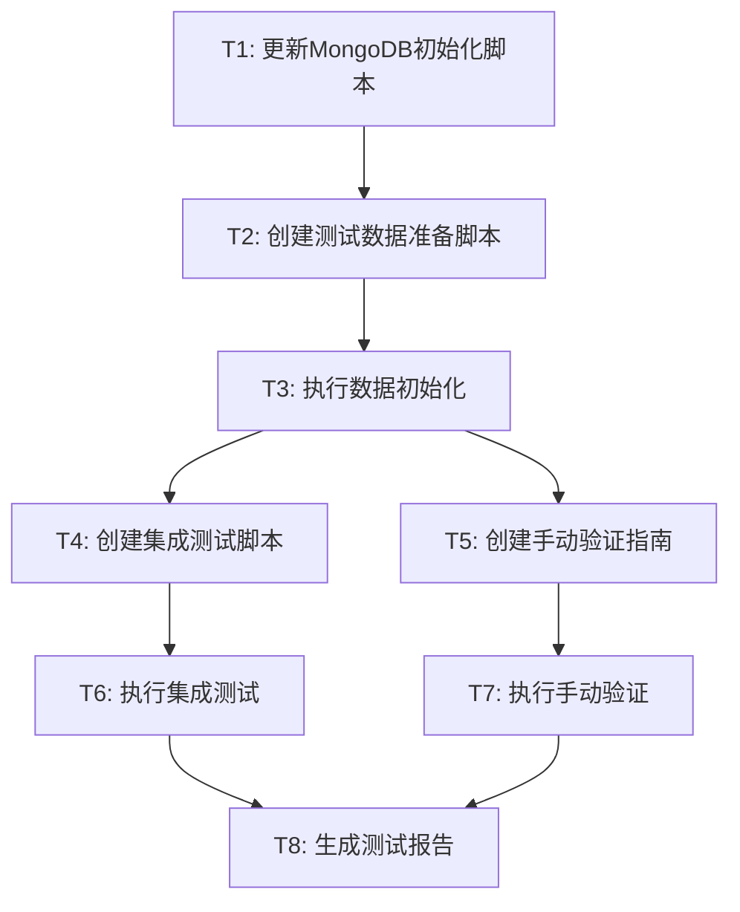

# 判题系统验证 - 任务拆分

## 任务依赖图



---

## T1: 更新 MongoDB 初始化脚本

### 输入契约
- **前置依赖**: 无
- **输入数据**: 
  - 现有 `deploy/mongo/init/init.js`
  - 测试用例数据模型定义
- **环境依赖**: 
  - MongoDB 可访问

### 输出契约
- **输出数据**: 
  - 更新后的 `deploy/mongo/init/init.js`
- **交付物**: 
  - 添加测试用例集合索引
  - 添加测试用例字段注释
- **验收标准**: 
  - [ ] 脚本可以成功执行
  - [ ] 测试用例集合索引创建成功
  - [ ] 字段注释清晰完整

### 实现约束
- **技术栈**: JavaScript (MongoDB Shell)
- **接口规范**: MongoDB 初始化脚本格式
- **质量要求**: 幂等性（可重复执行）

---

## T2: 创建测试数据准备脚本

### 输入契约
- **前置依赖**: T1 完成
- **输入数据**: 
  - 数据库连接配置
  - 测试数据规格
- **环境依赖**: 
  - Node.js 或 MongoDB Shell
  - MongoDB 连接

### 输出契约
- **输出数据**: 
  - `scripts/init_test_data.js`
  - `scripts/init_test_data.sh` (执行脚本)
- **交付物**: 
  - 用户数据创建（3个用户）
  - 题目数据创建（3个题目）
  - 测试用例创建（每题5个用例）
- **验收标准**: 
  - [ ] 脚本可以成功执行
  - [ ] 数据创建完整
  - [ ] 数据关联关系正确
  - [ ] 可重复执行（清理旧数据）

### 实现约束
- **技术栈**: JavaScript + MongoDB Driver
- **接口规范**: MongoDB CRUD 操作
- **质量要求**: 
  - 密码加密（bcrypt）
  - 数据验证
  - 错误处理

### 测试数据规格

#### 用户数据
```javascript
[
  {
    username: "admin",
    password: "admin123",  // bcrypt hash
    email: "admin@test.com",
    real_name: "测试管理员",
    role: "admin"
  },
  {
    username: "test_user_1",
    password: "test123",
    email: "user1@test.com",
    real_name: "测试用户1",
    role: "student"
  },
  {
    username: "test_user_2",
    password: "test123",
    email: "user2@test.com",
    real_name: "测试用户2",
    role: "student"
  }
]
```

#### 题目数据
```javascript
[
  {
    title: "A+B Problem",
    description: "计算两个整数的和",
    difficulty: "easy",
    time_limit: 1000,
    memory_limit: 128,
    tags: ["数学", "入门"],
    is_public: true,
    // 输入格式: 两个整数 a, b
    // 输出格式: a + b
  },
  {
    title: "数组排序",
    description: "对给定数组进行升序排序",
    difficulty: "medium",
    time_limit: 2000,
    memory_limit: 256,
    tags: ["排序", "数组"],
    is_public: true
  },
  {
    title: "字符串反转",
    description: "反转给定字符串",
    difficulty: "easy",
    time_limit: 1000,
    memory_limit: 128,
    tags: ["字符串"],
    is_public: true
  }
]
```

#### 测试用例数据
```javascript
// A+B Problem 测试用例
[
  { input: "1 2", output: "3", is_sample: true },
  { input: "100 200", output: "300", is_sample: true },
  { input: "0 0", output: "0", is_sample: false },
  { input: "-1 1", output: "0", is_sample: false },
  { input: "999999 1", output: "1000000", is_sample: false }
]

// 数组排序测试用例
[
  { input: "5\n3 1 4 2 5", output: "1 2 3 4 5", is_sample: true },
  { input: "3\n1 2 3", output: "1 2 3", is_sample: true },
  { input: "1\n42", output: "42", is_sample: false },
  { input: "4\n4 3 2 1", output: "1 2 3 4", is_sample: false },
  { input: "5\n5 5 5 5 5", output: "5 5 5 5 5", is_sample: false }
]

// 字符串反转测试用例
[
  { input: "hello", output: "olleh", is_sample: true },
  { input: "world", output: "dlrow", is_sample: true },
  { input: "a", output: "a", is_sample: false },
  { input: "12345", output: "54321", is_sample: false },
  { input: "racecar", output: "racecar", is_sample: false }
]
```

---

## T3: 执行数据初始化

### 输入契约
- **前置依赖**: T1, T2 完成
- **输入数据**: 
  - 初始化脚本
  - 测试数据脚本
- **环境依赖**: 
  - MongoDB 运行中
  - 网络连接正常

### 输出契约
- **输出数据**: 
  - 初始化后的数据库
- **交付物**: 
  - 执行日志
  - 数据验证报告
- **验收标准**: 
  - [ ] 所有集合创建成功
  - [ ] 所有数据插入成功
  - [ ] 数据完整性验证通过

### 实现约束
- **执行方式**: Shell 脚本
- **错误处理**: 详细日志记录
- **质量要求**: 可回滚

---

## T4: 创建集成测试脚本

### 输入契约
- **前置依赖**: T3 完成
- **输入数据**: 
  - API 端点配置
  - 测试数据
- **环境依赖**: 
  - 应用服务运行中
  - curl 或 Node.js

### 输出契约
- **输出数据**: 
  - `scripts/test_judge_flow.sh`
  - `scripts/test_cases/` (测试代码文件)
- **交付物**: 
  - 场景1: 基础判题流程测试
  - 场景2: 错误处理测试
  - 场景3: 异步流程测试
  - 场景4: 服务重启恢复测试
- **验收标准**: 
  - [ ] 所有测试场景脚本化
  - [ ] 自动化验证结果
  - [ ] 生成测试报告

### 实现约束
- **技术栈**: Bash + curl/Node.js
- **接口规范**: RESTful API
- **质量要求**: 
  - 自动化执行
  - 结果验证
  - 错误提示清晰

### 测试代码示例

#### A+B Problem (正确答案 - Java)
```java
import java.util.Scanner;

public class Main {
    public static void main(String[] args) {
        Scanner sc = new Scanner(System.in);
        int a = sc.nextInt();
        int b = sc.nextInt();
        System.out.println(a + b);
    }
}
```

#### A+B Problem (错误答案 - Java)
```java
import java.util.Scanner;

public class Main {
    public static void main(String[] args) {
        Scanner sc = new Scanner(System.in);
        int a = sc.nextInt();
        int b = sc.nextInt();
        System.out.println(a - b);  // 错误：减法
    }
}
```

#### A+B Problem (超时 - Java)
```java
import java.util.Scanner;

public class Main {
    public static void main(String[] args) {
        Scanner sc = new Scanner(System.in);
        int a = sc.nextInt();
        int b = sc.nextInt();
        while(true) {  // 死循环
            // 超时
        }
    }
}
```

---

## T5: 创建手动验证指南

### 输入契约
- **前置依赖**: T3 完成
- **输入数据**: 
  - API 文档
  - 测试数据
- **环境依赖**: 无

### 输出契约
- **输出数据**: 
  - `docs/判题系统验证/MANUAL_TEST_GUIDE.md`
- **交付物**: 
  - Postman Collection
  - cURL 命令示例
  - 验证检查清单
- **验收标准**: 
  - [ ] 文档清晰易懂
  - [ ] 包含所有关键验证点
  - [ ] 提供详细步骤

### 实现约束
- **文档格式**: Markdown
- **质量要求**: 
  - 步骤详细
  - 截图示例
  - 预期结果说明

---

## T6: 执行集成测试

### 输入契约
- **前置依赖**: T4 完成
- **输入数据**: 
  - 集成测试脚本
  - 测试环境配置
- **环境依赖**: 
  - 所有服务运行中
  - 测试数据已准备

### 输出契约
- **输出数据**: 
  - 测试执行日志
  - 测试结果报告
- **交付物**: 
  - 各场景测试结果
  - 性能数据
  - 错误日志
- **验收标准**: 
  - [ ] 所有测试场景执行
  - [ ] 测试结果符合预期
  - [ ] 性能指标达标

### 实现约束
- **执行环境**: 本地开发环境
- **质量要求**: 
  - 完整执行
  - 结果记录
  - 问题追踪

---

## T7: 执行手动验证

### 输入契约
- **前置依赖**: T5 完成
- **输入数据**: 
  - 手动验证指南
  - 测试账号
- **环境依赖**: 
  - Postman/浏览器
  - 所有服务运行中

### 输出契约
- **输出数据**: 
  - 验证检查清单（已完成）
  - 问题记录
- **交付物**: 
  - API 测试结果
  - 判题结果截图
  - 性能观察记录
- **验收标准**: 
  - [ ] 所有验证项完成
  - [ ] 结果符合预期
  - [ ] 问题已记录

### 实现约束
- **工具**: Postman/cURL/浏览器
- **质量要求**: 
  - 详细记录
  - 截图保存
  - 问题分类

---

## T8: 生成测试报告

### 输入契约
- **前置依赖**: T6, T7 完成
- **输入数据**: 
  - 集成测试结果
  - 手动验证结果
- **环境依赖**: 无

### 输出契约
- **输出数据**: 
  - `docs/判题系统验证/TEST_REPORT.md`
- **交付物**: 
  - 测试总结
  - 问题清单
  - 改进建议
- **验收标准**: 
  - [ ] 报告完整
  - [ ] 数据准确
  - [ ] 结论明确

### 实现约束
- **文档格式**: Markdown
- **质量要求**: 
  - 数据可视化
  - 问题分级
  - 建议可行

---

## 任务执行顺序

1. **第一阶段**（串行）: T1 → T2 → T3
2. **第二阶段**（并行）: T4 || T5
3. **第三阶段**（并行）: T6 || T7
4. **第四阶段**（串行）: T8

## 预估时间

- T1: 30分钟
- T2: 2小时
- T3: 30分钟
- T4: 3小时
- T5: 1小时
- T6: 1小时
- T7: 1小时
- T8: 1小时

**总计**: 约 10 小时
