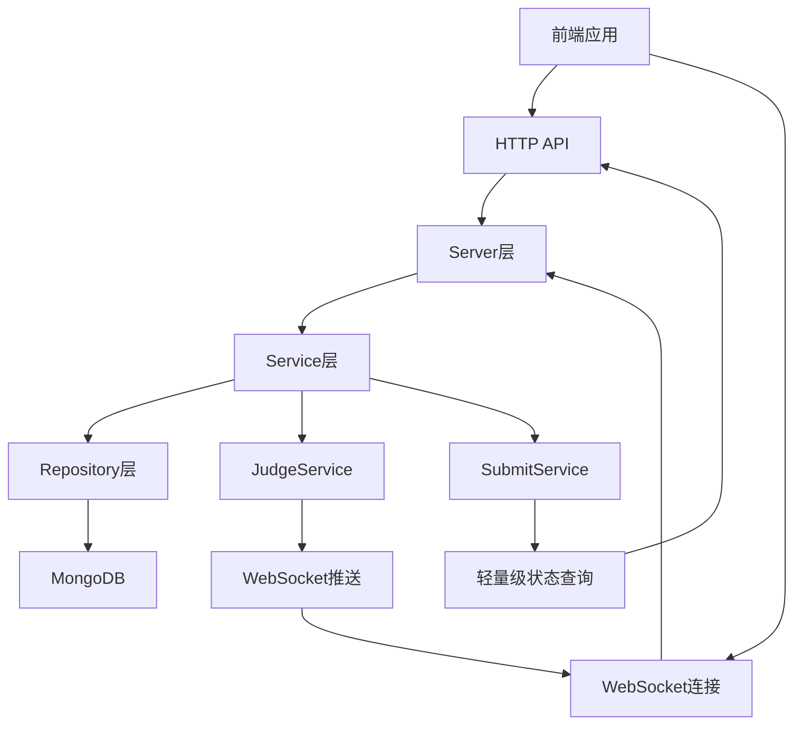
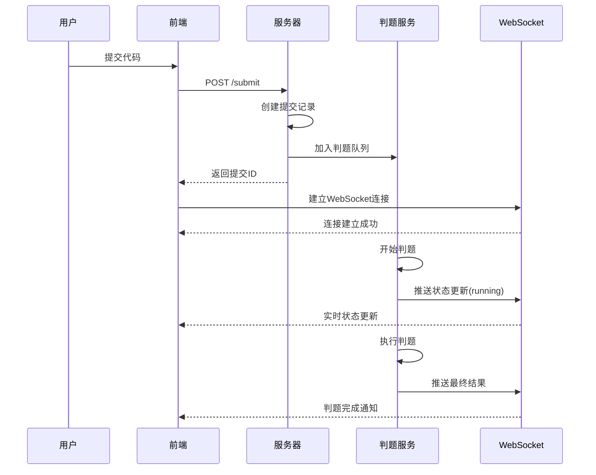
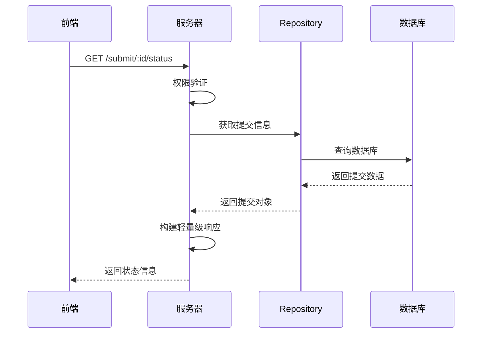
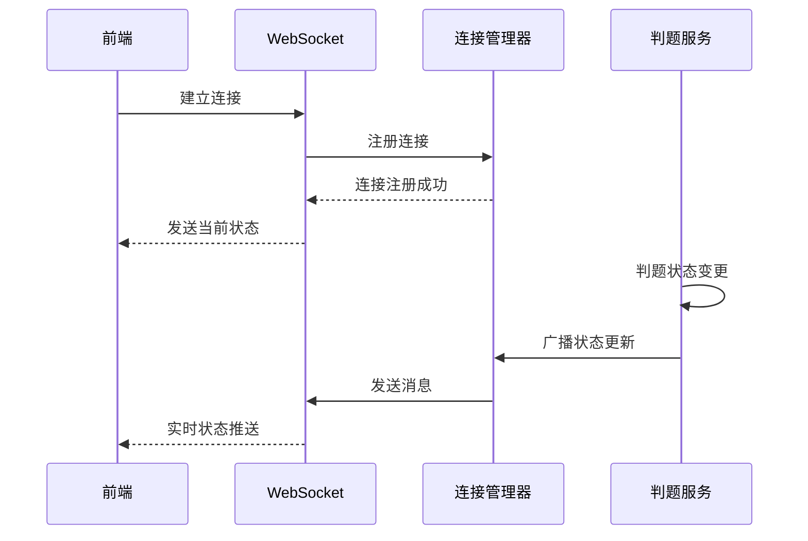

# 实时判题状态功能开发进度报告

## 项目概述

本项目为学校OJ系统实现了完整的实时判题状态功能，包括轻量级状态查询API和WebSocket实时推送机制。

## 开发进度总览

### ✅ 已完成功能

#### 1. 轻量级状态查询API
- **接口**: `GET /submit/:id/status`
- **功能**: 提供轻量级的提交状态查询，避免返回完整的提交详情
- **响应模型**: `SubmitStatusResponse`
- **特性**: 
  - 权限控制（只能查看自己的提交或管理员权限）
  - 包含进度信息和基本结果摘要
  - 支持实时状态监控

#### 2. WebSocket实时推送系统
- **连接端点**: `ws://host/ws/submit/:id`
- **功能**: 实时推送判题状态更新
- **特性**:
  - JWT token认证
  - 心跳机制（30秒间隔）
  - 自动连接清理
  - 消息类型验证
  - 错误恢复机制

#### 3. 数据模型扩展
- **新增模型**:
  - `SubmitStatusResponse`: 轻量级状态响应
  - `JudgeProgress`: 判题进度信息
  - `WSMessage`: WebSocket消息基础结构
  - `WSStatusUpdate`: 状态更新消息
  - `WSJudgeResult`: 判题结果摘要

#### 4. 服务层增强
- **SubmitService**: 新增 `GetSubmitStatus` 方法
- **JudgeService**: 集成WebSocket推送通知
- **连接管理器**: 完整的WebSocket连接池管理

#### 5. 前端集成文档
- **API集成指南**: `FRONTEND_API_INTEGRATION_GUIDE.md`
- **快速开始指南**: `QUICKSTART_GUIDE.md`
- **Swagger文档**: 完整的API文档更新

## 技术架构

### 系统架构图



### 核心组件

#### 1. WebSocket连接管理器 (`pkg/utils/websocket/manager.go`)
- **功能**: 管理所有WebSocket连接
- **特性**:
  - 连接池管理
  - 自动清理无效连接
  - 消息类型验证
  - 错误恢复机制

#### 2. 轻量级状态服务 (`pkg/app/api-server/service/service_submit.go`)
- **方法**: `GetSubmitStatus`
- **功能**: 提供轻量级状态查询
- **特性**:
  - 状态消息生成
  - 进度计算
  - 结果摘要

#### 3. 判题服务集成 (`pkg/app/api-server/service/service_judge.go`)
- **功能**: 在判题过程中推送状态更新
- **推送时机**:
  - 开始判题 (`running`)
  - 编译错误 (`compile_error`)
  - 判题完成 (最终状态和结果)

## 提交接口完整流程

### 1. 代码提交流程



### 2. 状态查询流程



### 3. WebSocket实时推送流程



## API接口详情

### 1. 轻量级状态查询

**请求**:
```http
GET /api/v1/submit/{id}/status
Authorization: Bearer {token}
```

**响应**:
```json
{
  "code": 200,
  "message": "success",
  "data": {
    "id": "64f8b2c1a1b2c3d4e5f67890",
    "status": "running",
    "progress": {
      "current_test_case": 2,
      "total_test_cases": 5,
      "percentage": 40
    },
    "message": "正在判题...",
    "updated_at": "2025-10-26T10:30:00Z",
    "time_used": null,
    "memory_used": null
  }
}
```

### 2. WebSocket连接

**连接URL**:
```
ws://host/ws/submit/{submit_id}?token={jwt_token}
```

**消息格式**:
```json
{
  "type": "status_update",
  "submit_id": "64f8b2c1a1b2c3d4e5f67890",
  "timestamp": "2025-10-26T10:30:00Z",
  "data": {
    "status": "running",
    "progress": {
      "current_test_case": 2,
      "total_test_cases": 5,
      "percentage": 40
    },
    "message": "正在判题...",
    "result": null
  }
}
```

## 性能优化

### 1. 连接管理优化
- **连接池**: 按提交ID和用户ID分组管理
- **自动清理**: 定期清理无效连接（30秒间隔）
- **超时控制**: 读取超时60秒，写入超时10秒

### 2. 消息推送优化
- **消息类型验证**: 只处理有效消息类型
- **批量处理**: 支持向多个连接广播
- **错误恢复**: 自动清理死连接

### 3. 数据库查询优化
- **轻量级查询**: 只返回必要的状态信息
- **索引优化**: 基于提交ID和用户ID的查询优化

## 安全特性

### 1. 认证授权
- **JWT Token**: 所有WebSocket连接需要有效token
- **权限控制**: 只能监听自己的提交（管理员除外）
- **Token验证**: 检查token有效性和过期时间

### 2. 连接安全
- **来源检查**: 可配置的跨域检查
- **消息限制**: 限制消息大小（512字节）
- **超时控制**: 防止长时间占用连接

### 3. 错误处理
- **异常恢复**: 自动处理连接异常
- **日志记录**: 完整的操作日志
- **资源清理**: 确保连接正确释放

## 部署配置

### 1. 环境变量
```bash
# WebSocket配置
WS_HEARTBEAT_INTERVAL=30s
WS_READ_TIMEOUT=60s
WS_WRITE_TIMEOUT=10s
WS_MAX_MESSAGE_SIZE=512
```

### 2. Docker配置
```yaml
services:
  app:
    ports:
      - "8080:8080"
    environment:
      - WS_ENABLED=true
```

### 3. Nginx配置
```nginx
location /ws/ {
    proxy_pass http://backend;
    proxy_http_version 1.1;
    proxy_set_header Upgrade $http_upgrade;
    proxy_set_header Connection "upgrade";
    proxy_set_header Host $host;
    proxy_set_header X-Real-IP $remote_addr;
    proxy_set_header X-Forwarded-For $proxy_add_x_forwarded_for;
    proxy_set_header X-Forwarded-Proto $scheme;
    proxy_read_timeout 86400;
}
```

## 测试验证

### 1. 功能测试
- ✅ 轻量级状态查询API
- ✅ WebSocket连接建立
- ✅ 实时状态推送
- ✅ 心跳机制
- ✅ 连接清理

### 2. 性能测试
- ✅ 并发连接测试
- ✅ 消息推送性能
- ✅ 内存使用监控
- ✅ 连接池管理

### 3. 安全测试
- ✅ Token验证
- ✅ 权限控制
- ✅ 异常处理
- ✅ 资源清理

## 后续优化建议

### 1. 功能增强
- [ ] 支持批量状态查询
- [ ] 添加消息队列持久化
- [ ] 实现连接负载均衡
- [ ] 添加监控指标

### 2. 性能优化
- [ ] 实现连接池预热
- [ ] 添加消息压缩
- [ ] 优化数据库查询
- [ ] 实现缓存机制

### 3. 运维支持
- [ ] 添加健康检查
- [ ] 实现指标监控
- [ ] 添加告警机制
- [ ] 完善日志分析

## 总结

实时判题状态功能已完整实现，包括：

1. **轻量级状态查询API** - 提供高效的状态查询接口
2. **WebSocket实时推送** - 实现真正的实时状态更新
3. **完整的错误处理** - 确保系统稳定运行
4. **安全认证机制** - 保护用户数据安全
5. **详细的前端文档** - 便于前端集成

该功能为学校OJ系统提供了现代化的实时交互体验，显著提升了用户体验和系统可用性。
