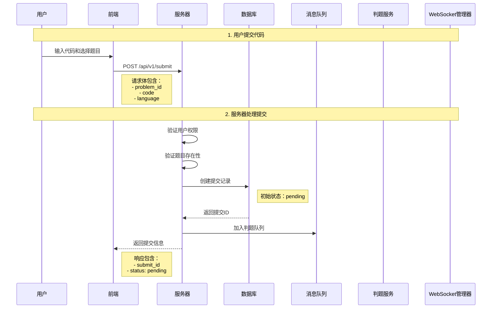
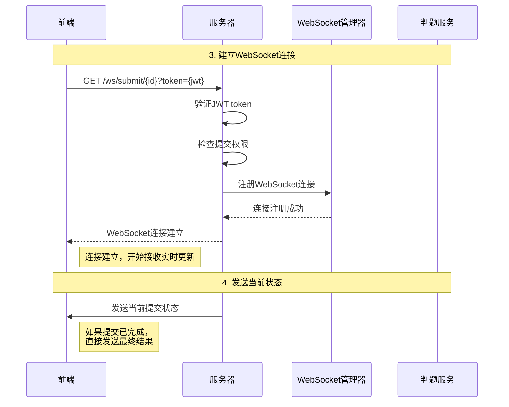
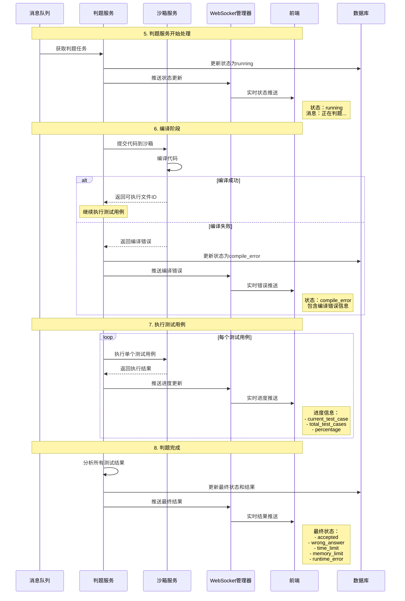
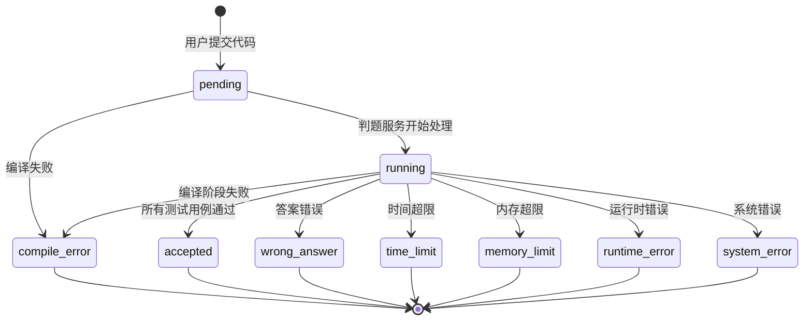

# 提交接口完整流程说明

## 概述

本文档详细说明了学校OJ系统中代码提交的完整流程，包括传统HTTP接口和新增的实时WebSocket推送机制。

## 完整提交流程

### 1. 代码提交阶段



### 2. 实时状态监听阶段



### 3. 判题执行阶段



## 接口详细说明

### 1. 代码提交接口

**接口**: `POST /api/v1/submit`

**请求体**:
```json
{
  "problem_id": "64f8b2c1a1b2c3d4e5f67890",
  "code": "#include <iostream>\nusing namespace std;\nint main() {\n    int a, b;\n    cin >> a >> b;\n    cout << a + b << endl;\n    return 0;\n}",
  "language": "cpp"
}
```

**响应**:
```json
{
  "code": 200,
  "message": "success",
  "data": {
    "id": "64f8b2c1a1b2c3d4e5f67891",
    "problem_id": "64f8b2c1a1b2c3d4e5f67890",
    "user_id": "64f8b2c1a1b2c3d4e5f67892",
    "language": "cpp",
    "status": "pending",
    "created_at": "2025-10-26T10:30:00Z"
  }
}
```

### 2. 轻量级状态查询接口

**接口**: `GET /api/v1/submit/{id}/status`

**响应**:
```json
{
  "code": 200,
  "message": "success",
  "data": {
    "id": "64f8b2c1a1b2c3d4e5f67891",
    "status": "running",
    "progress": {
      "current_test_case": 2,
      "total_test_cases": 5,
      "percentage": 40
    },
    "message": "正在判题...",
    "updated_at": "2025-10-26T10:30:15Z",
    "time_used": null,
    "memory_used": null
  }
}
```

### 3. WebSocket连接

**连接URL**: `ws://host/ws/submit/{submit_id}?token={jwt_token}`

**认证方式**:
- 通过URL参数传递token: `?token=eyJhbGciOiJIUzI1NiIsInR5cCI6IkpXVCJ9...`
- 或通过Authorization header: `Authorization: Bearer {token}`

## 状态流转图



## WebSocket消息格式

### 1. 状态更新消息

```json
{
  "type": "status_update",
  "submit_id": "64f8b2c1a1b2c3d4e5f67891",
  "timestamp": "2025-10-26T10:30:15Z",
  "data": {
    "status": "running",
    "progress": {
      "current_test_case": 2,
      "total_test_cases": 5,
      "percentage": 40
    },
    "message": "正在判题...",
    "result": null
  }
}
```

### 2. 判题完成消息

```json
{
  "type": "status_update",
  "submit_id": "64f8b2c1a1b2c3d4e5f67891",
  "timestamp": "2025-10-26T10:30:45Z",
  "data": {
    "status": "accepted",
    "progress": null,
    "message": "通过",
    "result": {
      "status": "accepted",
      "time_used": 15,
      "memory_used": 1024,
      "passed_cases": 5,
      "total_cases": 5,
      "compile_error": null
    }
  }
}
```

### 3. 编译错误消息

```json
{
  "type": "status_update",
  "submit_id": "64f8b2c1a1b2c3d4e5f67891",
  "timestamp": "2025-10-26T10:30:10Z",
  "data": {
    "status": "compile_error",
    "progress": null,
    "message": "编译错误",
    "result": {
      "status": "compile_error",
      "time_used": 0,
      "memory_used": 0,
      "passed_cases": 0,
      "total_cases": 0,
      "compile_error": "error: expected ';' before 'return'"
    }
  }
}
```

## 前端集成示例

### 1. 建立WebSocket连接

```javascript
// 建立WebSocket连接
function connectWebSocket(submitId, token) {
    const wsUrl = `ws://localhost:8080/ws/submit/${submitId}?token=${token}`;
    const ws = new WebSocket(wsUrl);
    
    ws.onopen = function(event) {
        console.log('WebSocket连接已建立');
    };
    
    ws.onmessage = function(event) {
        const message = JSON.parse(event.data);
        handleStatusUpdate(message);
    };
    
    ws.onclose = function(event) {
        console.log('WebSocket连接已关闭');
    };
    
    ws.onerror = function(error) {
        console.error('WebSocket错误:', error);
    };
    
    return ws;
}
```

### 2. 处理状态更新

```javascript
// 处理状态更新消息
function handleStatusUpdate(message) {
    const { type, submit_id, data } = message;
    
    if (type === 'status_update') {
        const { status, progress, message: statusMessage, result } = data;
        
        // 更新UI状态
        updateStatusDisplay(status, statusMessage);
        
        // 更新进度条
        if (progress) {
            updateProgressBar(progress);
        }
        
        // 显示结果
        if (result) {
            displayResult(result);
        }
    }
}
```

### 3. 轻量级状态查询

```javascript
// 轻量级状态查询
async function getSubmitStatus(submitId, token) {
    try {
        const response = await fetch(`/api/v1/submit/${submitId}/status`, {
            headers: {
                'Authorization': `Bearer ${token}`
            }
        });
        
        const data = await response.json();
        return data.data;
    } catch (error) {
        console.error('获取状态失败:', error);
        return null;
    }
}
```

## 错误处理

### 1. 网络错误处理

```javascript
// 网络错误重连机制
function handleWebSocketError(ws, submitId, token) {
    let reconnectAttempts = 0;
    const maxReconnectAttempts = 5;
    
    function reconnect() {
        if (reconnectAttempts < maxReconnectAttempts) {
            setTimeout(() => {
                console.log(`尝试重连 (${reconnectAttempts + 1}/${maxReconnectAttempts})`);
                const newWs = connectWebSocket(submitId, token);
                reconnectAttempts++;
            }, 2000 * Math.pow(2, reconnectAttempts)); // 指数退避
        }
    }
    
    ws.onclose = function(event) {
        if (!event.wasClean) {
            reconnect();
        }
    };
}
```

### 2. 权限错误处理

```javascript
// 权限错误处理
function handlePermissionError(response) {
    if (response.status === 401) {
        // Token过期，重新登录
        redirectToLogin();
    } else if (response.status === 403) {
        // 权限不足
        showErrorMessage('无权查看此提交状态');
    } else if (response.status === 404) {
        // 提交不存在
        showErrorMessage('提交不存在');
    }
}
```

## 性能优化建议

### 1. 连接管理
- 实现连接池，避免频繁建立/断开连接
- 使用心跳机制保持连接活跃
- 实现自动重连机制

### 2. 消息处理
- 限制消息大小，避免大消息阻塞
- 实现消息队列，处理消息积压
- 使用消息压缩减少网络传输

### 3. 状态缓存
- 缓存提交状态，减少数据库查询
- 实现状态同步机制
- 使用Redis等缓存中间件

## 监控和日志

### 1. 关键指标
- WebSocket连接数
- 消息推送成功率
- 平均响应时间
- 错误率统计

### 2. 日志记录
- 连接建立/断开日志
- 消息推送日志
- 错误日志
- 性能指标日志

### 3. 告警机制
- 连接数异常告警
- 消息推送失败告警
- 系统错误告警
- 性能指标异常告警

## 总结

提交接口的完整流程包括：

1. **代码提交** - 用户提交代码，服务器创建提交记录
2. **状态监听** - 建立WebSocket连接，开始实时状态监听
3. **判题执行** - 判题服务处理代码，推送状态更新
4. **结果展示** - 前端接收实时更新，展示判题结果

该流程实现了真正的实时交互体验，为用户提供了现代化的OJ使用体验。
