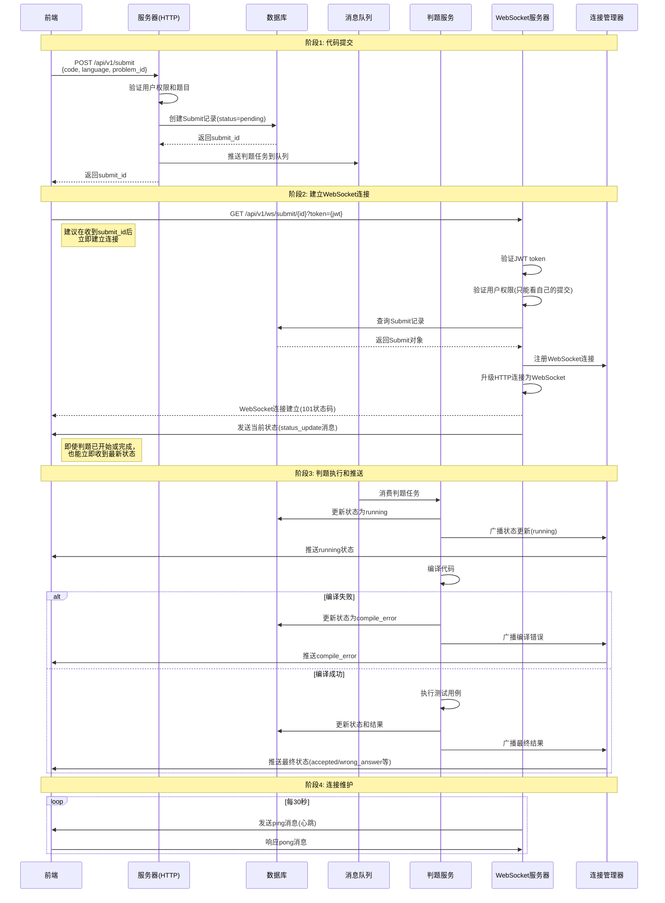

# WebSocket连接逻辑详解

## 📋 目录
1. [WebSocket完整流程](#websocket完整流程)
2. [是否需要快速连接](#是否需要快速连接)
3. [连接慢的影响](#连接慢的影响)
4. [Apifox测试问题解决](#apifox测试问题解决)
5. [前端最佳实践](#前端最佳实践)

---

## 🔄 WebSocket完整流程

### 1. 代码提交后的完整时序



### 2. WebSocket服务器处理逻辑

#### 连接建立过程 (`HandleSubmitWebSocket`)

```102:116:pkg/app/api-server/server/server_websocket.go
	// 升级到WebSocket连接
	conn, err := upgrader.Upgrade(c.Writer, c.Request, nil)
	if err != nil {
		s.lg.Errorf("WebSocket升级失败: %v", err)
		return
	}

	// 添加到连接管理器
	wsManager.GlobalConnectionManager.AddConnection(submitIDStr, userID.Hex(), conn)

	// 发送当前状态
	s.sendCurrentStatus(conn, submit)

	// 处理连接
	s.handleWebSocketConnection(conn, submitIDStr, userID.Hex())
```

**关键步骤**：
1. **参数验证**：验证提交ID格式
2. **Token认证**：从URL参数或Header获取JWT token并验证
3. **权限检查**：非管理员只能监听自己的提交
4. **连接升级**：将HTTP请求升级为WebSocket连接
5. **注册连接**：将连接添加到连接管理器
6. **发送初始状态**：立即发送当前提交状态（无论连接多晚建立）
7. **启动连接处理**：开始监听消息和心跳

#### 状态推送机制

判题服务在关键节点推送状态更新：

```155:227:pkg/app/api-server/service/service_judge.go
	// WebSocket推送：开始判题
	wsManager.BroadcastSubmitStatusUpdate(task.SubmitID, task.UserID, models.StatusRunning, nil, nil)

	// ... 编译和执行过程 ...

		// WebSocket推送：编译错误
		wsManager.BroadcastSubmitStatusUpdate(task.SubmitID, task.UserID, models.StatusCompileError, nil, result)

	// ... 判题完成 ...

	// WebSocket推送：判题完成
	wsManager.BroadcastSubmitStatusUpdate(task.SubmitID, task.UserID, finalStatus, nil, result)
```

**推送时机**：
- ✅ **开始判题**：状态从`pending`变为`running`
- ✅ **编译错误**：如果编译失败，推送错误信息
- ✅ **判题完成**：推送最终状态和结果

---

## ⚡ 是否需要快速连接

### 结论：**不需要立即连接，但有最佳实践**

### 为什么不需要立即连接？

1. **连接建立后会立即发送当前状态**
   ```146:160:pkg/app/api-server/server/server_websocket.go
   // sendCurrentStatus 发送当前状态
   func (s *Server) sendCurrentStatus(conn *websocket.Conn, submit *models.Submit) {
   	message := models.WSMessage{
   		Type:      "status_update",
   		SubmitID:  submit.ID.Hex(),
   		Timestamp: time.Now(),
   		Data: models.WSStatusUpdate{
   			Status:  submit.Status,
   			Message: s.getStatusMessage(submit.Status),
   			Result:  s.convertToWSResult(submit.Result),
   		},
   	}

   	if err := conn.WriteJSON(message); err != nil {
   		s.lg.Errorf("发送当前状态失败: %v", err)
   	}
   }
   ```
   无论连接何时建立，服务器都会：
   - 从数据库查询最新的提交状态
   - 立即发送给客户端
   - 确保客户端收到最新状态

2. **状态更新会被缓存和广播**
   - 连接管理器会维护所有活跃连接
   - 判题服务推送的状态更新会广播给所有监听该提交的连接
   - 即使连接建立较晚，只要判题未完成，仍能收到后续更新

### 最佳实践：**收到submit_id后立即连接**

虽然不需要立即连接，但建议这样做，原因：

1. **避免错过中间状态**
   - 如果连接太慢，可能错过`pending -> running`的状态变化
   - 虽然最终能收到结果，但用户体验不佳

2. **确保实时性**
   - 快速建立连接可以实时看到判题进度
   - 对于长时间判题（多测试用例），能看到进度更新

3. **前端实现简单**
   ```javascript
   // 提交代码后立即建立连接
   async function submitCode(code, problemId) {
     // 1. 提交代码
     const response = await fetch('/api/v1/submit', {
       method: 'POST',
       body: JSON.stringify({ code, problem_id: problemId, language: 'cpp' })
     });
     const { submit_id } = await response.json();
     
     // 2. 立即建立WebSocket连接（推荐）
     const ws = connectWebSocket(submit_id, token);
     
     return ws;
   }
   ```

---

## ⏱️ 连接慢的影响

### 场景分析

#### 场景1：连接非常快（提交后立即连接）
```
时间线：
0s:  提交代码，获得submit_id
0.5s: 建立WebSocket连接
0.5s: 收到当前状态: pending
2s:   收到状态更新: running (开始判题)
5s:   收到最终结果: accepted
```
✅ **最佳体验**：能收到所有状态变化

#### 场景2：连接较慢（提交后2秒连接）
```
时间线：
0s:  提交代码，获得submit_id
2s:   建立WebSocket连接
2s:   收到当前状态: running (已开始判题，直接收到running状态)
5s:   收到最终结果: accepted
```
⚠️ **可接受**：错过了pending->running的转变，但能收到后续更新

#### 场景3：连接很慢（提交后10秒连接，判题已完成）
```
时间线：
0s:  提交代码，获得submit_id
2s:   判题开始 (running)
5s:   判题完成 (accepted)
10s:  建立WebSocket连接
10s:  收到当前状态: accepted (直接收到最终结果)
```
✅ **仍然可用**：连接建立时立即收到最终结果，虽然没有看到过程

#### 场景4：连接失败或一直未连接
```
时间线：
0s:  提交代码，获得submit_id
2s:   判题开始 (running)
5s:   判题完成 (accepted)
...:  前端未建立WebSocket连接
```
⚠️ **降级方案**：前端应该使用轮询作为备用方案
```javascript
// 如果WebSocket连接失败，降级到轮询
if (!ws || ws.readyState !== WebSocket.OPEN) {
  // 使用轮询获取状态
  const pollInterval = setInterval(async () => {
    const status = await fetch(`/api/v1/submit/${submitId}/status`);
    updateUI(status);
    if (status.isFinal) clearInterval(pollInterval);
  }, 2000);
}
```

### 总结

| 连接时机 | 用户体验 | 是否推荐 |
|---------|---------|---------|
| 立即连接(0-1秒) | ⭐⭐⭐⭐⭐ 能看到所有状态变化 | ✅ 强烈推荐 |
| 较快连接(1-3秒) | ⭐⭐⭐⭐ 可能错过初始状态 | ✅ 推荐 |
| 较慢连接(3-10秒) | ⭐⭐⭐ 可能错过中间状态 | ⚠️ 可接受 |
| 很慢连接(>10秒) | ⭐⭐ 直接收到最终结果 | ⚠️ 不推荐但可用 |
| 未连接 | ⭐ 需要使用轮询 | ❌ 不推荐 |

---

## 🔧 Apifox测试问题解决

### 问题：WebSocket升级失败

### 原因分析

#### 1. **URL路径错误** ❌
```
错误：ws://localhost:8080/ws/submit/{id}
正确：ws://localhost:8080/api/v1/ws/submit/{id}
```
**原因**：WebSocket路由注册在`/api/v1`路由组下

#### 2. **缺少Token认证** ❌
```
错误：ws://localhost:8080/api/v1/ws/submit/{id}
正确：ws://localhost:8080/api/v1/ws/submit/{id}?token=your_jwt_token
```
**原因**：WebSocket握手时需要验证JWT token

#### 3. **请求头配置错误** ❌
Apifox可能没有正确设置WebSocket升级请求头：
- `Upgrade: websocket`
- `Connection: Upgrade`
- `Sec-WebSocket-Key`
- `Sec-WebSocket-Version: 13`

#### 4. **服务器不支持WebSocket升级** ❌
检查服务器配置是否正确

### 解决方案

#### 方案1：使用Apifox的WebSocket功能（推荐）

1. **创建WebSocket请求**
   - 在Apifox中创建新请求
   - 选择WebSocket类型
   - URL: `ws://localhost:8080/api/v1/ws/submit/{submit_id}?token={jwt_token}`

2. **配置参数**
   ```
   URL: ws://localhost:8080/api/v1/ws/submit/67124f5a8b8a4c123d456789
   查询参数：
   - token: your_jwt_token_here
   ```

3. **测试步骤**
   - 先调用登录接口获取token
   - 提交代码获取submit_id
   - 使用token和submit_id建立WebSocket连接
   - 观察收到的消息

#### 方案2：使用命令行工具测试

```bash
# 使用wscat工具（需要先安装: npm install -g wscat）
wscat -c "ws://localhost:8080/api/v1/ws/submit/67124f5a8b8a4c123d456789?token=your_token"

# 或使用curl（支持WebSocket的工具）
```

#### 方案3：使用浏览器测试（最简单）

```html
<!DOCTYPE html>
<html>
<head>
    <title>WebSocket测试</title>
</head>
<body>
    <script>
        // 替换为你的实际值
        const submitId = '67124f5a8b8a4c123d456789';
        const token = 'your_jwt_token_here';
        
        const ws = new WebSocket(`ws://localhost:8080/api/v1/ws/submit/${submitId}?token=${token}`);
        
        ws.onopen = () => {
            console.log('WebSocket连接已建立');
        };
        
        ws.onmessage = (event) => {
            const message = JSON.parse(event.data);
            console.log('收到消息:', message);
        };
        
        ws.onerror = (error) => {
            console.error('WebSocket错误:', error);
        };
        
        ws.onclose = (event) => {
            console.log('WebSocket连接已关闭', event.code, event.reason);
        };
    </script>
</body>
</html>
```

### 调试检查清单

- [ ] **检查URL路径**：确保包含`/api/v1`前缀
- [ ] **检查Token**：确保token有效且未过期
- [ ] **检查提交ID**：确保submit_id存在且属于当前用户
- [ ] **检查服务器日志**：查看是否有错误信息
- [ ] **检查网络**：确保能访问服务器
- [ ] **检查CORS**：虽然CheckOrigin返回true，但某些工具可能有CORS限制
- [ ] **检查服务器状态**：确保服务器正在运行

### 常见错误和解决方案

| 错误信息 | 可能原因 | 解决方案 |
|---------|---------|---------|
| `WebSocket升级失败` | URL路径错误 | 检查是否包含`/api/v1`前缀 |
| `需要提供访问令牌` | 缺少token | 在URL参数中添加`?token=xxx` |
| `无效的访问令牌` | Token过期或无效 | 重新登录获取新token |
| `提交不存在` | submit_id错误 | 检查submit_id是否正确 |
| `只能监听自己的提交状态` | 权限不足 | 确保使用提交者本人的token |
| `101 Switching Protocols` | ✅ 成功 | 连接已建立，等待接收消息 |

---

## 💡 前端最佳实践

### 1. 连接时机

```javascript
// ✅ 推荐：提交后立即建立连接
async function submitAndMonitor(code, problemId, token) {
  // 1. 提交代码
  const submitResponse = await fetch('/api/v1/submit', {
    method: 'POST',
    headers: {
      'Content-Type': 'application/json',
      'Authorization': `Bearer ${token}`
    },
    body: JSON.stringify({
      code,
      problem_id: problemId,
      language: 'cpp'
    })
  });
  
  const { submit_id } = await submitResponse.json();
  
  // 2. 立即建立WebSocket连接
  return connectWebSocket(submit_id, token);
}
```

### 2. 连接管理

```javascript
class SubmitStatusMonitor {
  constructor(submitId, token) {
    this.submitId = submitId;
    this.token = token;
    this.ws = null;
    this.reconnectAttempts = 0;
    this.maxReconnectAttempts = 5;
    this.reconnectDelay = 1000; // 1秒
  }
  
  connect() {
    const wsUrl = `ws://localhost:8080/api/v1/ws/submit/${this.submitId}?token=${this.token}`;
    this.ws = new WebSocket(wsUrl);
    
    this.ws.onopen = () => {
      console.log('WebSocket连接已建立');
      this.reconnectAttempts = 0; // 重置重连次数
    };
    
    this.ws.onmessage = (event) => {
      const message = JSON.parse(event.data);
      this.handleMessage(message);
    };
    
    this.ws.onerror = (error) => {
      console.error('WebSocket错误:', error);
    };
    
    this.ws.onclose = (event) => {
      console.log('WebSocket连接已关闭', event.code, event.reason);
      // 如果不是正常关闭，尝试重连
      if (event.code !== 1000 && this.reconnectAttempts < this.maxReconnectAttempts) {
        this.reconnect();
      }
    };
  }
  
  reconnect() {
    this.reconnectAttempts++;
    const delay = this.reconnectDelay * Math.pow(2, this.reconnectAttempts - 1); // 指数退避
    console.log(`${delay}ms后重连... (尝试 ${this.reconnectAttempts}/${this.maxReconnectAttempts})`);
    setTimeout(() => this.connect(), delay);
  }
  
  handleMessage(message) {
    switch (message.type) {
      case 'status_update':
        this.onStatusUpdate(message.data);
        break;
      case 'pong':
        // 心跳响应
        break;
      default:
        console.warn('未知消息类型:', message.type);
    }
  }
  
  onStatusUpdate(data) {
    // 更新UI
    console.log('状态更新:', data.status, data.message);
    
    // 如果判题完成，关闭连接
    if (this.isFinalStatus(data.status)) {
      this.close();
    }
  }
  
  isFinalStatus(status) {
    const finalStatuses = [
      'accepted', 'wrong_answer', 'time_limit',
      'memory_limit', 'runtime_error', 'compile_error', 'system_error'
    ];
    return finalStatuses.includes(status);
  }
  
  close() {
    if (this.ws) {
      this.ws.close(1000, '判题完成'); // 正常关闭
    }
  }
}

// 使用示例
const monitor = new SubmitStatusMonitor(submitId, token);
monitor.connect();
```

### 3. 降级策略

```javascript
// 如果WebSocket连接失败，降级到轮询
async function monitorSubmitStatus(submitId, token) {
  const monitor = new SubmitStatusMonitor(submitId, token);
  let usePolling = false;
  
  monitor.ws.onerror = () => {
    console.warn('WebSocket连接失败，降级到轮询');
    usePolling = true;
    startPolling(submitId, token);
  };
  
  monitor.connect();
}

function startPolling(submitId, token) {
  const pollInterval = setInterval(async () => {
    try {
      const response = await fetch(`/api/v1/submit/${submitId}/status`, {
        headers: {
          'Authorization': `Bearer ${token}`
        }
      });
      const status = await response.json();
      
      updateUI(status);
      
      // 如果判题完成，停止轮询
      if (isFinalStatus(status.status)) {
        clearInterval(pollInterval);
      }
    } catch (error) {
      console.error('轮询失败:', error);
    }
  }, 2000); // 每2秒轮询一次
}
```

---

## 📝 总结

1. **WebSocket连接时机**：
   - 不需要立即连接，但推荐在收到submit_id后尽快连接
   - 连接建立后会立即收到当前状态，确保不会丢失最终结果

2. **连接慢的影响**：
   - 可能错过中间状态更新（如pending->running）
   - 但最终结果会在连接建立时立即发送
   - 建议实现降级方案（轮询）作为备用

3. **Apifox测试**：
   - 确保URL路径正确：`/api/v1/ws/submit/{id}?token={token}`
   - 确保token有效
   - 使用WebSocket功能而非普通HTTP请求
   - 可以先用浏览器测试验证

4. **最佳实践**：
   - 提交代码后立即建立WebSocket连接
   - 实现自动重连机制
   - 提供轮询降级方案
   - 处理各种异常情况

