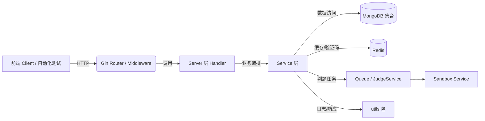

## 1. 总体架构



- **Server 层**：位于 `pkg/app/api-server/server`，负责路由注册、请求解析、权限校验、统一响应。
- **Service 层**：`pkg/app/api-server/service`，封装核心业务逻辑，访问 MongoDB、Redis、判题队列。
- **数据层**：通过 `pkg/utils` 提供的集合/客户端，使用 MongoDB 与 Redis。
- **判题子系统**：提交后通过队列投递到判题服务，异步获取结果。

## 2. 模块与接口映射

| 模块 | 需求要点 | Server Handler | 说明 |
| --- | --- | --- | --- |
| 用户 | 注册/登录、资料管理、管理员权限 | `/user/register`, `/user/login`, `/user/profile`, `/user`, `/user/:id` | 覆盖角色权限、账号状态校验 |
| 题目 | 列表、详情、搜索、管理、运行 | `/problem/`, `/problem/:id`, `/problem/search`, `/problem/:id/run` | 需校验公开/非公开、教师/管理员权限 |
| 提交 | 代码提交、列表、详情 | `/submit/`, `/submit/:id` | 需校验语言、题目状态、用户权限 |
| 测试用例 | 单用例、批量导入、维护 | `/testcase/**` | 需校验教师/管理员权限、题目存在 |
| 课程/班级/任务 | 课程 CRUD、班级管理、任务流转 | `/courses/**`, `/courses/clazzes/**`, `/courses/task/**`, `/courses/finishtask` | 涵盖权限（课程创建者/教师/成员）、邀请码流程 |
| 统计 | 用户、系统统计 | `/statistics/user`, `/statistics/system` | 需校验管理员权限或本人角色 |
| 判题 | 交互在 Service 层 (`service_judge.go`) | - | 由提交服务触发，需在测试中模拟队列交互 |

> 注：详细接口合同将在自动化测试阶段与 Swagger 注释统一生成。

## 3. 接口契约要点

- **认证/角色**：统一通过 `JWTMiddleware` 注入 `user_id`、`role`，必要时叠加 `RequireRole`。测试需覆盖未登录、角色不足场景。
- **响应格式**：统一使用 `utils.SuccessResponse/BadRequestResponse/...`；Swagger 文档需体现标准响应包，例如：
  ```json
  {
    "code": 0,
    "message": "success",
    "data": {}
  }
  ```
- **错误处理**：BadRequest 用于参数/校验错误，Unauthorized/Forbidden 用于权限问题，InternalServerError 用于系统异常。

## 4. 数据流与依赖

- **用户请求 → Handler**：解析参数，执行权限校验。
- **Handler → Service**：传递 `context.Context`，执行业务逻辑，包括 Mongo 查询、Redis 缓存。
- **Service → 外部系统**：
  - MongoDB：课程、班级、题目、提交等集合。
  - Redis：邀请码缓存、限流等。
  - Judge Queue：提交任务异步判题。
- **返回**：Service 返回结果或错误，Handler 根据错误类型构造响应。

## 5. 异常与安全策略

- **权限异常**：统一返回 403/401，测试覆盖伪造 token、错误角色。
- **数据校验**：ID 解析失败、必填字段为空即返回 400，Swagger 中标注请求体校验规则。
- **并发一致性**：
  - 班级加入使用 Mongo `$addToSet` 与 `$inc` 乐观锁。
  - 课程删除启用事务，需要测试失败回滚路径。
- **敏感信息**：密码在 Service 层处理（ TODO：后续补回 bcrypt 校验 ）。

## 6. Swagger 集成方案

- 引入依赖：
  ```go
  github.com/swaggo/swag v1.x
  github.com/swaggo/gin-swagger v1.x
  github.com/swaggo/files v1.x
  ```
- 项目根目录下新增 `docs/swagger`（swag init 输出），在 `server.go` 中注册 Swagger 路由（例如 `/swagger/*any`）。
- 在每个 Handler 函数前补充注释（@Summary/@Description/@Tags/@Param/@Success/@Failure），与响应模型对应。
- 在 CI 或 Makefile 中添加 `swag init` 生成命令，自动化脚本保证文档及时更新。

## 7. 自动化测试策略

- **工具**：Go `testing` + `net/http/httptest`，使用真实 Gin 路由实例。
- **Mock/Stub**：
  - 对 Service 层依赖 Mongo/Redis 的方法使用接口或自定义假实现。
  - 对 JudgeService、Queue 等使用假客户端，返回预期结果或错误。
- **测试维度**：
  - 正常流程：满足需求文档中每个成功场景。
  - 权限/异常：未登录、角色不符、数据不存在、参数非法。
  - 幂等/并发：班级加入重复、课程删除事务失败。
- **覆盖指标**：确保关键 handler 至少 1 条成功与 1 条失败路径；覆盖率重点关注 server 层、service 核心逻辑。

## 8. 里程碑

1. **接口盘点**：整理表格，确认与需求一一对应。
2. **Swagger 注释补齐**：模块分批补注释并生成文档。
3. **测试基线搭建**：抽象 service 依赖，编写首批 handler 测试（用户、课程、提交）。
4. **链路覆盖扩展**：覆盖测试用例、统计、任务流转等。
5. **CI 集成**：提供 `go test ./...` 与 `swag init` 脚本，生成前端可用 Swagger JSON。

## 9. 未决事项

- 判题服务联调：若需验证真实队列，需准备测试环境或提供 Mock Adapter。
- 用户密码已 TODO bcrypt 校验，需要评估是否纳入本次修改范围（默认仅记录风险）。

