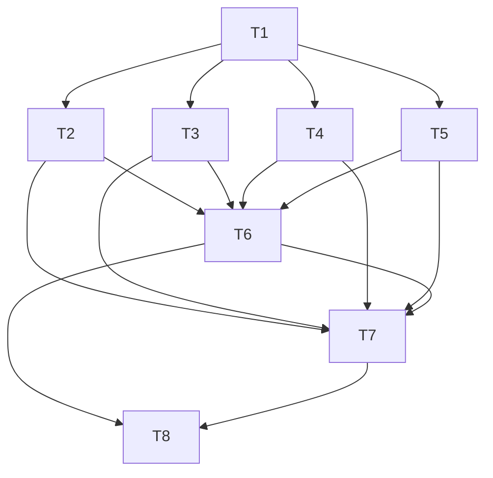

## 原子任务列表

### T1 接口盘点与需求映射
- **输入契约**：`docs/v1.0需求/v1.0需求文档.md`、`pkg/app/api-server/server/**/*.go`
- **输出契约**：接口映射表（CSV/Markdown），标记覆盖情况、缺口、权限说明；更新至项目文档目录
- **实现约束**：仅梳理现状，不修改代码；记录缺陷/差异
- **依赖关系**：无

### T2 课程/班级/任务接口校验与整改
- **输入契约**：T1 生成的映射表、`service_course.go`、`server_course.go`
- **输出契约**：修复后的 handler/service 代码、更新测试数据/文档、缺陷闭环记录
- **实现约束**：遵循现有业务逻辑；必要时补充权限/响应校验；变更需同步 Swagger 注释
- **依赖关系**：依赖 T1

### T3 题目/测试用例接口校验与整改
- **输入契约**：T1 映射结果、`server_problem.go`、`server_testcase.go`
- **输出契约**：修复代码（若有）、权限逻辑说明、补充/更新文档
- **实现约束**：保持题目公开/非公开策略；批量导入权限需严格校验
- **依赖关系**：依赖 T1

### T4 提交/判题接口校验与整改
- **输入契约**：T1 映射、`server_submit.go`、`service_judge.go`、`pkg/queue`
- **输出契约**：链路校验结果、必要的异常处理补丁、更新后的接口说明
- **实现约束**：判题队列可使用 Mock；保持异步行为
- **依赖关系**：依赖 T1

### T5 用户/统计接口校验与整改
- **输入契约**：T1 映射、`server_user.go`、`server_statistics.go`
- **输出契约**：修复代码/权限、文档说明、测试覆盖
- **实现约束**：管理员/教师/学生角色校验不得放宽；敏感信息处理符合规范
- **依赖关系**：依赖 T1

### T6 Swagger 集成与注释补齐
- **输入契约**：现有 handler 列表、T2~T5 的修复结果
- **输出契约**：Swagger 依赖配置、生成的 `docs/swagger` 目录、在 `server` 层注册 `/swagger` 路由
- **实现约束**：采用 `swaggo/swag`；注释覆盖全部公开/受保护接口；生成文档可在开发环境启动
- **依赖关系**：依赖 T2~T5（确保接口稳定）

### T7 自动化测试基线搭建
- **输入契约**：修复后的 handler/service、Swagger 契约、测试框架（Go testing）
- **输出契约**：`pkg/app/api-server/server/tests`（或等效路径）下的测试用例；覆盖率报告；CI/脚本说明
- **实现约束**：`go test ./...` 可通过；优先覆盖核心链路（注册登录、课程操作、题目提交等）
- **依赖关系**：依赖 T2~T6

### T8 接口文档与交付汇总
- **输入契约**：Swagger 生成结果、自动化测试报告
- **输出契约**：最终接口文档（HTML/JSON/Markdown）、`docs/接口完备性巡检_v1/ACCEPTANCE_*` 更新、交付清单
- **实现约束**：文档可供前端直接引用（Swagger JSON + 简要说明）；列明测试结果
- **依赖关系**：依赖 T6、T7

## 依赖关系图

