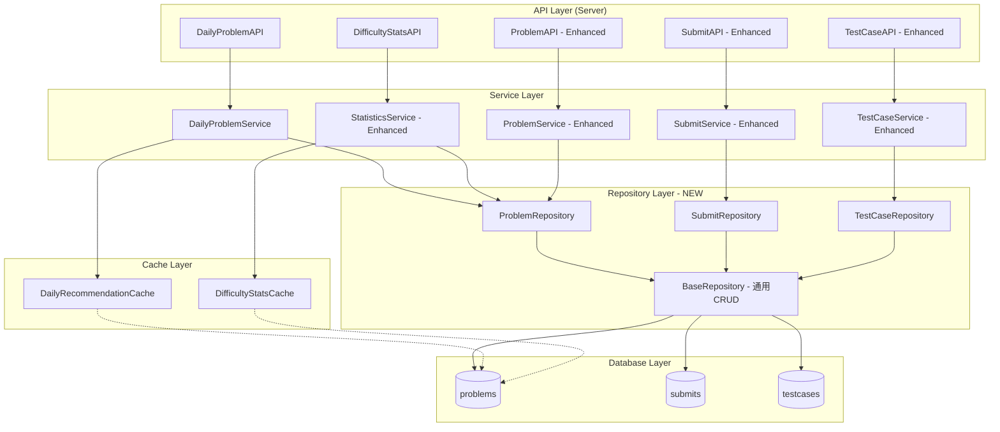
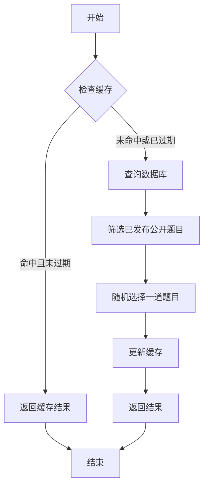
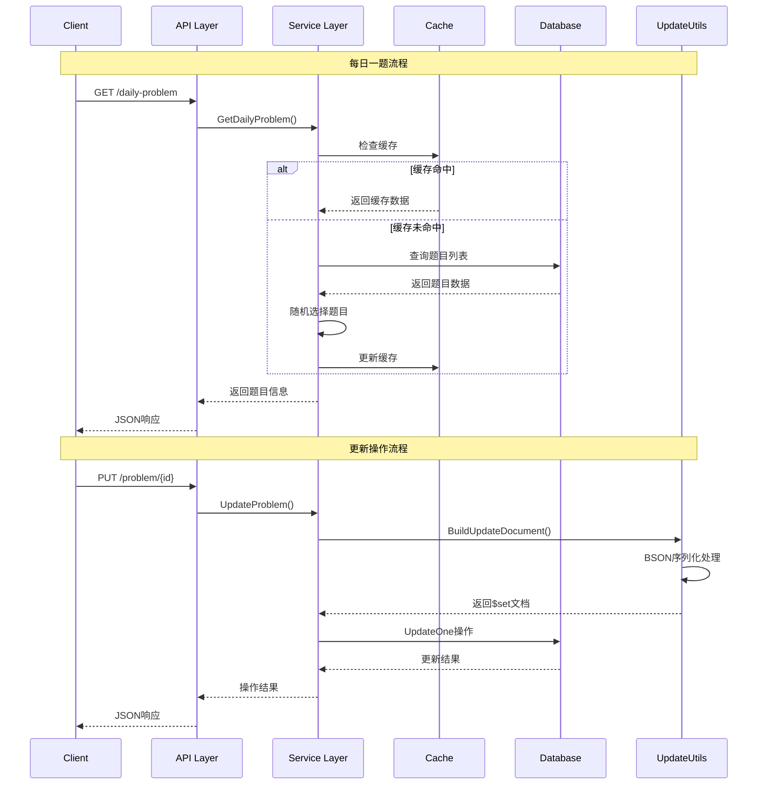
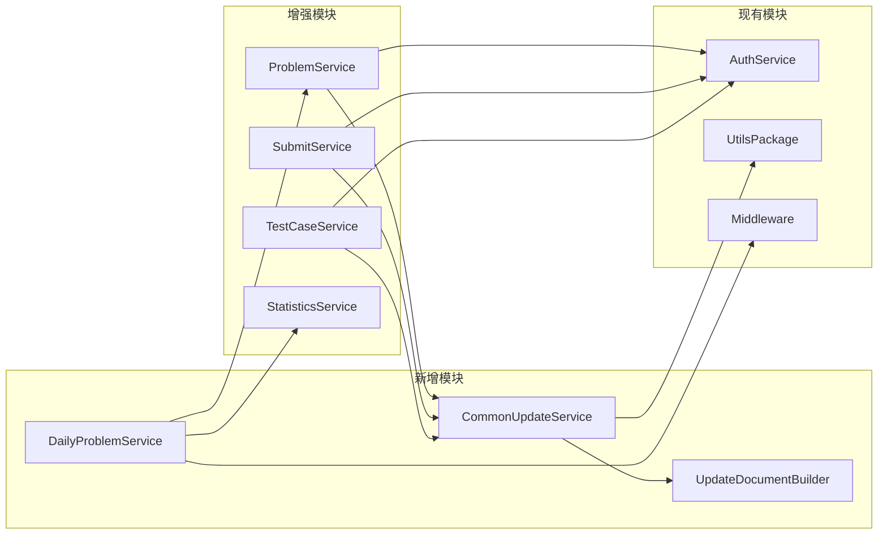

# DESIGN - 每日一题与题目统计功能架构设计

## 整体架构图



## 核心组件设计

### 1. 每日一题模块

#### DailyProblemService
```go
type DailyProblemService struct {
    problemService *ProblemService
    cache         map[string]*models.ProblemList // 简单内存缓存
    lastUpdate    time.Time
}

// 核心方法
func (s *DailyProblemService) GetDailyProblem(ctx context.Context, userID *primitive.ObjectID) (*models.ProblemList, error)
func (s *DailyProblemService) refreshDailyRecommendation(ctx context.Context) error
```

#### 推荐策略


### 2. 难度统计模块

#### 轻量级统计API
```go
type DifficultyStats struct {
    Easy   int64 `json:"easy"`
    Medium int64 `json:"medium"`
    Hard   int64 `json:"hard"`
    Total  int64 `json:"total"`
}

// StatisticsService 新增方法
func (s *StatisticsService) GetDifficultyStats(ctx context.Context) (*DifficultyStats, error)
```

### 3. Repository层设计 (核心架构优化)

#### BaseRepository (通用数据访问层)
```go
type BaseRepository struct {
    db *mongo.Database
}

// 轻量通用更新函数
func (r *BaseRepository) BuildUpdateSet(obj interface{}) (bson.M, error) {
    data, err := bson.Marshal(obj)
    if err != nil {
        return nil, err
    }
    var update bson.M
    if err := bson.Unmarshal(data, &update); err != nil {
        return nil, err
    }
    if len(update) == 0 {
        return nil, nil
    }
    return bson.M{"$set": update}, nil
}

// 带时间戳的通用更新
func (r *BaseRepository) BuildUpdateSetWithTime(obj interface{}) (bson.M, error) {
    updateDoc, err := r.BuildUpdateSet(obj)
    if err != nil {
        return nil, err
    }
    if updateDoc == nil {
        return bson.M{"$set": bson.M{"updatedAt": time.Now()}}, nil
    }
    updateDoc["$set"].(bson.M)["updatedAt"] = time.Now()
    return updateDoc, nil
}

// 通用更新方法
func (r *BaseRepository) UpdateOne(ctx context.Context, collection string, filter bson.M, updateData interface{}) (*mongo.UpdateResult, error) {
    updateDoc, err := r.BuildUpdateSetWithTime(updateData)
    if err != nil {
        return nil, err
    }
    if updateDoc == nil {
        return nil, fmt.Errorf("no fields to update")
    }
    
    coll := r.db.Collection(collection)
    return coll.UpdateOne(ctx, filter, updateDoc)
}
```

#### ProblemRepository
```go
type ProblemRepository struct {
    *BaseRepository
}

func (r *ProblemRepository) UpdateProblem(ctx context.Context, problemID primitive.ObjectID, req *models.UpdateProblemRequest) error {
    // 业务规则验证
    if err := r.validateProblemUpdate(req); err != nil {
        return err
    }
    
    // 使用通用更新方法
    _, err := r.UpdateOne(ctx, "problems", bson.M{"_id": problemID}, req)
    return err
}

func (r *ProblemRepository) GetByID(ctx context.Context, id primitive.ObjectID) (*models.Problem, error) {
    // 具体的查询实现
}

func (r *ProblemRepository) GetPublicProblems(ctx context.Context, filter bson.M, opts *options.FindOptions) ([]*models.Problem, error) {
    // 具体的查询实现
}
```

#### SubmitRepository & TestCaseRepository
```go
type SubmitRepository struct {
    *BaseRepository
}

type TestCaseRepository struct {
    *BaseRepository
}

// 都继承BaseRepository的通用CRUD方法
// 各自实现特定的业务查询方法
```

---

## 分层设计和核心组件

### API层增强
```go
// 新增每日一题API
func (s *Server) GetDailyProblem(c *gin.Context)

// 新增轻量级统计API  
func (s *Server) GetProblemDifficultyStats(c *gin.Context)

// 现有API保持不变，内部逻辑优化
func (s *Server) UpdateProblem(c *gin.Context)    // 使用新的更新逻辑
func (s *Server) UpdateSubmit(c *gin.Context)     // 使用新的更新逻辑  
func (s *Server) UpdateTestCase(c *gin.Context)   // 使用新的更新逻辑
```

### Service层重构
```go
// Problem Service 优化
func (s *ProblemService) UpdateProblem(ctx context.Context, problemID primitive.ObjectID, req *models.UpdateProblemRequest) error {
    // 使用 CommonUpdateService.BuildUpdateDocument
    updateDoc, err := s.commonUpdateService.BuildUpdateDocument(req)
    if err != nil {
        return err
    }
    
    return s.commonUpdateService.UpdateDocument(ctx, "problems", 
        bson.M{"_id": problemID}, updateDoc)
}
```

### 数据流向图


---

## 模块依赖关系图



---

## 接口契约定义

### 1. 每日一题API

```yaml
GET /api/daily-problem
Summary: 获取每日推荐题目
Parameters:
  - None (用户信息从JWT获取)
Response:
  200:
    content:
      application/json:
        schema:
          type: object
          properties:
            code:
              type: integer
              example: 200
            message:
              type: string
              example: "success"
            data:
              $ref: '#/components/schemas/ProblemList'
            extra:
              type: object
              properties:
                date:
                  type: string
                  format: date
                  example: "2025-10-25"
                cache_hit:
                  type: boolean
                  example: true
```

### 2. 难度统计API

```yaml
GET /api/problems/difficulty-stats
Summary: 获取题目难度分布统计
Response:
  200:
    content:
      application/json:
        schema:
          type: object
          properties:
            code:
              type: integer
              example: 200
            message:
              type: string
              example: "success"
            data:
              type: object
              properties:
                easy:
                  type: integer
                  example: 45
                medium:
                  type: integer
                  example: 38
                hard:
                  type: integer
                  example: 17
                total:
                  type: integer
                  example: 100
```

### 3. 通用更新工具接口

```go
// UpdateDocumentBuilder 接口定义
type UpdateDocumentBuilder interface {
    Build(data interface{}) (bson.M, error)
    BuildWithCustomFields(data interface{}, customFields bson.M) (bson.M, error)
}

// CommonUpdateService 接口定义
type CommonUpdateService interface {
    UpdateDocument(ctx context.Context, collection string, filter bson.M, updateData interface{}) (*mongo.UpdateResult, error)
    UpdateDocumentWithValidation(ctx context.Context, collection string, filter bson.M, updateData interface{}, validator func(interface{}) error) (*mongo.UpdateResult, error)
}
```

---

## 异常处理策略

### 1. 每日一题异常处理
```go
// 分层异常处理
func (s *DailyProblemService) GetDailyProblem(ctx context.Context, userID *primitive.ObjectID) (*models.ProblemList, error) {
    // 1. 缓存异常 - 降级到数据库查询
    // 2. 数据库异常 - 返回默认题目或错误
    // 3. 无可用题目 - 返回特定错误码
    // 4. 超时处理 - 设置合理超时时间
}

// 错误类型定义
var (
    ErrNoDailyProblem = errors.New("no available daily problem")
    ErrCacheFailure   = errors.New("cache operation failed")
    ErrDatabaseFailure= errors.New("database operation failed")
)
```

### 2. 更新操作异常处理
```go
// 更新文档构建异常
func (u *UpdateDocumentBuilder) Build(data interface{}) (bson.M, error) {
    // 1. 类型检查异常
    // 2. BSON序列化异常  
    // 3. 字段解析异常
    // 4. 空文档异常 (所有字段都是空值)
}

// 数据库更新异常
func (s *CommonUpdateService) UpdateDocument(...) (*mongo.UpdateResult, error) {
    // 1. 连接异常
    // 2. 权限异常
    // 3. 文档不存在异常
    // 4. 并发更新异常
}
```

### 3. 统计API异常处理
```go
// 统计查询异常
func (s *StatisticsService) GetDifficultyStats(ctx context.Context) (*DifficultyStats, error) {
    // 1. 数据库连接异常 - 返回缓存数据
    // 2. 查询超时异常 - 设置超时限制
    // 3. 数据不一致异常 - 记录日志并返回近似值
}
```

---

## 性能优化策略

### 1. 缓存策略
```go
// 分层缓存设计
type CacheLayer struct {
    // L1: 内存缓存 (热点数据)
    memoryCache map[string]interface{}
    
    // L2: 可扩展到Redis (可选)
    // redisClient *redis.Client
}

// 缓存更新策略
// - 每日一题: 24小时TTL，定时刷新
// - 难度统计: 1小时TTL，写入时失效
```

### 2. 数据库优化
```go
// 查询优化
// 1. 复用现有索引
// 2. 使用聚合查询减少网络传输
// 3. 限制返回字段大小

// 更新优化  
// 1. 批量更新支持
// 2. 乐观锁防止并发冲突
// 3. 部分更新减少网络传输
```

### 3. 并发控制
```go
// 每日推荐生成的并发控制
var dailyRecommendationMutex sync.RWMutex

// 更新操作的并发安全
// 使用MongoDB的原子更新操作
// 避免读-修改-写的竞态条件
```

---

## 设计原则验证

### ✅ 架构一致性
- 保持现有Server→Service→Database三层架构
- 新增组件遵循相同的依赖注入模式
- 接口设计符合现有RESTful规范

### ✅ 接口完整性
- 每日一题API提供完整的题目信息
- 难度统计API返回结构化数据
- 通用更新工具支持扩展和定制

### ✅ 系统无冲突
- 新增缓存不影响现有数据流
- 通用更新工具可选择性使用
- 保持现有API接口签名不变

### ✅ 可行性验证
- 基于现有Go和MongoDB技术栈
- 利用BSON反射机制实现通用更新
- 缓存策略简单可靠，易于实现

**架构设计完成** ✅  
**模块依赖关系清晰** ✅  
**接口契约定义完整** ✅  
**异常处理策略完善** ✅
