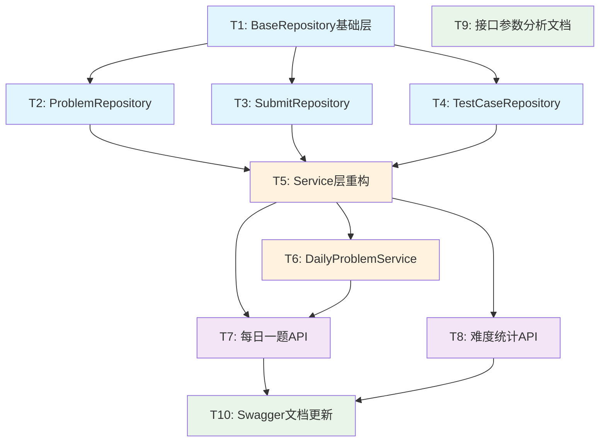

# TASK - 每日一题与题目统计功能任务拆分

## 任务依赖关系图



---

## 原子任务详细定义

### T1: BaseRepository基础层开发
**复杂度**: 🟡 中 (25分钟)  
**优先级**: 🔴 最高 (所有Repository的基础)

#### 输入契约
- **前置依赖**: 无
- **输入数据**: MongoDB连接、通用CRUD需求
- **环境依赖**: BSON包、MongoDB Driver

#### 输出契约
- **交付物**: `pkg/app/api-server/repository/base_repository.go`
- **核心结构**:
```go
type BaseRepository struct {
    db *mongo.Database
}

// 轻量通用更新函数 (基于BSON序列化)
func (r *BaseRepository) BuildUpdateSet(obj interface{}) (bson.M, error) {
    data, err := bson.Marshal(obj)
    if err != nil {
        return nil, err
    }
    var update bson.M
    if err := bson.Unmarshal(data, &update); err != nil {
        return nil, err
    }
    if len(update) == 0 {
        return nil, nil
    }
    return bson.M{"$set": update}, nil
}

// 带时间戳的通用更新
func (r *BaseRepository) BuildUpdateSetWithTime(obj interface{}) (bson.M, error)

// 通用CRUD方法
func (r *BaseRepository) UpdateOne(ctx context.Context, collection string, filter bson.M, updateData interface{}) (*mongo.UpdateResult, error)
func (r *BaseRepository) FindOne(ctx context.Context, collection string, filter bson.M, result interface{}) error
func (r *BaseRepository) Find(ctx context.Context, collection string, filter bson.M, opts *options.FindOptions) (*mongo.Cursor, error)
func (r *BaseRepository) InsertOne(ctx context.Context, collection string, document interface{}) (*mongo.InsertOneResult, error)
func (r *BaseRepository) DeleteOne(ctx context.Context, collection string, filter bson.M) (*mongo.DeleteResult, error)
```
- **验收标准**:
  - [ ] 轻量更新函数正确实现 (基于BSON序列化)
  - [ ] 通用CRUD方法完整
  - [ ] 错误处理和日志记录完善
  - [ ] 并发安全
  - [ ] 单元测试覆盖核心方法

#### 实现约束
- **技术栈**: 纯BSON序列化，无反射，MongoDB Driver
- **性能要求**: 更新函数处理时间 < 2ms
- **架构原则**: 作为所有具体Repository的基类
- **依赖注入**: 支持MongoDB连接注入

#### 依赖关系
- **后置任务**: T2, T3, T4 (具体Repository实现)

---

### T2: ProblemRepository开发
**复杂度**: 🟡 中 (20分钟)  
**优先级**: 🔴 高

#### 输入契约
- **前置依赖**: T1 (BaseRepository)
- **输入数据**: Problem相关的CRUD需求
- **环境依赖**: Problem数据模型、业务规则

#### 输出契约
- **交付物**: `pkg/app/api-server/repository/problem_repository.go`
- **核心结构**:
```go
type ProblemRepository struct {
    *BaseRepository
}

// Problem特定的更新方法
func (r *ProblemRepository) UpdateProblem(ctx context.Context, problemID primitive.ObjectID, req *models.UpdateProblemRequest) error {
    // 业务规则验证
    if err := r.validateProblemUpdate(req); err != nil {
        return err
    }
    
    // 使用BaseRepository的通用更新方法
    _, err := r.UpdateOne(ctx, "problems", bson.M{"_id": problemID}, req)
    return err
}

// Problem特定的查询方法
func (r *ProblemRepository) GetByID(ctx context.Context, id primitive.ObjectID) (*models.Problem, error)
func (r *ProblemRepository) GetPublicProblems(ctx context.Context, filter bson.M, opts *options.FindOptions) ([]*models.Problem, error)
func (r *ProblemRepository) GetProblemsWithUserStatus(ctx context.Context, filter bson.M, userID *primitive.ObjectID, opts *options.FindOptions) ([]*models.ProblemList, error)
func (r *ProblemRepository) SearchProblems(ctx context.Context, keyword string, filter bson.M, opts *options.FindOptions) ([]*models.ProblemList, error)

// 业务规则验证
func (r *ProblemRepository) validateProblemUpdate(req *models.UpdateProblemRequest) error
```
- **验收标准**:
  - [ ] 继承BaseRepository的通用功能
  - [ ] Problem特定的CRUD方法实现
  - [ ] 业务规则验证 (如草稿状态不能公开)
  - [ ] 用户状态查询支持
  - [ ] 搜索功能支持
  - [ ] 错误处理完善

#### 实现约束
- **数据一致性**: 保持现有业务规则
- **性能优化**: 复用现有索引
- **向后兼容**: 不影响现有Service层接口

#### 依赖关系
- **后置任务**: T5 (Service层重构)

---

### T3: SubmitRepository开发
**复杂度**: 🟡 中 (15分钟)  
**优先级**: 🔴 高

#### 输入契约
- **前置依赖**: T1 (BaseRepository)
- **输入数据**: Submit相关的CRUD需求
- **环境依赖**: Submit数据模型

#### 输出契约
- **交付物**: `pkg/app/api-server/repository/submit_repository.go`
- **核心结构**:
```go
type SubmitRepository struct {
    *BaseRepository
}

// Submit特定的更新方法
func (r *SubmitRepository) UpdateSubmit(ctx context.Context, submitID primitive.ObjectID, req *models.UpdateSubmitRequest) error
func (r *SubmitRepository) UpdateSubmitResult(ctx context.Context, submitID primitive.ObjectID, result *models.JudgeResult) error

// Submit特定的查询方法
func (r *SubmitRepository) GetByID(ctx context.Context, id primitive.ObjectID) (*models.Submit, error)
func (r *SubmitRepository) GetUserSubmits(ctx context.Context, userID primitive.ObjectID, filter bson.M, opts *options.FindOptions) ([]*models.Submit, error)
func (r *SubmitRepository) GetProblemSubmits(ctx context.Context, problemID primitive.ObjectID, filter bson.M, opts *options.FindOptions) ([]*models.Submit, error)
func (r *SubmitRepository) GetUserProblemStatuses(ctx context.Context, userID primitive.ObjectID, problemIDs []primitive.ObjectID) (map[primitive.ObjectID]models.UserProblemStatus, error)
```
- **验收标准**:
  - [ ] 继承BaseRepository的通用功能
  - [ ] Submit状态更新逻辑正确
  - [ ] 判题结果更新安全
  - [ ] 用户状态查询支持
  - [ ] 并发更新处理

#### 依赖关系
- **后置任务**: T5 (Service层重构)

---

### T4: TestCaseRepository开发
**复杂度**: 🟡 中 (15分钟)  
**优先级**: 🔴 高

#### 输入契约
- **前置依赖**: T1 (BaseRepository)
- **输入数据**: TestCase相关的CRUD需求
- **环境依赖**: TestCase数据模型

#### 输出契约
- **交付物**: `pkg/app/api-server/repository/testcase_repository.go`
- **核心结构**:
```go
type TestCaseRepository struct {
    *BaseRepository
}

// TestCase特定的更新方法
func (r *TestCaseRepository) UpdateTestCase(ctx context.Context, testCaseID primitive.ObjectID, req *models.UpdateTestCaseRequest) error

// TestCase特定的查询方法
func (r *TestCaseRepository) GetByID(ctx context.Context, id primitive.ObjectID) (*models.TestCase, error)
func (r *TestCaseRepository) GetByProblemID(ctx context.Context, problemID primitive.ObjectID) ([]*models.TestCase, error)
func (r *TestCaseRepository) GetSampleTestCases(ctx context.Context, problemID primitive.ObjectID) ([]*models.TestCase, error)
func (r *TestCaseRepository) BatchCreate(ctx context.Context, testCases []*models.TestCase) (*mongo.InsertManyResult, error)
```
- **验收标准**:
  - [ ] 继承BaseRepository的通用功能
  - [ ] TestCase的CRUD方法实现
  - [ ] 正确处理字段清空需求 (解决空字符串判断问题)
  - [ ] 批量创建支持
  - [ ] 示例测试用例查询支持

#### 实现约束
- **数据完整性**: TestCase的关键字段不能意外清空
- **向后兼容**: 保持现有API接口不变
- **性能优化**: 批量操作效率

#### 依赖关系
- **后置任务**: T5 (Service层重构)

---

### T5: Service层重构 (使用Repository)
**复杂度**: 🟡 中 (35分钟)  
**优先级**: 🔴 高

#### 输入契约
- **前置依赖**: T2, T3, T4 (三个Repository)
- **输入数据**: 现有Service层代码
- **环境依赖**: 现有业务逻辑

#### 输出契约
- **交付物**: 
  - `pkg/app/api-server/service/service_problem.go` (重构)
  - `pkg/app/api-server/service/service_submit.go` (重构)
  - `pkg/app/api-server/service/service_testcase.go` (重构)
- **重构重点**:
```go
// ProblemService 重构示例
type ProblemService struct {
    problemRepo *repository.ProblemRepository
    submitRepo  *repository.SubmitRepository
}

func (s *ProblemService) UpdateProblem(ctx context.Context, problemID primitive.ObjectID, req *models.UpdateProblemRequest) error {
    // 直接使用Repository，无需手动构建更新文档
    return s.problemRepo.UpdateProblem(ctx, problemID, req)
}

func (s *ProblemService) GetProblems(ctx context.Context, page, pageSize int, difficulty models.ProblemDifficulty, tags []string, includePrivate bool, role models.UserRole, userID *primitive.ObjectID) ([]*models.ProblemList, int64, error) {
    // 使用Repository的查询方法
    filter := s.buildProblemFilter(difficulty, tags, includePrivate, role)
    return s.problemRepo.GetProblemsWithUserStatus(ctx, filter, userID, opts)
}
```
- **验收标准**:
  - [ ] ProblemService完全使用ProblemRepository
  - [ ] SubmitService完全使用SubmitRepository
  - [ ] TestCaseService完全使用TestCaseRepository
  - [ ] 所有现有功能保持不变
  - [ ] API接口向后兼容
  - [ ] 业务逻辑层简化，专注于业务规则

#### 实现约束
- **向后兼容**: Service层接口签名不变
- **业务逻辑**: 保持现有验证和处理逻辑
- **依赖注入**: Repository通过构造函数注入

#### 依赖关系
- **后置任务**: T6, T7, T8 (新功能开发)

---

### T6: DailyProblemService开发
**复杂度**: 🟡 中 (30分钟)  
**优先级**: 🟡 中

#### 输入契约
- **前置依赖**: T5 (Service层重构，ProblemRepository可用)
- **输入数据**: 用户ID (可选，用于用户状态)
- **环境依赖**: 内存缓存支持

#### 输出契约
- **交付物**: `pkg/app/api-server/service/service_daily_problem.go`
- **核心功能**:
```go
type DailyProblemService struct {
    problemRepo *repository.ProblemRepository
    cache       map[string]*models.ProblemList
    lastUpdate  time.Time
    mutex       sync.RWMutex
}

func (s *DailyProblemService) GetDailyProblem(ctx context.Context, userID *primitive.ObjectID) (*models.ProblemList, error)
func (s *DailyProblemService) refreshDailyRecommendation(ctx context.Context) error
```
- **验收标准**:
  - [ ] 每日缓存机制正确工作
  - [ ] 随机推荐算法实现
  - [ ] 并发安全的缓存访问
  - [ ] 优雅的缓存过期和刷新
  - [ ] 完整的错误处理

#### 实现约束
- **推荐策略**: 从已发布公开题目中随机选择
- **缓存策略**: 24小时TTL，内存存储
- **性能要求**: 响应时间 < 100ms

#### 依赖关系
- **后置任务**: T7 (每日一题API)

---

### T7: 每日一题API接口开发
**复杂度**: 🟢 低 (15分钟)  
**优先级**: 🟡 中

#### 输入契约
- **前置依赖**: T6 (DailyProblemService)
- **环境依赖**: Gin框架、JWT中间件

#### 输出契约
- **交付物**: `pkg/app/api-server/server/server_problem.go` (新增方法)
- **API规范**:
```go
// GetDailyProblem godoc
// @Summary      获取每日推荐题目
// @Description  获取当日推荐的题目，全局统一推荐
// @Tags         题目
// @Accept       json
// @Produce      json
// @Success      200 {object} map[string]interface{} "每日推荐题目"
// @Failure      500 {object} map[string]interface{} "获取失败"
// @Router       /daily-problem [get]
func (s *Server) GetDailyProblem(c *gin.Context)
```
- **验收标准**:
  - [ ] API响应格式正确
  - [ ] 支持用户状态显示 (如果已登录)
  - [ ] 错误处理完善
  - [ ] Swagger注释完整

#### 实现约束
- **响应格式**: 与现有API保持一致
- **权限控制**: 无需登录，但登录用户显示状态
- **路由注册**: 在现有路由组中注册

#### 依赖关系
- **后置任务**: T10 (Swagger文档更新)

---

### T8: 轻量级难度统计API开发
**复杂度**: 🟢 低 (20分钟)  
**优先级**: 🟡 中

#### 输入契约
- **前置依赖**: T5 (Service层重构，ProblemRepository可用)
- **环境依赖**: MongoDB聚合查询支持

#### 输出契约
- **交付物**: 
  - `pkg/app/api-server/service/service_statistics.go` (新增方法)
  - `pkg/app/api-server/server/server_statistics.go` (新增API)
- **API规范**:
```go
// GetProblemDifficultyStats godoc
// @Summary      获取题目难度分布统计
// @Description  获取各难度题目数量的轻量级统计
// @Tags         统计
// @Accept       json  
// @Produce      json
// @Success      200 {object} map[string]interface{} "难度统计"
// @Failure      500 {object} map[string]interface{} "获取失败"
// @Router       /problems/difficulty-stats [get]
func (s *Server) GetProblemDifficultyStats(c *gin.Context)
```
- **验收标准**:
  - [ ] 返回格式：`{"easy": count, "medium": count, "hard": count, "total": count}`
  - [ ] API响应时间 < 50ms
  - [ ] 支持缓存优化 (1小时TTL)
  - [ ] 错误处理完善

#### 实现约束
- **查询优化**: 使用Repository层和MongoDB聚合管道
- **缓存策略**: 简单内存缓存，1小时过期
- **数据一致性**: 实时查询确保数据准确

#### 依赖关系
- **后置任务**: T10 (Swagger文档更新)

---

### T9: 接口返回参数分析文档
**复杂度**: 🟢 低 (25分钟)  
**优先级**: 🟢 低

#### 输入契约
- **前置依赖**: 无 (独立任务)
- **分析对象**: GetProblems、SearchProblems两个接口

#### 输出契约
- **交付物**: `docs/每日一题与题目统计/API_ANALYSIS_接口参数分析.md`
- **内容结构**:
  1. **GetProblems接口分析**
     - 请求参数详解
     - 返回字段说明
     - 用户状态逻辑
     - 权限控制机制
  2. **SearchProblems接口分析**
     - 搜索参数类型
     - 搜索算法说明
     - 结果排序逻辑
     - 性能特征
  3. **使用场景和最佳实践**
  4. **性能优化建议**

- **验收标准**:
  - [ ] 字段说明完整准确
  - [ ] 包含实际使用示例
  - [ ] 性能特征分析清晰
  - [ ] 最佳实践建议实用

---

### T10: Swagger文档更新
**复杂度**: 🟢 低 (15分钟)  
**优先级**: 🟢 低

#### 输入契约
- **前置依赖**: T4, T5, T6, T7, T8 (所有API相关任务)
- **环境依赖**: Swag工具链

#### 输出契约
- **交付物**: 更新的`docs/`目录和Swagger UI
- **更新内容**:
  - 每日一题API文档
  - 难度统计API文档
  - 更新相关接口的响应示例
- **验收标准**:
  - [ ] 新接口在Swagger UI中正确显示
  - [ ] 所有接口参数和响应格式准确
  - [ ] 示例数据合理有效

#### 实现约束
- **文档风格**: 与现有Swagger注释保持一致
- **示例数据**: 使用真实合理的示例值

---

## 并行执行策略

### 🔄 阶段1: 基础工具开发 (并行)
- **T1** (UpdateDocumentBuilder) - 核心基础
- **T3** (DailyProblemService) - 独立开发
- **T9** (接口参数分析) - 独立文档工作

### 🔄 阶段2: 服务层开发 (并行)
- **T2** (CommonUpdateService) - 依赖T1
- **T5** (难度统计API) - 独立开发

### 🔄 阶段3: 重构和API (并行)  
- **T4** (每日一题API) - 依赖T3
- **T6, T7, T8** (三个模块重构) - 并行进行，依赖T2

### 🔄 阶段4: 收尾工作
- **T10** (Swagger文档) - 依赖所有API任务

---

## 质量门控检查

### 复杂度评估 ✅
- **中复杂度**: 4个 (T1,T2,T5,T6 - 110分钟)
- **低复杂度**: 6个 (T3,T4,T7,T8,T9,T10 - 110分钟)
- **总估时**: 220分钟 (~3.7小时)

### 依赖关系验证 ✅
- 无循环依赖
- 关键路径: T1→(T2,T3,T4)→T5→T6→T7→T10
- 并行度: T2,T3,T4可并行执行，最多3个Repository任务同时进行

### 任务原子性验证 ✅
- 每个任务都有明确的输入输出
- 独立的验收标准
- 可以独立编译和测试

### 覆盖度验证 ✅
- ✅ 每日一题完整功能覆盖
- ✅ 难度统计API覆盖
- ✅ 三个模块更新逻辑重构覆盖
- ✅ 通用工具开发覆盖
- ✅ 文档和接口分析覆盖

**任务拆分完成** ✅  
**依赖关系清晰** ✅  
**复杂度评估合理** ✅  
**原子性和独立性满足** ✅
