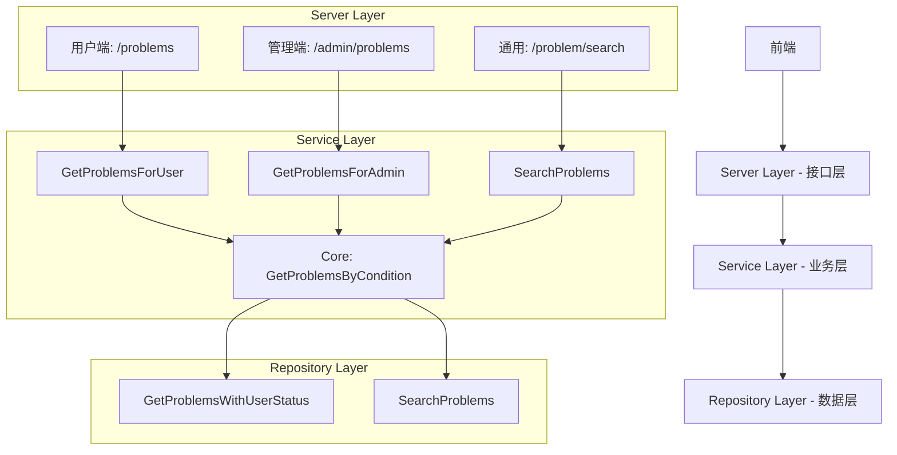

# 题目列表接口架构优化建议

## 📋 问题分析

### 当前设计的问题

1. **单一接口承载过多职责**
   - `GetProblems` 通过多个参数控制不同场景
   - Server层权限校验逻辑复杂且重复
   - 接口语义不够清晰

2. **可维护性问题**
   - 管理员和用户端需求差异化时，修改影响面大
   - 权限逻辑分散在Server层，难以统一管理
   - 参数过多，容易出错

3. **可扩展性限制**
   - 新增角色或权限时，需要修改多处代码
   - 不同端的个性化需求难以满足

## 🎯 推荐架构方案

### 架构分层策略



### 1. Server层 - 职责分离

```go
// 用户端接口 - 简单清晰
func (s *Server) GetProblems(c *gin.Context) {
    // 只处理用户端逻辑
    userID := s.getUserIDFromContext(c) // 提取为独立方法
    
    problems, total, err := s.svc.ProblemService.GetProblemsForUser(
        ctx, page, pageSize, difficulty, tags, userID,
    )
    // ...
}

// 管理员端接口 - 功能完整
func (s *Server) GetProblemsForAdmin(c *gin.Context) {
    // 管理员专用逻辑
    problems, total, err := s.svc.ProblemService.GetProblemsForAdmin(
        ctx, page, pageSize, difficulty, tags, status, createdBy,
    )
    // ...
}
```

### 2. Service层 - 智能复用

```go
// 核心复用方法 - 私有
func (s *ProblemService) getProblemsByCondition(
    ctx context.Context,
    condition ProblemQueryCondition,
) ([]*models.ProblemList, int64, error) {
    // 统一的核心查询逻辑
    return s.repo.GetProblemsWithUserStatus(
        ctx, 
        condition.Page, 
        condition.PageSize,
        condition.Difficulty,
        condition.Tags,
        condition.IncludePrivate,
        condition.Role,
        condition.UserID,
    )
}

// 用户端业务方法
func (s *ProblemService) GetProblemsForUser(
    ctx context.Context,
    page, pageSize int,
    difficulty models.ProblemDifficulty,
    tags []string,
    userID *primitive.ObjectID,
) ([]*models.ProblemList, int64, error) {
    condition := ProblemQueryCondition{
        Page:           page,
        PageSize:       pageSize,
        Difficulty:     difficulty,
        Tags:           tags,
        IncludePrivate: false,           // 用户端固定为 false
        Role:           models.RoleStudent,  // 固定角色
        UserID:         userID,
    }
    
    utils.Logger.Debugf("GetProblemsForUser: 用户端查询, userID=%v", userID)
    return s.getProblemsByCondition(ctx, condition)
}

// 管理员端业务方法
func (s *ProblemService) GetProblemsForAdmin(
    ctx context.Context,
    page, pageSize int,
    difficulty models.ProblemDifficulty,
    tags []string,
    status models.ProblemStatus,
    createdBy *primitive.ObjectID,
) ([]*models.ProblemList, int64, error) {
    condition := ProblemQueryCondition{
        Page:           page,
        PageSize:       pageSize,
        Difficulty:     difficulty,
        Tags:           tags,
        IncludePrivate: true,               // 管理员可以看私有
        Role:           models.RoleAdmin,    // 管理员角色
        UserID:         nil,                // 管理员不需要用户状态
        Status:         status,             // 管理员可以按状态筛选
        CreatedBy:      createdBy,          // 管理员可以按创建者筛选
    }
    
    utils.Logger.Debugf("GetProblemsForAdmin: 管理员查询")
    return s.getProblemsByCondition(ctx, condition)
}
```

### 3. Repository层 - 保持不变

Repository层的 `GetProblemsWithUserStatus` 方法已经足够灵活，无需修改。

## 🔄 迁移策略

### 阶段1: 添加新接口（向后兼容）
1. 保留现有的 `GetProblems` 接口
2. 添加新的 `GetProblemsForUser` 和 `GetProblemsForAdmin` 方法
3. 添加管理员专用路由 `/admin/problems`

### 阶段2: 逐步迁移前端
1. 前端逐步切换到新接口
2. 监控新旧接口使用情况

### 阶段3: 清理旧接口（可选）
1. 在确认前端完全迁移后，考虑废弃旧接口
2. 更新API文档

## ✅ 方案优势

1. **职责清晰**
   - 用户端接口专注于用户体验
   - 管理端接口提供完整的管理功能

2. **易于维护**
   - 权限逻辑在Service层统一管理
   - 核心查询逻辑复用，减少重复代码

3. **可扩展性强**
   - 新增角色时，只需添加对应的业务方法
   - 个性化需求可在各自方法中实现

4. **向后兼容**
   - 可以渐进式迁移，降低风险

## 🚀 实施建议

**建议采用这种架构，原因：**
1. 符合单一职责原则
2. 提高代码可读性和可维护性
3. 为未来扩展提供良好基础
4. 保持Repository层的灵活性

**不建议完全分离的原因：**
- Repository层重复会增加维护成本
- 核心查询逻辑是可以安全复用的
- 数据访问层的统一性有助于性能优化
