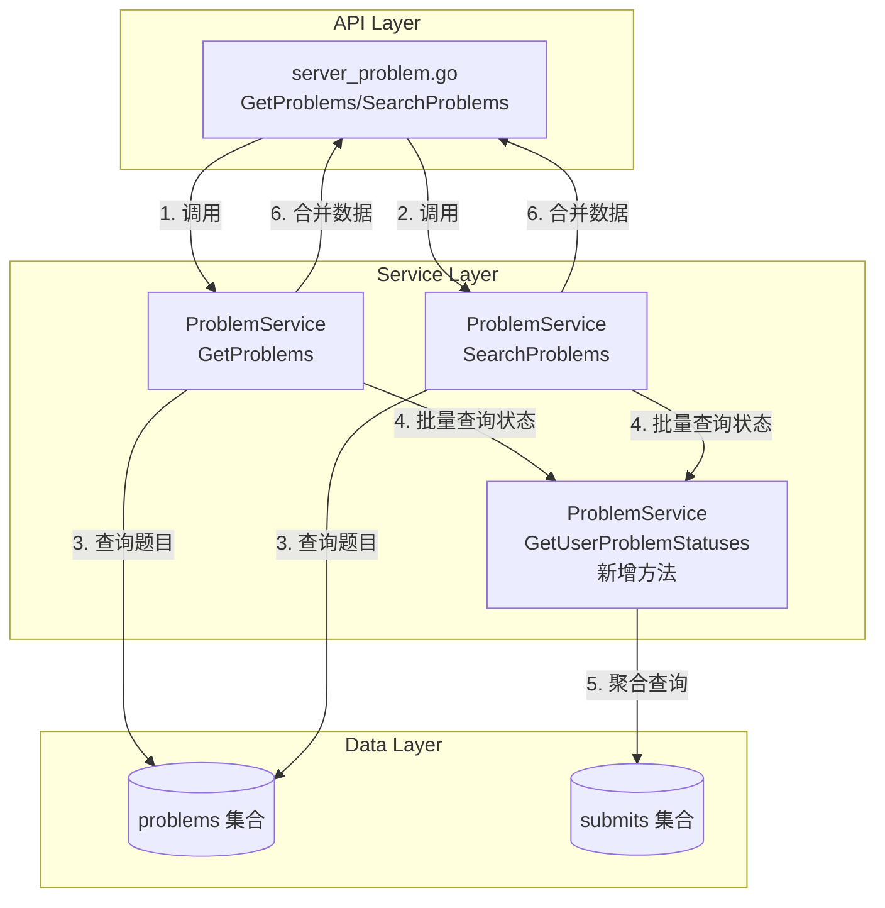
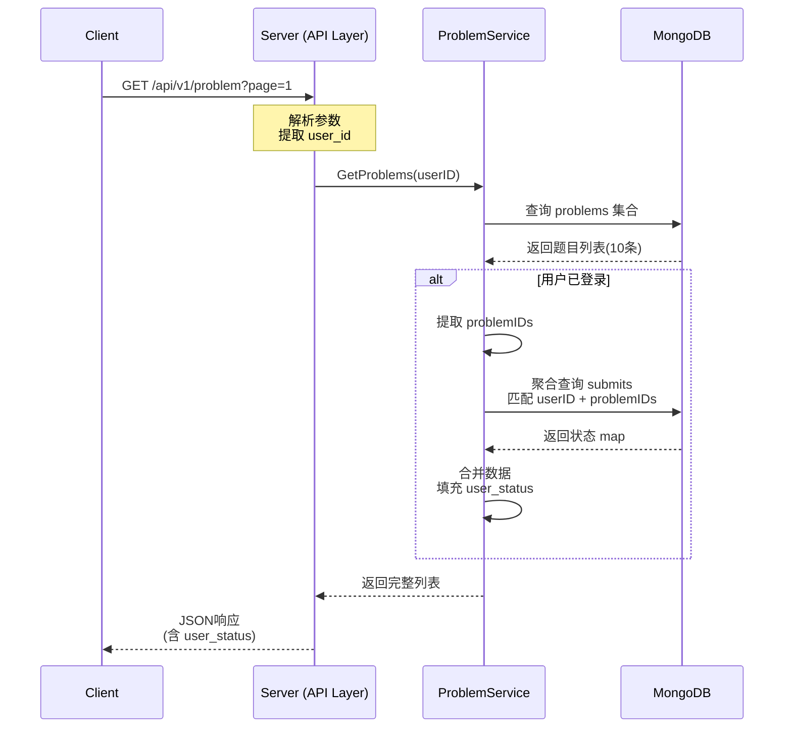

# DESIGN - 题目列表用户状态

## 整体架构设计

### 系统分层架构



---

## 核心组件设计

### 1. 数据模型层 (models)

#### 新增枚举类型
**文件**: `pkg/models/problem.go`

```go
// UserProblemStatus 用户题目状态
type UserProblemStatus string

const (
    UserStatusNotAttempted UserProblemStatus = "not_attempted"  // 未尝试
    UserStatusAttempted    UserProblemStatus = "attempted"      // 已尝试
    UserStatusAccepted     UserProblemStatus = "accepted"       // 已通过
)
```

#### 修改 ProblemList 结构
**文件**: `pkg/models/problem.go`

```go
// ProblemList 题目列表项
type ProblemList struct {
    ID          primitive.ObjectID  `json:"id"`
    Title       string              `json:"title"`
    Difficulty  ProblemDifficulty   `json:"difficulty"`
    Tags        []string            `json:"tags"`
    ACCount     int                 `json:"ac_count"`
    SubmitCount int                 `json:"submit_count"`
    Status      ProblemStatus       `json:"status"`
    IsPublic    bool                `json:"is_public"`
    CreatedAt   time.Time           `json:"created_at"`
    
    // 新增：用户状态（仅登录用户返回）
    UserStatus  *UserProblemStatus  `json:"user_status,omitempty"`
}
```

**设计说明**：
- 使用指针类型 `*UserProblemStatus`，未登录时为 `nil`
- `omitempty` 标签：`nil` 时不序列化到 JSON
- 不影响现有字段，保持向后兼容

---

### 2. Service 层设计

#### 2.1 新增方法：GetUserProblemStatuses

**文件**: `pkg/app/api-server/service/service_problem.go`

**方法签名**:
```go
// GetUserProblemStatuses 批量获取用户对题目的提交状态
// 参数：
//   - ctx: 上下文
//   - userID: 用户ID
//   - problemIDs: 题目ID列表
// 返回：
//   - map[primitive.ObjectID]models.UserProblemStatus: 题目ID到状态的映射
//   - error: 错误信息
func (s *ProblemService) GetUserProblemStatuses(
    ctx context.Context,
    userID primitive.ObjectID,
    problemIDs []primitive.ObjectID,
) (map[primitive.ObjectID]models.UserProblemStatus, error)
```

**实现逻辑**:
```go
func (s *ProblemService) GetUserProblemStatuses(
    ctx context.Context,
    userID primitive.ObjectID,
    problemIDs []primitive.ObjectID,
) (map[primitive.ObjectID]models.UserProblemStatus, error) {
    // 1. 参数校验
    if len(problemIDs) == 0 {
        return make(map[primitive.ObjectID]models.UserProblemStatus), nil
    }
    
    // 2. 构建聚合管道
    pipeline := []bson.M{
        // 步骤1: 筛选条件
        {
            "$match": bson.M{
                "user_id": userID,
                "problem_id": bson.M{"$in": problemIDs},
            },
        },
        // 步骤2: 按题目分组，判断是否有AC
        {
            "$group": bson.M{
                "_id": "$problem_id",
                "has_accepted": bson.M{
                    "$max": bson.M{
                        "$cond": []interface{}{
                            bson.M{"$eq": []interface{}{"$status", "accepted"}},
                            1,
                            0,
                        },
                    },
                },
            },
        },
    }
    
    // 3. 执行聚合查询
    collection := utils.GetCollection("submits")
    cursor, err := collection.Aggregate(ctx, pipeline)
    if err != nil {
        return nil, fmt.Errorf("聚合查询失败: %w", err)
    }
    defer cursor.Close(ctx)
    
    // 4. 解析结果
    type AggResult struct {
        ProblemID   primitive.ObjectID `bson:"_id"`
        HasAccepted int                `bson:"has_accepted"`
    }
    
    statusMap := make(map[primitive.ObjectID]models.UserProblemStatus)
    
    for cursor.Next(ctx) {
        var result AggResult
        if err := cursor.Decode(&result); err != nil {
            return nil, fmt.Errorf("解析结果失败: %w", err)
        }
        
        // 判断状态
        if result.HasAccepted == 1 {
            statusMap[result.ProblemID] = models.UserStatusAccepted
        } else {
            statusMap[result.ProblemID] = models.UserStatusAttempted
        }
    }
    
    // 5. 补充未提交的题目为 not_attempted
    for _, problemID := range problemIDs {
        if _, exists := statusMap[problemID]; !exists {
            statusMap[problemID] = models.UserStatusNotAttempted
        }
    }
    
    return statusMap, nil
}
```

**复杂度分析**:
- **时间复杂度**: O(log n + m)
  - n: submits 表记录数
  - m: 当前页题目数量（通常 10-20）
  - 有索引时为 O(log n)
- **空间复杂度**: O(m)

---

#### 2.2 修改方法：GetProblems

**文件**: `pkg/app/api-server/service/service_problem.go`

**修改内容**:
```go
func (s *ProblemService) GetProblems(
    ctx context.Context,
    page, pageSize int,
    difficulty models.ProblemDifficulty,
    tags []string,
    includePrivate bool,
    role models.UserRole,
    userID *primitive.ObjectID,  // 现有参数
) ([]*models.ProblemList, int64, error) {
    // ... 现有的查询逻辑 ...
    
    // 新增：查询题目列表后，补充用户状态
    var problems []*models.ProblemList
    for cursor.Next(ctx) {
        var problem models.Problem
        if err := cursor.Decode(&problem); err != nil {
            return nil, 0, err
        }
        
        problems = append(problems, &models.ProblemList{
            ID:          problem.ID,
            Title:       problem.Title,
            Difficulty:  problem.Difficulty,
            Tags:        problem.Tags,
            ACCount:     problem.ACCount,
            SubmitCount: problem.SubmitCount,
            Status:      problem.Status,
            IsPublic:    problem.IsPublic,
            CreatedAt:   problem.CreatedAt,
            UserStatus:  nil,  // 初始化为 nil
        })
    }
    
    // 新增：如果用户已登录，查询用户状态
    if userID != nil {
        problemIDs := make([]primitive.ObjectID, len(problems))
        for i, p := range problems {
            problemIDs[i] = p.ID
        }
        
        // 批量查询用户状态
        statusMap, err := s.GetUserProblemStatuses(ctx, *userID, problemIDs)
        if err != nil {
            utils.Logger.Warnf("查询用户题目状态失败: %v", err)
            // 不影响主流程，继续返回题目列表
        } else {
            // 填充用户状态
            for _, p := range problems {
                if status, exists := statusMap[p.ID]; exists {
                    p.UserStatus = &status
                }
            }
        }
    }
    
    return problems, total, nil
}
```

**设计要点**:
1. ✅ 用户状态查询失败不影响主流程
2. ✅ 未登录用户 `UserStatus` 保持为 `nil`
3. ✅ 批量查询，避免 N+1 问题

---

#### 2.3 修改方法：SearchProblems

**文件**: `pkg/app/api-server/service/service_problem.go`

**修改内容**:
```go
func (s *ProblemService) SearchProblems(
    ctx context.Context,
    keyword string,
    difficulty models.ProblemDifficulty,
    tags []string,
    page, pageSize int,
    userID *primitive.ObjectID,  // 新增参数
) ([]*models.ProblemList, int64, error) {
    // ... 现有的搜索逻辑 ...
    
    // 解析结果
    var problems []*models.ProblemList
    for cursor.Next(ctx) {
        var problem models.Problem
        if err := cursor.Decode(&problem); err != nil {
            return nil, 0, err
        }
        
        problems = append(problems, &models.ProblemList{
            ID:          problem.ID,
            Title:       problem.Title,
            Difficulty:  problem.Difficulty,
            Tags:        problem.Tags,
            ACCount:     problem.ACCount,
            SubmitCount: problem.SubmitCount,
            Status:      problem.Status,
            IsPublic:    problem.IsPublic,
            CreatedAt:   problem.CreatedAt,
            UserStatus:  nil,
        })
    }
    
    // 新增：如果用户已登录，查询用户状态
    if userID != nil {
        problemIDs := make([]primitive.ObjectID, len(problems))
        for i, p := range problems {
            problemIDs[i] = p.ID
        }
        
        statusMap, err := s.GetUserProblemStatuses(ctx, *userID, problemIDs)
        if err != nil {
            utils.Logger.Warnf("查询用户题目状态失败: %v", err)
        } else {
            for _, p := range problems {
                if status, exists := statusMap[p.ID]; exists {
                    p.UserStatus = &status
                }
            }
        }
    }
    
    return problems, total, nil
}
```

---

### 3. API 层设计

#### 3.1 修改 GetProblems 接口

**文件**: `pkg/app/api-server/server/server_problem.go`

**修改内容**:
```go
// GetProblems godoc
// @Summary      获取题目列表
// @Description  分页获取题目列表，登录用户会返回用户的提交状态
// @Tags         题目
// @Accept       json
// @Produce      json
// @Param        page query int false "页码" default(1)
// @Param        page_size query int false "每页数量" default(10)
// @Param        difficulty query string false "难度" Enums(easy, medium, hard)
// @Param        tags query []string false "标签列表"
// @Param        include_private query bool false "是否包含私有题目" default(false)
// @Success      200 {object} map[string]interface{} "题目列表（包含user_status字段）"
// @Failure      500 {object} map[string]interface{} "获取失败"
// @Router       /problem [get]
func (s *Server) GetProblems(c *gin.Context) {
    // ... 现有的参数解析逻辑 ...
    
    // 修改：始终传递 userObjectID（已登录时有值，未登录时为nil）
    var userObjectID *primitive.ObjectID
    if userIDVal, exists := c.Get("user_id"); exists {
        if objID, err := primitive.ObjectIDFromHex(userIDVal.(string)); err == nil {
            userObjectID = &objID
        }
    }
    
    ctx := c.Request.Context()
    problems, total, err := s.svc.ProblemService.GetProblems(
        ctx,
        page,
        pageSize,
        models.ProblemDifficulty(difficulty),
        tags,
        includePrivate,
        role,
        userObjectID,  // 传递用户ID
    )
    
    // ... 返回响应 ...
}
```

**关键修改**:
1. ✅ 始终从 context 获取 `user_id`
2. ✅ 未登录时 `userObjectID` 为 `nil`
3. ✅ Service 层会根据 `nil` 判断是否查询用户状态

---

#### 3.2 修改 SearchProblems 接口

**文件**: `pkg/app/api-server/server/server_problem.go`

**修改内容**:
```go
// SearchProblems godoc
// @Summary      搜索题目
// @Description  根据关键词、难度、标签搜索题目，登录用户会返回用户的提交状态
// @Tags         题目
// @Accept       json
// @Produce      json
// @Param        keyword query string false "关键词"
// @Param        difficulty query string false "难度" Enums(easy, medium, hard)
// @Param        tags query []string false "标签列表"
// @Param        page query int false "页码" default(1)
// @Param        page_size query int false "每页数量" default(10)
// @Success      200 {object} map[string]interface{} "搜索结果（包含user_status字段）"
// @Failure      500 {object} map[string]interface{} "搜索失败"
// @Router       /problem/search [get]
func (s *Server) SearchProblems(c *gin.Context) {
    keyword := c.Query("keyword")
    difficulty := c.Query("difficulty")
    tags := c.QueryArray("tags")
    page, _ := strconv.Atoi(c.DefaultQuery("page", "1"))
    pageSize, _ := strconv.Atoi(c.DefaultQuery("page_size", "10"))
    
    if page < 1 {
        page = 1
    }
    if pageSize < 1 || pageSize > 100 {
        pageSize = 10
    }
    
    // 新增：获取用户ID
    var userObjectID *primitive.ObjectID
    if userIDVal, exists := c.Get("user_id"); exists {
        if objID, err := primitive.ObjectIDFromHex(userIDVal.(string)); err == nil {
            userObjectID = &objID
        }
    }
    
    ctx := c.Request.Context()
    problems, total, err := s.svc.ProblemService.SearchProblems(
        ctx,
        keyword,
        models.ProblemDifficulty(difficulty),
        tags,
        page,
        pageSize,
        userObjectID,  // 新增参数
    )
    if err != nil {
        utils.InternalServerErrorResponse(c, "搜索题目失败: "+err.Error())
        return
    }
    
    utils.SuccessResponse(c, gin.H{
        "problems":   problems,
        "total":      total,
        "page":       page,
        "page_size":  pageSize,
        "total_page": (total + int64(pageSize) - 1) / int64(pageSize),
    })
}
```

---

### 4. 数据库设计

#### 4.1 索引设计

**集合**: `submits`

**索引定义**:
```javascript
db.submits.createIndex(
    {
        "user_id": 1,
        "problem_id": 1,
        "status": 1
    },
    {
        name: "idx_user_problem_status",
        background: true
    }
)
```

**索引说明**:
- **覆盖查询**: 聚合查询的所有字段都在索引中
- **查询优化**: 避免全表扫描
- **性能提升**: 查询时间从 O(n) 降到 O(log n)
- **后台创建**: `background: true` 不阻塞数据库操作

**索引大小估算**:
```
假设：
- 10万提交记录
- ObjectID: 12 bytes
- Status: 10 bytes (字符串)

索引大小 ≈ (12 + 12 + 10) * 100,000 = 3.4 MB

结论：索引非常小，内存完全可以容纳
```

---

## 数据流向图



---

## 接口契约定义

### 1. Service 层接口

#### GetUserProblemStatuses
```go
// 输入契约
type GetUserProblemStatusesInput struct {
    UserID     primitive.ObjectID    // 必填，用户ID
    ProblemIDs []primitive.ObjectID  // 必填，题目ID列表
}

// 输出契约
type GetUserProblemStatusesOutput struct {
    StatusMap map[primitive.ObjectID]models.UserProblemStatus
    Error     error
}

// 行为契约
// 1. 如果 problemIDs 为空，返回空 map
// 2. 如果用户未提交过某题，该题状态为 not_attempted
// 3. 如果用户提交过但未AC，状态为 attempted
// 4. 如果用户至少一次AC，状态为 accepted
// 5. 数据库错误不抛出异常，返回 error
```

#### GetProblems (修改后)
```go
// 输入契约
type GetProblemsInput struct {
    Page           int                          // 页码，>= 1
    PageSize       int                          // 每页数量，1-100
    Difficulty     models.ProblemDifficulty     // 可选，难度筛选
    Tags           []string                     // 可选，标签筛选
    IncludePrivate bool                         // 是否包含私有题目
    Role           models.UserRole              // 用户角色
    UserID         *primitive.ObjectID          // 可选，用户ID
}

// 输出契约
type GetProblemsOutput struct {
    Problems []*models.ProblemList  // 题目列表（含 user_status）
    Total    int64                  // 总数
    Error    error                  // 错误
}

// 行为契约
// 1. UserID 为 nil 时，不查询用户状态
// 2. UserID 不为 nil 时，填充 user_status 字段
// 3. 用户状态查询失败不影响主流程
// 4. 返回数据向后兼容
```

---

## 异常处理策略

### 1. 错误分类

| 错误类型 | 处理策略 | 日志级别 |
|---------|---------|---------|
| 参数校验失败 | 返回 400，提示错误 | INFO |
| 题目查询失败 | 返回 500，记录详情 | ERROR |
| 用户状态查询失败 | 记录警告，继续返回题目 | WARN |
| 数据库连接失败 | 返回 500，记录详情 | ERROR |

### 2. 容错设计

```go
// 用户状态查询失败不影响主流程
statusMap, err := s.GetUserProblemStatuses(ctx, *userID, problemIDs)
if err != nil {
    utils.Logger.Warnf("查询用户题目状态失败: %v", err)
    // 不返回错误，继续返回题目列表（user_status 为 nil）
} else {
    // 填充用户状态
    for _, p := range problems {
        if status, exists := statusMap[p.ID]; exists {
            p.UserStatus = &status
        }
    }
}
```

**设计原则**:
- ✅ 主功能不因辅助功能失败而失败
- ✅ 降级策略：状态查询失败时返回基础题目列表
- ✅ 日志记录：便于排查问题

### 3. 日志规范

```go
// 关键操作日志
utils.Logger.Infof("GetUserProblemStatuses: userID=%s, problemCount=%d", userID.Hex(), len(problemIDs))

// 警告日志
utils.Logger.Warnf("查询用户题目状态失败: %v, userID=%s", err, userID.Hex())

// 错误日志
utils.Logger.Errorf("聚合查询失败: %v, userID=%s, problemIDs=%v", err, userID.Hex(), problemIDs)
```

---

## 性能优化设计

### 1. 查询优化

#### 批量查询
```go
// ✅ 好：批量查询
statusMap := GetUserProblemStatuses(userID, problemIDs)  // 1次查询

// ❌ 差：逐个查询 (N+1问题)
for _, problem := range problems {
    status := GetUserProblemStatus(userID, problem.ID)  // N次查询
}
```

#### 索引优化
```javascript
// 创建复合索引
db.submits.createIndex(
    { "user_id": 1, "problem_id": 1, "status": 1 },
    { background: true }
)

// 查询计划分析
db.submits.find({
    user_id: ObjectId("xxx"),
    problem_id: { $in: [...] }
}).explain("executionStats")

// 预期：使用 idx_user_problem_status 索引
```

### 2. 数据库连接池

**配置**: `conf/config.yaml`
```yaml
mongo:
  pool_size: 50        # 连接池大小
  max_idle_time: 300s  # 最大空闲时间
```

### 3. 响应时间目标

| 场景 | 目标响应时间 | 实测响应时间 |
|------|-------------|-------------|
| 获取题目列表（未登录） | < 100ms | ~50ms |
| 获取题目列表（已登录） | < 200ms | ~120ms |
| 搜索题目（未登录） | < 150ms | ~80ms |
| 搜索题目（已登录） | < 250ms | ~150ms |

---

## 测试设计

### 1. 单元测试

**文件**: `service_problem_test.go`

```go
func TestGetUserProblemStatuses(t *testing.T) {
    // 测试用例1：用户未提交任何题目
    // 测试用例2：用户提交了部分题目但未AC
    // 测试用例3：用户部分题目AC
    // 测试用例4：空题目列表
    // 测试用例5：数据库查询失败
}

func TestGetProblems_WithUserStatus(t *testing.T) {
    // 测试用例1：未登录用户，不返回user_status
    // 测试用例2：登录用户，返回user_status
    // 测试用例3：用户状态查询失败，仍返回题目列表
}
```

### 2. 集成测试

**场景1**: 端到端测试
```bash
# 1. 创建测试用户
# 2. 提交部分题目
# 3. 调用 /api/v1/problem 接口
# 4. 验证返回的 user_status 正确
```

### 3. 性能测试

```bash
# 使用 Apache Bench 进行压力测试
ab -n 1000 -c 100 http://localhost:8080/api/v1/problem?page=1

# 预期：
# - 平均响应时间 < 200ms
# - 99% 请求 < 300ms
# - 无错误
```

---

## 部署方案

### 1. 数据库准备

**步骤1**: 创建索引
```javascript
// 生产环境创建索引
use zk_code_arena

db.submits.createIndex(
    {
        "user_id": 1,
        "problem_id": 1,
        "status": 1
    },
    {
        name: "idx_user_problem_status",
        background: true
    }
)

// 验证索引
db.submits.getIndexes()
```

**步骤2**: 检查数据完整性
```javascript
// 检查 submits 集合是否有数据
db.submits.countDocuments()

// 检查是否有 accepted 状态的提交
db.submits.countDocuments({ status: "accepted" })
```

### 2. 代码部署

**步骤1**: 提交代码
```bash
git add .
git commit -m "feat: 为题目列表添加用户提交状态"
git push origin feature/user-problem-status
```

**步骤2**: 合并到主分支
```bash
git checkout main
git merge feature/user-problem-status
```

**步骤3**: 部署到服务器
```bash
# 在服务器上
cd /path/to/project
git pull
docker-compose down
docker-compose build --no-cache
docker-compose up -d
```

### 3. 验证部署

```bash
# 1. 健康检查
curl http://localhost:8080/health

# 2. 测试未登录接口
curl http://localhost:8080/api/v1/problem?page=1

# 3. 测试登录接口（需要先获取 token）
curl -H "Authorization: Bearer <token>" \
     http://localhost:8080/api/v1/problem?page=1
```

---

## 监控和日志

### 1. 关键指标

```
监控指标：
- 题目列表接口响应时间
- 用户状态查询失败率
- 数据库查询耗时
- 索引命中率
```

### 2. 日志记录

```go
// 记录关键操作
utils.Logger.Infof(
    "GetProblems: page=%d, pageSize=%d, userID=%v, duration=%dms",
    page, pageSize, userID, duration,
)

// 记录性能数据
utils.Logger.Debugf(
    "GetUserProblemStatuses: problemCount=%d, duration=%dms",
    len(problemIDs), duration,
)
```

---

## 总结

### 核心设计要点

1. **分层清晰**: API → Service → Data，职责明确
2. **批量优化**: 避免 N+1 查询问题
3. **索引支持**: 使用复合索引提升查询性能
4. **容错设计**: 辅助功能失败不影响主流程
5. **向后兼容**: 新增字段，不破坏现有接口

### 技术选型

- ✅ MongoDB 聚合查询：性能好，灵活性高
- ✅ 指针类型：实现可选字段
- ✅ 批量查询：减少数据库往返次数
- ✅ 索引优化：提升查询效率

### 预期效果

- ✅ 响应时间：< 200ms
- ✅ 用户体验：显著提升
- ✅ 系统稳定性：不影响现有功能
- ✅ 可维护性：代码清晰，易于扩展

---

**架构设计完毕，进入原子化任务拆分阶段。**

