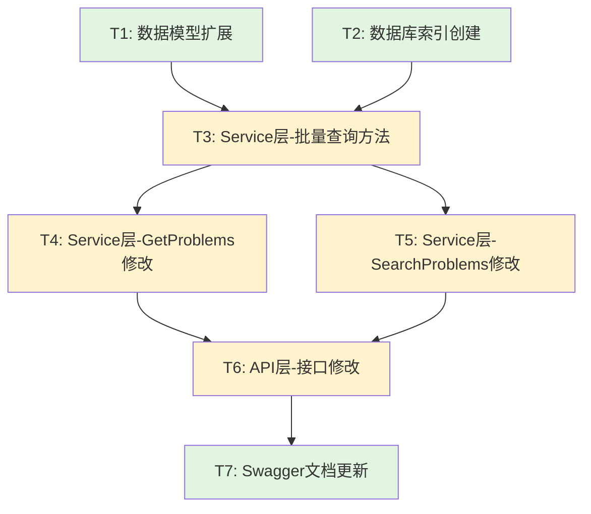

# TASK - 题目列表用户状态

## 任务拆分概览

根据架构设计，将实现工作拆分为 **7个原子任务**，按依赖关系顺序执行。

---

## 任务依赖关系图



**图例**：
- 🟢 绿色：基础任务（可并行）
- 🟡 黄色：核心任务（有依赖）

---

## 任务列表

### 任务T1: 数据模型扩展

#### 输入契约
- **前置依赖**: 无
- **输入数据**: DESIGN 文档中的数据模型定义
- **环境依赖**: Go 开发环境

#### 输出契约
- **交付物**: 
  - `pkg/models/problem.go` 文件修改
  - 新增 `UserProblemStatus` 枚举
  - 修改 `ProblemList` 结构体
- **验收标准**:
  - [ ] 定义了 `UserProblemStatus` 类型及三个常量
  - [ ] `ProblemList` 增加了 `UserStatus` 字段（指针类型）
  - [ ] 代码编译通过
  - [ ] 添加了必要的注释

#### 实现约束
- **技术栈**: Go 1.23+
- **接口规范**: 
  ```go
  type UserProblemStatus string
  
  const (
      UserStatusNotAttempted UserProblemStatus = "not_attempted"
      UserStatusAttempted    UserProblemStatus = "attempted"
      UserStatusAccepted     UserProblemStatus = "accepted"
  )
  ```
- **质量要求**: 
  - 命名符合 Go 规范
  - 添加godoc注释
  - 使用指针类型配合 `omitempty`

#### 依赖关系
- **前置任务**: 无
- **后置任务**: T3
- **并行任务**: T2

---

### 任务T2: 数据库索引创建

#### 输入契约
- **前置依赖**: 无
- **输入数据**: MongoDB 连接信息
- **环境依赖**: MongoDB 实例

#### 输出契约
- **交付物**:
  - 创建索引 `idx_user_problem_status`
  - 索引验证文档
- **验收标准**:
  - [ ] 索引已创建成功
  - [ ] 索引包含字段：`user_id`, `problem_id`, `status`
  - [ ] 使用 `background: true` 后台创建
  - [ ] 执行 `explain()` 验证索引生效

#### 实现约束
- **技术栈**: MongoDB Shell 或 Compass
- **接口规范**:
  ```javascript
  db.submits.createIndex(
      {
          "user_id": 1,
          "problem_id": 1,
          "status": 1
      },
      {
          name: "idx_user_problem_status",
          background: true
      }
  )
  ```
- **质量要求**:
  - 不阻塞数据库操作（background）
  - 验证索引大小合理

#### 依赖关系
- **前置任务**: 无
- **后置任务**: T3
- **并行任务**: T1

---

### 任务T3: Service层 - 批量查询用户状态方法

#### 输入契约
- **前置依赖**: T1 (数据模型), T2 (索引)
- **输入数据**: 
  - `userID`: 用户ID
  - `problemIDs`: 题目ID列表
- **环境依赖**: MongoDB连接

#### 输出契约
- **交付物**:
  - `pkg/app/api-server/service/service_problem.go` 新增方法
  - `GetUserProblemStatuses()` 方法实现
- **验收标准**:
  - [ ] 方法签名正确
  - [ ] 使用聚合管道查询
  - [ ] 正确判断三种状态
  - [ ] 包含完整错误处理
  - [ ] 添加日志记录
  - [ ] 单元测试通过

#### 实现约束
- **技术栈**: Go + MongoDB Driver
- **接口规范**:
  ```go
  func (s *ProblemService) GetUserProblemStatuses(
      ctx context.Context,
      userID primitive.ObjectID,
      problemIDs []primitive.ObjectID,
  ) (map[primitive.ObjectID]models.UserProblemStatus, error)
  ```
- **质量要求**:
  - 时间复杂度: O(log n + m)
  - 空间复杂度: O(m)
  - 包含边界条件处理（空列表等）
  - 日志记录查询时间

#### 依赖关系
- **前置任务**: T1, T2
- **后置任务**: T4, T5
- **并行任务**: 无

---

### 任务T4: Service层 - 修改GetProblems方法

#### 输入契约
- **前置依赖**: T3 (批量查询方法)
- **输入数据**: 原有 `GetProblems` 方法参数
- **环境依赖**: 无

#### 输出契约
- **交付物**:
  - `pkg/app/api-server/service/service_problem.go` 修改
  - `GetProblems` 方法增加用户状态查询
- **验收标准**:
  - [ ] 兼容原有参数
  - [ ] 登录用户填充 `user_status`
  - [ ] 未登录用户 `user_status` 为 nil
  - [ ] 状态查询失败不影响主流程
  - [ ] 添加日志记录
  - [ ] 单元测试通过

#### 实现约束
- **技术栈**: Go
- **接口规范**: 保持现有签名不变
- **质量要求**:
  - 向后兼容
  - 容错设计（状态查询失败仍返回题目）
  - 性能优化（批量查询）

#### 依赖关系
- **前置任务**: T3
- **后置任务**: T6
- **并行任务**: T5

---

### 任务T5: Service层 - 修改SearchProblems方法

#### 输入契约
- **前置依赖**: T3 (批量查询方法)
- **输入数据**: 
  - 原有 `SearchProblems` 方法参数
  - 新增 `userID *primitive.ObjectID` 参数
- **环境依赖**: 无

#### 输出契约
- **交付物**:
  - `pkg/app/api-server/service/service_problem.go` 修改
  - `SearchProblems` 方法签名修改
  - 增加用户状态查询逻辑
- **验收标准**:
  - [ ] 方法签名已修改
  - [ ] 登录用户填充 `user_status`
  - [ ] 未登录用户 `user_status` 为 nil
  - [ ] 状态查询失败不影响主流程
  - [ ] 添加日志记录
  - [ ] 单元测试通过

#### 实现约束
- **技术栈**: Go
- **接口规范**:
  ```go

  ```
- **质量要求**: 同 T4

#### 依赖关系
- **前置任务**: T3
- **后置任务**: T6
- **并行任务**: T4

---

### 任务T6: API层 - 接口修改

#### 输入契约
- **前置依赖**: T4, T5 (Service 层修改)
- **输入数据**: HTTP 请求（含 JWT token）
- **环境依赖**: Gin 框架

#### 输出契约
- **交付物**:
  - `pkg/app/api-server/server/server_problem.go` 修改
  - `GetProblems` 接口修改
  - `SearchProblems` 接口修改
- **验收标准**:
  - [ ] 从 context 正确提取 `user_id`
  - [ ] 调用 Service 层时传递正确的参数
  - [ ] 返回数据格式正确
  - [ ] 错误处理完善
  - [ ] 集成测试通过

#### 实现约束
- **技术栈**: Gin + Go
- **接口规范**: RESTful API
- **质量要求**:
  - 统一错误响应格式
  - 日志记录请求和响应
  - 性能监控

#### 依赖关系
- **前置任务**: T4, T5
- **后置任务**: T7
- **并行任务**: 无

---

### 任务T7: Swagger文档更新

#### 输入契约
- **前置依赖**: T6 (API 层修改)
- **输入数据**: 代码中的 Swagger 注释
- **环境依赖**: swag 工具

#### 输出契约
- **交付物**:
  - 更新 Swagger 注释
  - 重新生成 `docs/swagger.json` 和 `docs/swagger.yaml`
- **验收标准**:
  - [ ] Swagger 注释完整准确
  - [ ] 文档中包含 `user_status` 字段说明
  - [ ] 示例数据正确
  - [ ] Swagger UI 显示正常

#### 实现约束
- **技术栈**: Swagger 2.0
- **接口规范**: 
  ```go
  // @Success 200 {object} map[string]interface{} "题目列表（包含user_status字段）"
  ```
- **质量要求**:
  - 注释格式规范
  - 参数说明完整
  - 示例代码正确

#### 依赖关系
- **前置任务**: T6
- **后置任务**: 无
- **并行任务**: 无

---

## 执行顺序

### 阶段1: 基础准备（可并行）
```
T1 (数据模型扩展) ─┐
                  ├─→ 完成后进入阶段2
T2 (数据库索引)   ─┘
```

**预估时间**: 15分钟

---

### 阶段2: 核心实现
```
T3 (批量查询方法)
    ↓
    ├─→ T4 (GetProblems修改) ─┐
    └─→ T5 (SearchProblems修改)─┤
                               ├─→ T6 (API层修改)
```

**预估时间**: 90分钟

---

### 阶段3: 文档完善
```
T6 (API层修改)
    ↓
T7 (Swagger文档更新)
```

**预估时间**: 15分钟

---

## 总预估时间

| 任务 | 预估时间 | 复杂度 |
|------|---------|-------|
| T1: 数据模型扩展 | 10分钟 | 🟢 简单 |
| T2: 数据库索引 | 5分钟 | 🟢 简单 |
| T3: 批量查询方法 | 40分钟 | 🟡 中等 |
| T4: GetProblems修改 | 25分钟 | 🟡 中等 |
| T5: SearchProblems修改 | 25分钟 | 🟡 中等 |
| T6: API层修改 | 20分钟 | 🟢 简单 |
| T7: Swagger文档 | 15分钟 | 🟢 简单 |
| **总计** | **140分钟** | **约2.5小时** |

---

## 验收检查清单

### 功能验收
- [ ] T1-T7 所有任务完成
- [ ] 登录用户访问题目列表，返回正确的 `user_status`
- [ ] 未登录用户不返回 `user_status` 字段
- [ ] 搜索接口同样返回用户状态
- [ ] 用户提交后状态正确更新

### 性能验收
- [ ] 响应时间 < 200ms（10条记录）
- [ ] 数据库索引生效
- [ ] 无 N+1 查询问题

### 代码质量验收
- [ ] 所有代码编译通过
- [ ] 单元测试通过
- [ ] 代码符合项目规范
- [ ] 注释清晰完整

### 文档验收
- [ ] Swagger 文档已更新
- [ ] 日志记录完整
- [ ] 错误处理完善

---

**任务拆分完毕，等待用户确认后进入 Approve (审批)阶段。**

  func (s *ProblemService) SearchProblems(
      ctx context.Context,
      keyword string,
      difficulty models.ProblemDifficulty,
      tags []string,
      page, pageSize int,
      userID *primitive.ObjectID,  // 新增参数
  ) ([]*models.ProblemList, int64, error)