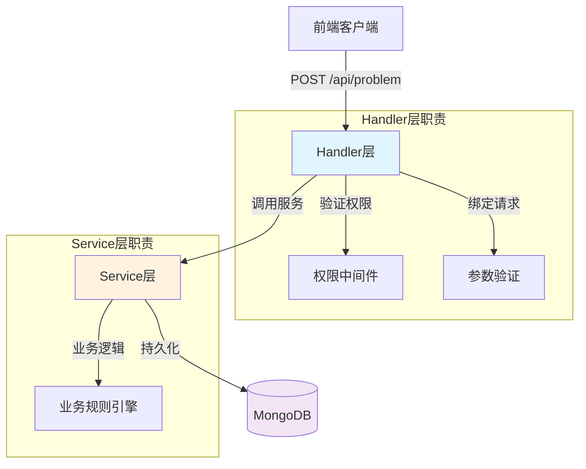
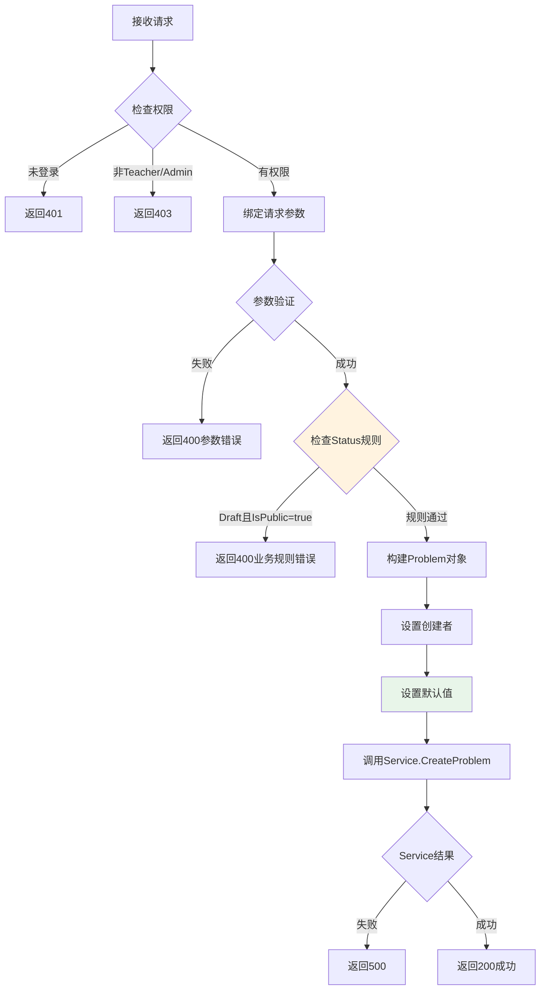
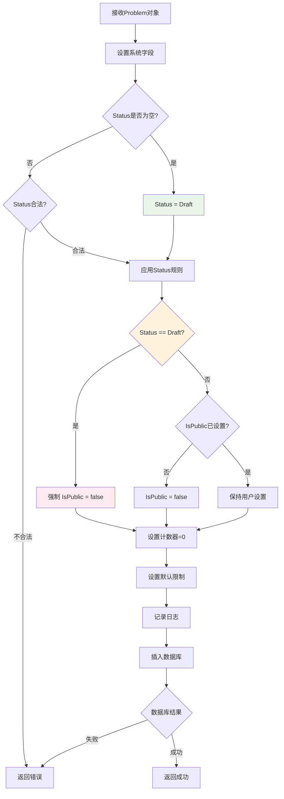
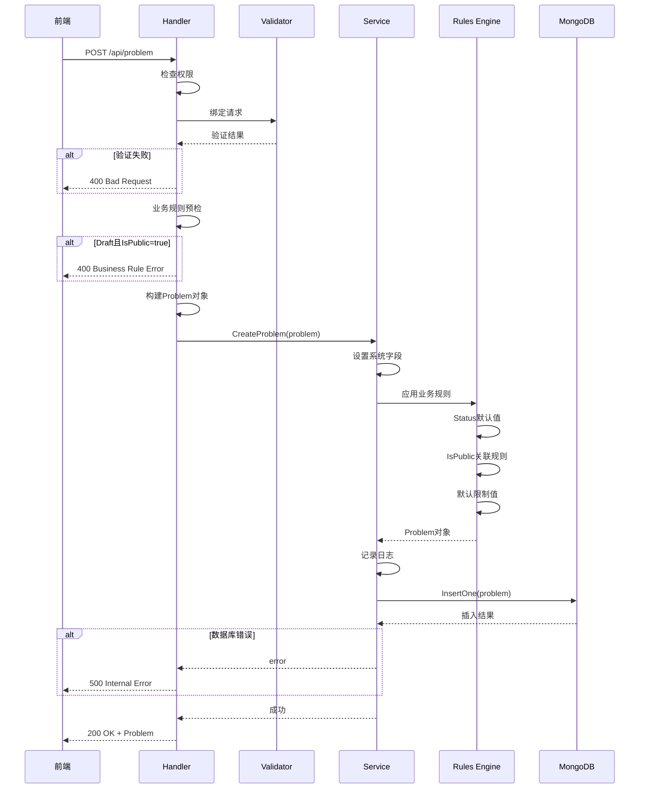

# 题目创建接口重构 - 设计文档

## 🏗️ 整体架构设计

### 系统分层架构



---

## 📦 数据模型设计

### 1. Request模型

#### CreateProblemRequest（新增）

```go
// CreateProblemRequest 创建题目请求
type CreateProblemRequest struct {
    // 基本信息
    Title        string             `json:"title" binding:"required,min=1,max=200"`
    Description  string             `json:"description" binding:"required,min=10"`
    
    // 题目详情
    Input        string             `json:"input"`
    Output       string             `json:"output"`
    SampleInput  string             `json:"sample_input"`
    SampleOutput string             `json:"sample_output"`
    Hint         string             `json:"hint"`
    Source       string             `json:"source"`
    Author       string             `json:"author"`
    
    // 难度和标签
    Difficulty   ProblemDifficulty  `json:"difficulty" binding:"required,oneof=easy medium hard"`
    Tags         []string           `json:"tags" binding:"max=10,dive,min=1,max=20"`
    
    // 限制条件
    TimeLimit    *int               `json:"time_limit" binding:"omitempty,min=100,max=10000"`    // 可选，默认1000ms
    MemoryLimit  *int               `json:"memory_limit" binding:"omitempty,min=32,max=1024"`    // 可选，默认256MB
    
    // 状态控制（可选，如果传入需要验证）
    Status       *ProblemStatus     `json:"status" binding:"omitempty,oneof=draft published archived"`
    IsPublic     *bool              `json:"is_public"`  // 可选，默认false
}
```

**设计说明：**
- ✅ Title和Description为必填
- ✅ TimeLimit和MemoryLimit为指针类型，支持可选和默认值
- ✅ Status为指针类型，允许前端不传（使用默认值）
- ✅ IsPublic为指针类型，允许前端不传（使用默认值）
- ✅ Tags使用dive验证每个元素

### 2. Response模型

复用现有的 `models.Problem` 结构，无需新增。

---

## 🔧 核心组件设计

### 1. Handler层设计

#### CreateProblem接口

**位置：** `pkg/app/api-server/server/server_problem.go`

**职责：**
1. 权限验证（已在中间件完成）
2. 请求参数绑定和验证
3. 业务规则预检
4. 调用Service层
5. 返回统一响应

**流程图：**



**伪代码：**

```go
func (s *Server) CreateProblem(c *gin.Context) {
    // 1. 权限检查（已在中间件完成）
    role, exists := c.Get("role")
    if !exists || (role != RoleAdmin && role != RoleTeacher) {
        return 401/403
    }
    
    // 2. 绑定和验证请求
    var req CreateProblemRequest
    if err := c.ShouldBindJSON(&req); err != nil {
        return 400 with validation errors
    }
    
    // 3. 业务规则预检
    if req.Status != nil && *req.Status == StatusDraft {
        if req.IsPublic != nil && *req.IsPublic == true {
            return 400 "草稿状态的题目不能设为公开"
        }
    }
    
    // 4. 构建Problem对象
    problem := buildProblemFromRequest(&req)
    
    // 5. 设置创建者
    problem.CreatedBy = getCurrentUserID(c)
    
    // 6. 调用Service
    err := s.svc.ProblemService.CreateProblem(ctx, problem)
    if err != nil {
        return 500
    }
    
    // 7. 返回成功
    return 200 with problem
}
```

---

### 2. Service层设计

#### CreateProblem方法

**位置：** `pkg/app/api-server/service/service_problem.go`

**职责：**
1. 设置系统字段（ID、时间戳）
2. 应用默认值规则
3. 应用业务规则（Status与IsPublic关联）
4. 持久化到数据库
5. 记录日志

**业务规则引擎：**



**伪代码：**

```go
func (s *ProblemService) CreateProblem(ctx context.Context, problem *models.Problem) error {
    // 1. 设置系统字段
    problem.ID = primitive.NewObjectID()
    problem.CreatedAt = time.Now()
    problem.UpdatedAt = time.Now()
    
    // 2. 设置默认Status
    if problem.Status == "" {
        problem.Status = models.StatusDraft
        utils.Logger.Info("设置默认状态为草稿")
    }
    
    // 3. 应用Status规则
    if problem.Status == models.StatusDraft {
        // 草稿状态强制私有
        problem.IsPublic = false
        utils.Logger.Info("草稿状态，强制设为私有")
    } else {
        // 已发布/归档状态，保持用户设置或默认私有
        if !problem.IsPublic {
            problem.IsPublic = false  // 默认私有
        }
    }
    
    // 4. 设置默认计数器
    problem.ACCount = 0
    problem.SubmitCount = 0
    
    // 5. 设置默认限制（如果未传）
    if problem.TimeLimit == 0 {
        problem.TimeLimit = 1000
    }
    if problem.MemoryLimit == 0 {
        problem.MemoryLimit = 256
    }
    
    // 6. 记录日志
    utils.Logger.Infof("创建题目: title=%s, status=%s, isPublic=%v, createdBy=%s", 
        problem.Title, problem.Status, problem.IsPublic, problem.CreatedBy.Hex())
    
    // 7. 持久化
    collection := utils.GetCollection("problems")
    _, err := collection.InsertOne(ctx, problem)
    
    return err
}
```

---

## 🔄 数据流向图



---

## 🛡️ 异常处理策略

### 错误分类

| 错误类型 | HTTP状态码 | 错误信息示例 | 处理方式 |
|---------|-----------|------------|---------|
| 权限错误 | 401/403 | "需要登录" / "权限不足" | 中间件处理 |
| 参数验证错误 | 400 | "Title字段不能为空" | Gin binding |
| 业务规则错误 | 400 | "草稿状态不能设为公开" | Handler预检 |
| 数据库错误 | 500 | "创建题目失败" | Service返回 |

### 错误响应格式

```json
{
  "code": 400,
  "message": "参数验证失败",
  "errors": [
    {
      "field": "title",
      "message": "Title字段为必填项"
    },
    {
      "field": "difficulty",
      "message": "Difficulty必须是easy、medium或hard之一"
    }
  ]
}
```

---

## 📊 接口契约定义

### API规范

**端点：** `POST /api/problem`

**请求头：**
```
Authorization: Bearer <token>
Content-Type: application/json
```

**请求体：**
```json
{
  "title": "两数之和",
  "description": "给定一个整数数组和一个目标值，找出数组中和为目标值的两个数。",
  "difficulty": "easy",
  "tags": ["数组", "哈希表"],
  "time_limit": 1000,
  "memory_limit": 256,
  "status": "draft",        // 可选，默认draft
  "is_public": false        // 可选，默认false
}
```

**成功响应：** `200 OK`
```json
{
  "code": 0,
  "message": "success",
  "data": {
    "id": "507f1f77bcf86cd799439011",
    "title": "两数之和",
    "description": "...",
    "status": "draft",
    "is_public": false,
    "ac_count": 0,
    "submit_count": 0,
    "created_at": "2025-10-23T15:00:00Z",
    "updated_at": "2025-10-23T15:00:00Z",
    "created_by": "507f1f77bcf86cd799439012"
  }
}
```

**错误响应：** `400 Bad Request`
```json
{
  "code": 400,
  "message": "草稿状态的题目不能设为公开"
}
```

---

## 🔍 设计原则

### 1. 单一职责原则
- Handler层：HTTP处理
- Service层：业务逻辑
- Model层：数据定义

### 2. 开闭原则
- 状态规则可扩展
- 验证规则可配置

### 3. 依赖倒置原则
- Service不依赖Handler
- 使用接口定义契约

### 4. 防御性编程
- 所有输入都验证
- 默认值安全设置
- 详细日志记录

---

## ✅ 质量门控

- [x] 架构图清晰准确
- [x] 接口定义完整
- [x] 数据流向明确
- [x] 异常处理完善
- [x] 与现有系统无冲突
- [x] 设计可行性验证

---

## 🔄 下一步

进入 **Atomize阶段**，拆分实现任务。

