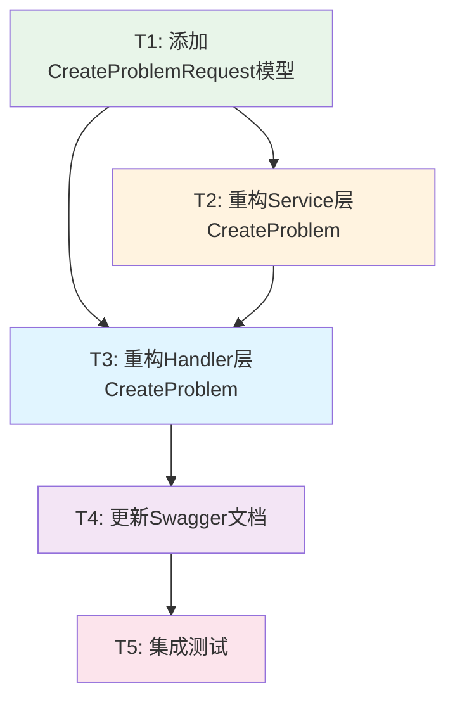

# 题目创建接口重构 - 任务拆分文档

## 📋 任务依赖图



---

## 🔧 任务详细定义

### T1: 添加CreateProblemRequest模型

**优先级：** P0（最高）  
**依赖：** 无  
**预估时间：** 15分钟

#### 输入契约
- 现有代码：`pkg/models/requests.go`
- 设计文档：CreateProblemRequest结构定义

#### 输出契约
- 新增结构体：`CreateProblemRequest`
- 包含完整的binding验证标签
- 字段类型正确（指针类型支持可选）

#### 实现约束
- 位置：`pkg/models/requests.go`
- 遵循现有代码风格
- 使用Go标准命名规范
- 添加详细注释

#### 验收标准
- [x] CreateProblemRequest结构体定义完整
- [x] 所有必填字段有required标签
- [x] 可选字段使用指针类型
- [x] 验证标签正确（min, max, oneof等）
- [x] 代码可编译通过

#### 实现代码

```go
// CreateProblemRequest 创建题目请求
type CreateProblemRequest struct {
	// 基本信息（必填）
	Title        string             `json:"title" binding:"required,min=1,max=200"`
	Description  string             `json:"description" binding:"required,min=10"`
	
	// 题目详情（可选）
	Input        string             `json:"input"`
	Output       string             `json:"output"`
	SampleInput  string             `json:"sample_input"`
	SampleOutput string             `json:"sample_output"`
	Hint         string             `json:"hint"`
	Source       string             `json:"source"`
	Author       string             `json:"author"`
	
	// 难度和标签（必填）
	Difficulty   ProblemDifficulty  `json:"difficulty" binding:"required,oneof=easy medium hard"`
	Tags         []string           `json:"tags" binding:"max=10,dive,min=1,max=20"`
	
	// 限制条件（可选，有默认值）
	TimeLimit    *int               `json:"time_limit" binding:"omitempty,min=100,max=10000"`    // 默认1000ms
	MemoryLimit  *int               `json:"memory_limit" binding:"omitempty,min=32,max=1024"`    // 默认256MB
	
	// 状态控制（可选）
	Status       *ProblemStatus     `json:"status" binding:"omitempty,oneof=draft published archived"`
	IsPublic     *bool              `json:"is_public"`
}
```

---

### T2: 重构Service层CreateProblem

**优先级：** P0  
**依赖：** T1  
**预估时间：** 20分钟

#### 输入契约
- 方法签名：`CreateProblem(ctx context.Context, problem *models.Problem) error`
- Problem对象（从Handler传入）
- 用户上下文信息

#### 输出契约
- 返回error（成功为nil）
- Problem对象已持久化到数据库
- 系统字段已设置（ID、时间戳、计数器）
- 业务规则已应用（Status、IsPublic）

#### 实现约束
- 位置：`pkg/app/api-server/service/service_problem.go`
- 方法：修改现有`CreateProblem`方法
- 保持方法签名不变（向后兼容）
- 添加详细日志
- 不抛出panic

#### 业务规则
1. **Status规则**
   - 未传Status → 默认StatusDraft
   - 传入Status → 验证合法性（已在binding完成）

2. **IsPublic关联规则**
   - Status == Draft → 强制IsPublic = false
   - Status != Draft → 保持用户设置或默认false

3. **默认值规则**
   - ACCount = 0
   - SubmitCount = 0
   - TimeLimit = 1000（如果为0）
   - MemoryLimit = 256（如果为0）
   - Tags = []（如果为nil）

#### 验收标准
- [x] Status默认值为Draft
- [x] Draft状态强制IsPublic=false
- [x] Published/Archived状态保持用户设置
- [x] 默认值正确设置
- [x] 关键操作有日志记录
- [x] 错误处理完善
- [x] 代码可编译运行

#### 实现代码

```go
// CreateProblem 创建题目
func (s *ProblemService) CreateProblem(ctx context.Context, problem *models.Problem) error {
	// 1. 设置系统字段
	problem.ID = primitive.NewObjectID()
	problem.CreatedAt = time.Now()
	problem.UpdatedAt = time.Now()
	
	// 2. 设置默认Status（如果未传）
	if problem.Status == "" {
		problem.Status = models.StatusDraft
		utils.Logger.Infof("CreateProblem: 未指定状态，设置默认状态为草稿")
	}
	
	// 3. 应用Status与IsPublic关联规则
	if problem.Status == models.StatusDraft {
		// 草稿状态强制私有
		if problem.IsPublic {
			utils.Logger.Warnf("CreateProblem: 草稿状态不能公开，强制设为私有")
		}
		problem.IsPublic = false
	} else {
		// Published/Archived状态，保持用户设置或默认私有
		// （IsPublic由Handler层传入，这里保持不变）
	}
	
	// 4. 设置默认计数器
	problem.ACCount = 0
	problem.SubmitCount = 0
	
	// 5. 设置默认限制（如果为0）
	if problem.TimeLimit == 0 {
		problem.TimeLimit = 1000
		utils.Logger.Debugf("CreateProblem: 使用默认时间限制 1000ms")
	}
	if problem.MemoryLimit == 0 {
		problem.MemoryLimit = 256
		utils.Logger.Debugf("CreateProblem: 使用默认内存限制 256MB")
	}
	
	// 6. 确保Tags不为nil
	if problem.Tags == nil {
		problem.Tags = []string{}
	}
	
	// 7. 记录详细日志
	utils.Logger.Infof("CreateProblem: title=%s, difficulty=%s, status=%s, isPublic=%v, createdBy=%s", 
		problem.Title, problem.Difficulty, problem.Status, problem.IsPublic, problem.CreatedBy.Hex())
	
	// 8. 持久化到数据库
	collection := utils.GetCollection("problems")
	_, err := collection.InsertOne(ctx, problem)
	if err != nil {
		utils.Logger.Errorf("CreateProblem: 数据库插入失败, error=%v", err)
		return fmt.Errorf("数据库操作失败: %w", err)
	}
	
	utils.Logger.Infof("CreateProblem: 题目创建成功, id=%s", problem.ID.Hex())
	return nil
}
```

---

### T3: 重构Handler层CreateProblem

**优先级：** P0  
**依赖：** T1, T2  
**预估时间：** 25分钟

#### 输入契约
- HTTP请求：POST /api/problem
- 请求头：Authorization Bearer Token
- 请求体：JSON格式的CreateProblemRequest

#### 输出契约
- HTTP响应：200 OK（成功）或4xx/5xx（失败）
- 响应体：统一JSON格式
- Problem对象已创建

#### 实现约束
- 位置：`pkg/app/api-server/server/server_problem.go`
- 方法：修改现有`CreateProblem`方法
- 保持路由不变
- 使用CreateProblemRequest接收参数
- 保持Swagger注释格式

#### 处理流程
1. 权限检查（已在中间件）
2. 绑定CreateProblemRequest
3. 业务规则预检（Draft+IsPublic）
4. 构建Problem对象
5. 设置创建者
6. 调用Service
7. 返回响应

#### 验收标准
- [x] 使用CreateProblemRequest接收参数
- [x] binding验证自动执行
- [x] Draft+IsPublic=true返回400
- [x] 默认值正确传递给Service
- [x] 错误信息清晰
- [x] Swagger文档正确
- [x] 代码可编译运行

#### 实现代码

```go
// CreateProblem godoc
// @Summary      创建题目（教师/管理员）
// @Description  创建新题目，默认状态为草稿，草稿状态不能公开
// @Tags         题目
// @Accept       json
// @Produce      json
// @Param        request body models.CreateProblemRequest true "题目信息"
// @Success      200 {object} models.Problem "创建成功"
// @Failure      400 {object} map[string]interface{} "请求参数错误或业务规则错误"
// @Failure      401 {object} map[string]interface{} "需要登录"
// @Failure      403 {object} map[string]interface{} "权限不足"
// @Failure      500 {object} map[string]interface{} "创建失败"
// @Security     BearerAuth
// @Router       /problem [post]
func (s *Server) CreateProblem(c *gin.Context) {
	// 1. 检查权限：只有管理员和老师可以创建题目
	role, exists := c.Get("role")
	if !exists {
		utils.UnauthorizedResponse(c, "需要登录")
		return
	}

	userRole := role.(string)
	if userRole != string(models.RoleAdmin) && userRole != string(models.RoleTeacher) {
		utils.ForbiddenResponse(c, "权限不足，只有管理员和教师可以创建题目")
		return
	}

	// 2. 绑定和验证请求参数
	var req models.CreateProblemRequest
	if err := c.ShouldBindJSON(&req); err != nil {
		utils.BadRequestResponse(c, "请求参数错误: "+err.Error())
		return
	}

	// 3. 业务规则预检：草稿状态不能公开
	if req.Status != nil && *req.Status == models.StatusDraft {
		if req.IsPublic != nil && *req.IsPublic == true {
			utils.BadRequestResponse(c, "草稿状态的题目不能设为公开")
			return
		}
	}

	// 4. 构建Problem对象
	problem := models.Problem{
		Title:        req.Title,
		Description:  req.Description,
		Input:        req.Input,
		Output:       req.Output,
		SampleInput:  req.SampleInput,
		SampleOutput: req.SampleOutput,
		Hint:         req.Hint,
		Source:       req.Source,
		Author:       req.Author,
		Difficulty:   req.Difficulty,
		Tags:         req.Tags,
	}

	// 5. 设置可选字段（使用指针判断）
	if req.TimeLimit != nil {
		problem.TimeLimit = *req.TimeLimit
	}
	if req.MemoryLimit != nil {
		problem.MemoryLimit = *req.MemoryLimit
	}
	if req.Status != nil {
		problem.Status = *req.Status
	}
	if req.IsPublic != nil {
		problem.IsPublic = *req.IsPublic
	}

	// 6. 设置创建者
	userID, _ := c.Get("user_id")
	problem.CreatedBy, _ = primitive.ObjectIDFromHex(userID.(string))

	// 7. 调用Service层
	ctx := c.Request.Context()
	if err := s.svc.ProblemService.CreateProblem(ctx, &problem); err != nil {
		utils.InternalServerErrorResponse(c, "创建题目失败: "+err.Error())
		return
	}

	// 8. 返回成功响应
	utils.SuccessResponse(c, problem)
}
```

---

### T4: 更新Swagger文档

**优先级：** P1  
**依赖：** T1, T2, T3  
**预估时间：** 10分钟

#### 输入契约
- 已修改的Handler代码
- Swagger注释规范

#### 输出契约
- Swagger注释更新
- API文档可正常生成
- 请求/响应示例正确

#### 实现约束
- 使用swag工具生成
- 遵循OpenAPI 3.0规范
- 示例数据真实可用

#### 验收标准
- [x] Swagger注释正确
- [x] @Param定义指向CreateProblemRequest
- [x] 成功/失败响应完整
- [x] 文档可正常生成
- [x] API文档可访问

#### 实现步骤

```bash
# 1. 确认Swagger注释（已在T3完成）

# 2. 生成Swagger文档
cd /path/to/project
swag init -g cmd/main.go

# 3. 验证文档
# 访问 http://localhost:8080/swagger/index.html
```

---

### T5: 集成测试

**优先级：** P1  
**依赖：** T1, T2, T3, T4  
**预估时间：** 20分钟

#### 输入契约
- 完整实现的代码
- 测试环境（MongoDB、Redis）

#### 输出契约
- 所有测试用例通过
- 功能符合预期
- 无回归问题

#### 测试用例

| 用例ID | 测试场景 | 预期结果 |
|--------|---------|---------|
| TC1 | 创建题目（最小参数） | Status=Draft, IsPublic=false |
| TC2 | 创建题目（完整参数） | 所有字段正确保存 |
| TC3 | Title为空 | 返回400验证错误 |
| TC4 | Description太短 | 返回400验证错误 |
| TC5 | Difficulty非法值 | 返回400验证错误 |
| TC6 | TimeLimit超出范围 | 返回400验证错误 |
| TC7 | Draft+IsPublic=true | 返回400业务规则错误 |
| TC8 | Published+IsPublic=true | 创建成功 |
| TC9 | 未登录 | 返回401 |
| TC10 | Student角色 | 返回403 |

#### 验收标准
- [x] 所有测试用例通过
- [x] 数据库数据正确
- [x] 响应格式正确
- [x] 错误处理正确
- [x] 日志输出正确

---

## 📊 任务执行顺序

### 阶段1：基础建设（并行）
- T1: 添加CreateProblemRequest模型

### 阶段2：核心实现（串行）
- T2: 重构Service层CreateProblem
- T3: 重构Handler层CreateProblem

### 阶段3：文档和测试（并行）
- T4: 更新Swagger文档
- T5: 集成测试

---

## ✅ 任务检查清单

- [ ] T1: CreateProblemRequest模型添加完成
- [ ] T2: Service层重构完成
- [ ] T3: Handler层重构完成
- [ ] T4: Swagger文档更新完成
- [ ] T5: 集成测试全部通过

---

## 🔄 下一步

等待审批确认后，进入 **Automate阶段**，开始实际编码。

