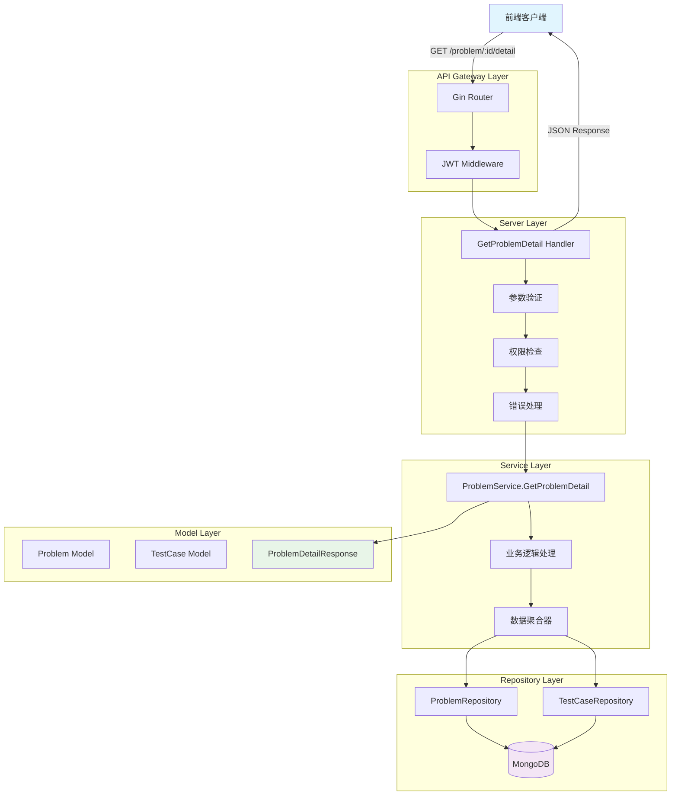
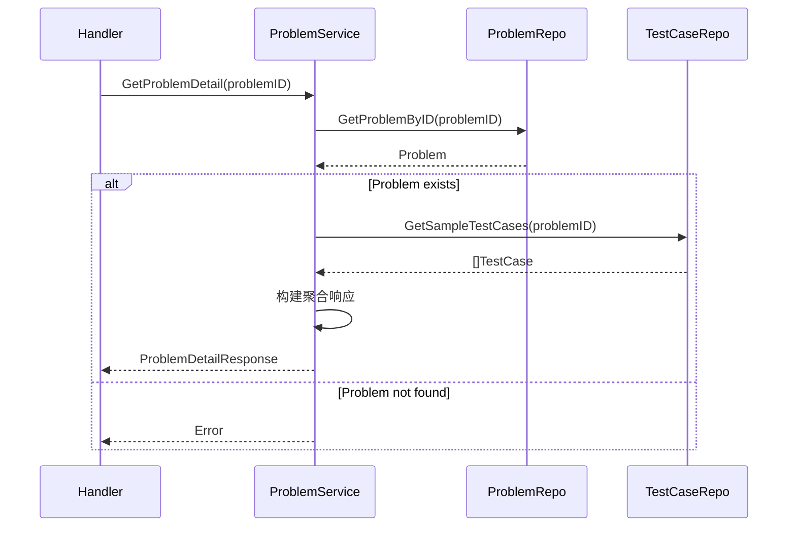
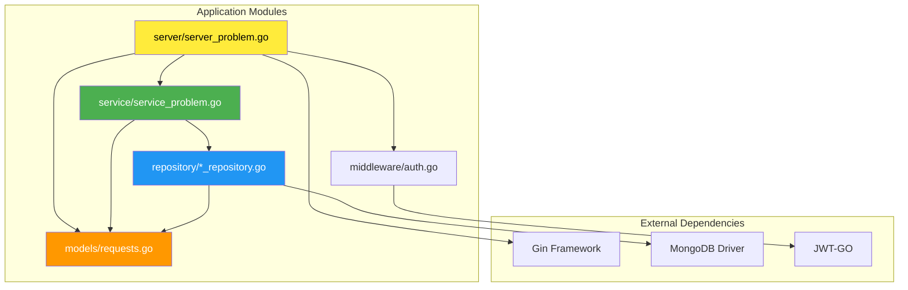
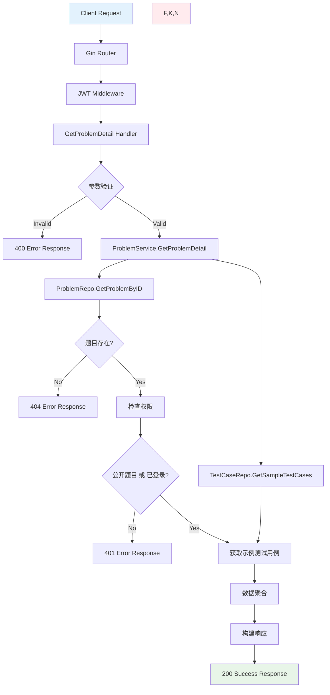
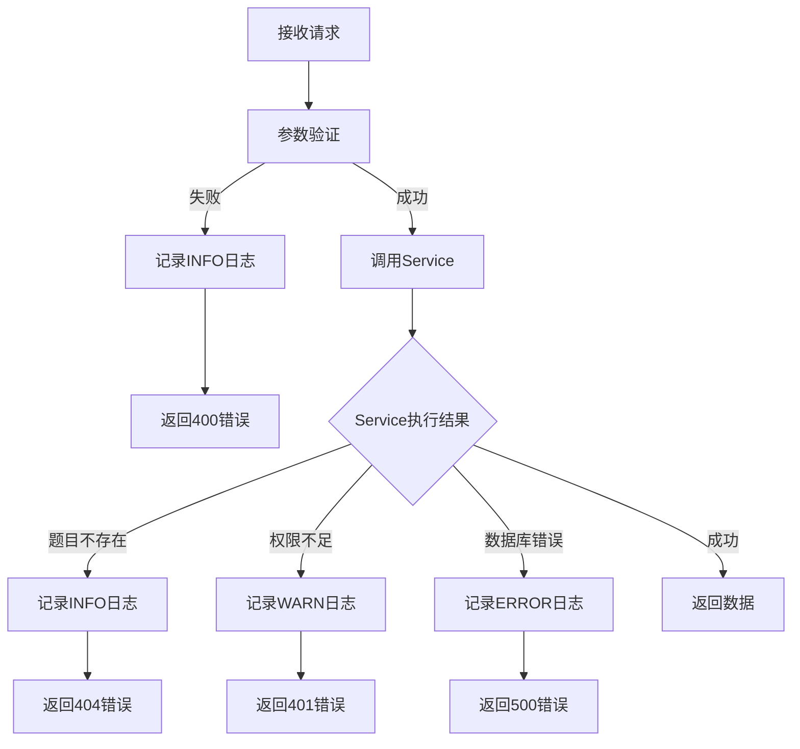

# DESIGN - 题目详情聚合接口

## 整体架构图



## 分层设计和核心组件

### 1. Server Layer (路由处理层)

#### 1.1 路由注册
```go
// 在 RegisterProblem 中添加新路由
problemGroup.GET("/:id/detail", s.GetProblemDetail) // 获取题目详情聚合信息
```

#### 1.2 Handler 组件
**职责**:
- 参数解析和验证
- 权限检查
- 调用Service层
- 错误处理和响应格式化

**核心逻辑**:
```go
func (s *Server) GetProblemDetail(c *gin.Context) {
    // 1. 参数验证
    // 2. 调用Service获取数据
    // 3. 权限检查（基于题目的is_public字段）
    // 4. 返回聚合结果
}
```

### 2. Service Layer (业务逻辑层)

#### 2.1 ProblemService 扩展
**新增方法**: `GetProblemDetail(ctx context.Context, problemID primitive.ObjectID) (*models.ProblemDetailResponse, error)`

**业务流程**:


### 3. Repository Layer (数据访问层)

#### 3.1 复用现有Repository
- **ProblemRepository**: 
  - `GetProblemByID(ctx, id)` - 获取题目基本信息
  
- **TestCaseRepository**: 
  - `GetSampleTestCases(ctx, problemID)` - 获取示例测试用例

#### 3.2 数据查询优化
```go
// 并发查询优化（可选）
func (s *ProblemService) GetProblemDetail(ctx context.Context, problemID primitive.ObjectID) (*models.ProblemDetailResponse, error) {
    var (
        problem *models.Problem
        sampleCases []*models.TestCase
        problemErr, casesErr error
    )
    
    // 并发查询
    var wg sync.WaitGroup
    wg.Add(2)
    
    go func() {
        defer wg.Done()
        problem, problemErr = s.repo.GetProblemByID(ctx, problemID)
    }()
    
    go func() {
        defer wg.Done() 
        sampleCases, casesErr = s.testCaseRepo.GetSampleTestCases(ctx, problemID)
    }()
    
    wg.Wait()
    
    // 错误处理和结果组装...
}
```

## 模块依赖关系图



## 接口契约定义

### 1. HTTP 接口契约

#### Request
```http
GET /problem/{id}/detail
Content-Type: application/json
Authorization: Bearer {token} (可选，私有题目时必需)
```

**Path Parameters:**
| 参数 | 类型 | 必需 | 描述 |
|------|------|------|------|
| id | string | 是 | 题目ID (MongoDB ObjectID) |

#### Response
**成功响应 (200):**
```json
{
  "code": 200,
  "message": "success", 
  "data": {
    "problem": {
      "id": "507f1f77bcf86cd799439011",
      "title": "两数之和",
      "description": "给定一个整数数组...",
      "input": "输入格式说明...",
      "output": "输出格式说明...",
      "sample_input": "nums = [2,7,11,15], target = 9",
      "sample_output": "[0,1]", 
      "difficulty": "easy",
      "time_limit": 1000,
      "memory_limit": 256,
      "tags": ["数组", "哈希表"],
      "ac_count": 1500,
      "submit_count": 3000,
      "created_at": "2024-01-15T10:30:00Z"
    },
    "sample_cases": [
      {
        "id": "507f1f77bcf86cd799439012",
        "problem_id": "507f1f77bcf86cd799439011", 
        "input": "nums = [2,7,11,15], target = 9",
        "output": "[0,1]",
        "is_sample": true
      },
      {
        "id": "507f1f77bcf86cd799439013",
        "problem_id": "507f1f77bcf86cd799439011",
        "input": "nums = [3,2,4], target = 6", 
        "output": "[1,2]",
        "is_sample": true
      }
    ]
  }
}
```

**错误响应:**
```json
// 400 - 无效ID
{
  "code": 400,
  "message": "无效的题目ID",
  "data": null
}

// 401 - 需要登录
{
  "code": 401, 
  "message": "需要登录才能查看此题目",
  "data": null
}

// 404 - 题目不存在
{
  "code": 404,
  "message": "题目不存在", 
  "data": null
}
```

### 2. 内部接口契约

#### Service Layer Contract
```go
type ProblemServiceInterface interface {
    GetProblemDetail(ctx context.Context, problemID primitive.ObjectID) (*models.ProblemDetailResponse, error)
}
```

#### Repository Layer Contract
```go
// 复用现有接口
type ProblemRepositoryInterface interface {
    GetProblemByID(ctx context.Context, id primitive.ObjectID) (*models.Problem, error)
}

type TestCaseRepositoryInterface interface {
    GetSampleTestCases(ctx context.Context, problemID primitive.ObjectID) ([]*models.TestCase, error)
}
```

## 数据流向图



## 异常处理策略

### 1. 错误分类和处理

| 错误类型 | HTTP状态码 | 处理策略 | 日志级别 |
|----------|-----------|----------|----------|
| 无效题目ID | 400 | 立即返回错误响应 | INFO |
| 题目不存在 | 404 | 检查数据库后返回 | INFO |
| 权限不足 | 401 | 验证Token后返回 | WARN |
| 数据库错误 | 500 | 记录详细日志，返回通用错误 | ERROR |
| 网络超时 | 500 | 重试机制，记录日志 | ERROR |

### 2. 错误处理流程



### 3. 日志记录规范

```go
// 示例日志记录
utils.Logger.Infof("GetProblemDetail: problemID=%s", problemID.Hex())
utils.Logger.Warnf("GetProblemDetail: 权限不足, problemID=%s, userID=%s", problemID.Hex(), userID)
utils.Logger.Errorf("GetProblemDetail: 数据库查询失败, problemID=%s, error=%v", problemID.Hex(), err)
```

## 性能优化设计

### 1. 查询优化
- **并发查询**: 题目信息和示例测试用例并行获取
- **索引利用**: 利用existing indexes on `problems._id` 和 `testcases.problem_id + is_sample`

### 2. 缓存策略（后续扩展）
```go
// 缓存键设计
cacheKey := fmt.Sprintf("problem_detail:%s", problemID.Hex())
cacheTTL := 10 * time.Minute // 10分钟缓存
```

### 3. 数据传输优化
- **字段选择**: 仅返回前端需要的字段
- **压缩**: 利用Gin的GZIP中间件

## 安全设计

### 1. 权限控制
```go
// 权限检查逻辑
if !problem.IsPublic {
    userID, exists := c.Get("user_id")
    if !exists {
        return utils.UnauthorizedResponse(c, "需要登录才能查看此题目")
    }
}
```

### 2. 输入验证
- ObjectID格式验证
- SQL注入防护（MongoDB天然防护）
- XSS防护（输出编码）

### 3. 敏感信息保护
- 不返回题目的创建者信息
- 不暴露内部测试用例
- 仅返回示例测试用例

## 扩展性设计

### 1. 接口版本化
```go
// 支持未来版本扩展
v1.GET("/:id/detail", s.GetProblemDetail)
v2.GET("/:id/detail", s.GetProblemDetailV2) // 未来版本
```

### 2. 响应格式扩展
```go
type ProblemDetailResponse struct {
    Problem     *Problem   `json:"problem"`
    SampleCases []TestCase `json:"sample_cases"`
    // 预留扩展字段
    Meta        *Meta      `json:"meta,omitempty"`        // 元数据
    Related     []Problem  `json:"related,omitempty"`     // 相关题目
}
```

### 3. 配置化
```go
// 配置项
type Config struct {
    MaxSampleCases int           `yaml:"max_sample_cases"` // 最大示例用例数
    CacheTTL       time.Duration `yaml:"cache_ttl"`        // 缓存过期时间
}
```
