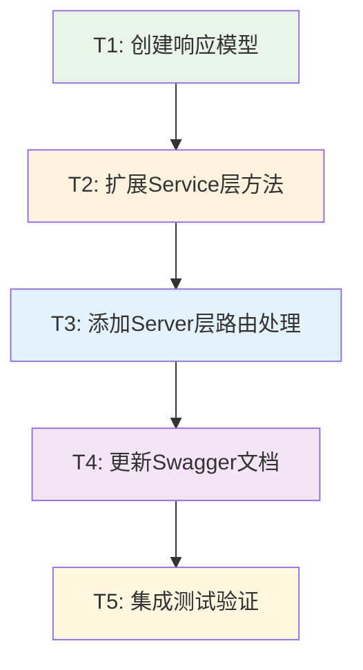

# TASK - 题目详情聚合接口原子任务

## 任务依赖图



## 原子任务详细定义

### T1: 创建响应模型
**任务ID**: T1  
**优先级**: 高  
**预估时间**: 15分钟  

#### 输入契约
- **前置依赖**: 无
- **输入数据**: DESIGN文档中的响应模型规范
- **环境依赖**: Go开发环境

#### 输出契约  
- **输出数据**: `models/requests.go` 中新增 `ProblemDetailResponse` 结构体
- **交付物**: 
  - 新增响应模型定义
  - 包含完整的JSON标签和注释
- **验收标准**:
  - [ ] `ProblemDetailResponse` 结构体定义正确
  - [ ] 包含 `Problem` 和 `SampleCases` 字段
  - [ ] JSON标签格式正确
  - [ ] 代码可以编译通过

#### 实现约束
- **技术栈**: Go语言
- **接口规范**: 遵循现有模型定义规范
- **质量要求**: 
  - 字段命名遵循Go命名规范
  - 注释清晰描述字段用途
  - JSON标签与API规范一致

#### 具体实现
```go
// ProblemDetailResponse 题目详情聚合响应
type ProblemDetailResponse struct {
    Problem     *Problem   `json:"problem"`      // 题目基本信息
    SampleCases []TestCase `json:"sample_cases"` // 示例测试用例列表
}
```

---

### T2: 扩展Service层方法
**任务ID**: T2  
**优先级**: 高  
**预估时间**: 30分钟  

#### 输入契约
- **前置依赖**: T1完成
- **输入数据**: `ProblemDetailResponse` 模型定义
- **环境依赖**: 现有Repository层方法

#### 输出契约
- **输出数据**: `service/service_problem.go` 中新增 `GetProblemDetail` 方法
- **交付物**:
  - Service层业务逻辑实现
  - 错误处理机制
  - 日志记录
- **验收标准**:
  - [ ] 方法签名正确：`GetProblemDetail(ctx context.Context, problemID primitive.ObjectID) (*models.ProblemDetailResponse, error)`
  - [ ] 正确调用Repository层获取数据
  - [ ] 数据聚合逻辑正确
  - [ ] 错误处理完善
  - [ ] 包含适当的日志记录

#### 实现约束
- **技术栈**: Go语言，复用现有Repository
- **接口规范**: 遵循现有Service层模式
- **质量要求**:
  - 错误处理要全面
  - 日志记录要详细
  - 代码结构清晰

#### 依赖关系
- **后置任务**: T3
- **并行任务**: 无

---

### T3: 添加Server层路由处理
**任务ID**: T3  
**优先级**: 高  
**预估时间**: 25分钟  

#### 输入契约
- **前置依赖**: T2完成
- **输入数据**: Service层 `GetProblemDetail` 方法
- **环境依赖**: 现有Gin路由框架

#### 输出契约
- **输出数据**: `server/server_problem.go` 中新增路由处理方法
- **交付物**:
  - HTTP处理函数 `GetProblemDetail`
  - 路由注册
  - 参数验证
  - 权限检查
  - 错误响应处理
- **验收标准**:
  - [ ] 路由 `GET /:id/detail` 注册正确
  - [ ] 参数验证逻辑正确（ObjectID格式）
  - [ ] 权限检查实现（私有题目需要登录）
  - [ ] 错误响应格式统一
  - [ ] 成功响应格式正确

#### 实现约束
- **技术栈**: Gin框架，复用现有中间件
- **接口规范**: 遵循现有API响应格式
- **质量要求**:
  - 参数验证要严格
  - 权限控制要准确
  - 错误信息要友好

#### 具体实现要点
```go
// 核心处理逻辑
func (s *Server) GetProblemDetail(c *gin.Context) {
    // 1. 参数验证
    // 2. 调用Service获取数据  
    // 3. 权限检查
    // 4. 返回响应
}
```

---

### T4: 更新Swagger文档
**任务ID**: T4  
**优先级**: 中  
**预估时间**: 20分钟  

#### 输入契约
- **前置依赖**: T3完成
- **输入数据**: 完整的API接口实现
- **环境依赖**: Swagger注释规范

#### 输出契约
- **输出数据**: 完整的Swagger API文档注释
- **交付物**:
  - Handler方法的Swagger注释
  - 参数说明文档
  - 响应示例文档
- **验收标准**:
  - [ ] Swagger注释语法正确
  - [ ] 包含完整的参数说明
  - [ ] 包含所有响应状态码
  - [ ] 响应示例准确
  - [ ] `swag init` 可以正常生成文档

#### 实现约束
- **技术栈**: Swagger注释规范
- **接口规范**: 遵循现有Swagger文档格式
- **质量要求**:
  - 文档描述要清晰
  - 示例要准确
  - 参数说明要完整

#### 具体注释示例
```go
// GetProblemDetail godoc
// @Summary      获取题目详情聚合信息
// @Description  获取题目基本信息和所有示例测试用例
// @Tags         题目
// @Accept       json
// @Produce      json
// @Param        id path string true "题目ID"
// @Success      200 {object} map[string]interface{} "题目详情聚合信息"
// @Failure      400 {object} map[string]interface{} "无效的题目ID"
// @Failure      401 {object} map[string]interface{} "需要登录"
// @Failure      404 {object} map[string]interface{} "题目不存在"
// @Router       /problem/{id}/detail [get]
```

---

### T5: 集成测试验证
**任务ID**: T5  
**优先级**: 高  
**预估时间**: 25分钟  

#### 输入契约
- **前置依赖**: T1, T2, T3, T4完成
- **输入数据**: 完整的API接口实现
- **环境依赖**: 测试环境和测试数据

#### 输出契约
- **输出数据**: 验证报告和测试结果
- **交付物**:
  - 功能测试用例执行
  - 边界条件测试
  - 权限控制验证
  - 性能基准测试
- **验收标准**:
  - [ ] 正常场景测试通过
  - [ ] 异常场景处理正确
  - [ ] 权限控制验证通过
  - [ ] API响应格式正确
  - [ ] 性能满足预期(<200ms)

#### 实现约束
- **技术栈**: Go testing包，Postman或类似工具
- **接口规范**: 完整的测试覆盖
- **质量要求**:
  - 测试用例要全面
  - 结果验证要准确
  - 文档记录要详细

#### 测试场景清单
1. **正常场景**:
   - [ ] 公开题目访问测试
   - [ ] 私有题目（已登录）访问测试
   - [ ] 包含多个示例用例的题目测试

2. **异常场景**:
   - [ ] 无效题目ID测试
   - [ ] 不存在题目测试  
   - [ ] 私有题目（未登录）访问测试

3. **边界条件**:
   - [ ] 无示例测试用例的题目
   - [ ] 大量示例测试用例的题目

## 任务执行顺序

1. **T1 → T2**: 模型定义完成后才能实现Service层业务逻辑
2. **T2 → T3**: Service层完成后才能实现HTTP处理层  
3. **T3 → T4**: API实现完成后才能编写准确的文档
4. **T1,T2,T3,T4 → T5**: 所有开发任务完成后进行集成测试

## 质量控制检查点

### 代码质量
- [ ] 所有代码通过 `go build` 编译
- [ ] 遵循项目现有代码规范
- [ ] 包含适当的注释和文档
- [ ] 错误处理机制完善

### 功能质量  
- [ ] API接口功能正确
- [ ] 权限控制准确
- [ ] 数据格式符合规范
- [ ] 异常情况处理得当

### 性能质量
- [ ] 响应时间满足预期
- [ ] 数据库查询优化
- [ ] 内存使用合理
- [ ] 并发安全性确保

### 安全质量
- [ ] 输入验证严格
- [ ] 权限检查准确
- [ ] 敏感信息保护
- [ ] 日志记录安全
